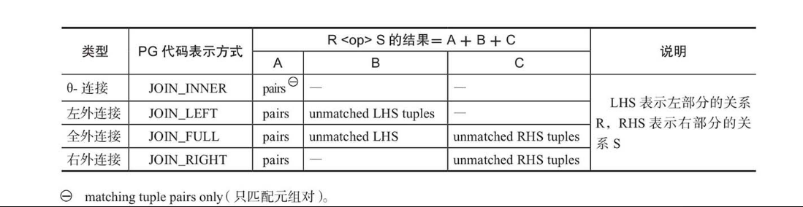

# 查询重写规则

## 条件化简

利用等式和不等式的性质，可以将WHERE、HAVING和ON条件化简，不同数据库的实现可能不完全相同。化简方式通常包含以下几项：

1. **把HAVING条件并入WHERE条件**。便于统一、集中化解条件子句，节约多次化解时间。不是任何情况下HAVING条件都可以并入WHERE条件，只有在SQL语句不存在GROUPBY条件或聚集函数的情况下，才能将HAVING条件与WHERE条件的进行合并。


2. **去除表达式中冗余的括号**。这样可以减少语法分析时产生的AND和OR树的层次。如`((a AND b) AND (c AND d))`就可以化简为`a AND b AND c AND d`。

3. **常量传递**。对不同关系可以使得条件分离后有效实施“选择下推”，从而可以极大地减小中间关系的规模。如`col_1 = col_2 AND col_2 = 3`就可以化简为`col_1=3 ANDcol_2=3`。操作符=、<、>、<=、>=、<>、LIKE中的任何一个，在`col_1<操作符>col_2`条件中都会发生常量传递。


4. **消除死码**。化简条件，将不必要的条件去除。如`WHERE(0>1 AND s1=5)`, `0>1`使得AND恒为假，则WHERE条件恒为假。此时就不必再对该SQL语句进行优化和执行了，加快了查询执行的速度。


5. **表达式计算**。对可以求解的表达式进行计算，得出结果。如`WHERE col_1=1 + 2`变换为`WHERE col_1=3`。


6. **等式变换**。化简条件(如反转关系操作符的操作数的顺序)，从而改变某些表的访问路径。如`-a=3`可化简为`a=-3`。这样的好处是如果a上有索引，则可以利用索引扫描来加快访问。

7. **不等式变换**。化简条件，将不必要的重复条件去除。如`a>10 AND b=6 AND a>2`可化简为`b=6 AND a>10`。


8. **布尔表达式变换**。在上面的内容中，涉及了一些布尔表达式参与的变换(`a>10 AND b=6 AND a>2`化简为`b=6 AND a>10`)。此外还有:

    1. **谓词传递闭包**。一些比较操作符，如<、>等，具有传递性，可以起到化简表达式的作用。如由`a>b AND b>2`可以推导出`a>b AND b>2 AND a>2`，`a>2`是一个隐含条件，这样把`a>2`和`b>2`分别下推到对应的关系上，就可以减少参与比较操作a>b的元组了。

    2. **任何一个布尔表达式都能被转换为一个等价的合取范式（CNF）**。因为合取项只要有一个为假，整个表达式就为假，故代码中可以在发现一个合取项为假时，即停止其他合取项的判断，以加快判断速度。另外因为AND操作符是可交换的，所以优化器可以按照先易后难的顺序计算表达式，一旦发现一个合取项为假时，即停止其他合取项的判断，以加快判断速度。

        > 合取范式格式为：C1 AND C2 AND … AND Cn；其中，Ck（1<=k<=n）称为合取项，每个合取项是不包含AND的布尔表达式。

    3. **索引的利用**。如果一个合取项上存在索引，则先判断索引是否可用，如能利用索引快速得出合取项的值，则能加快判断速度。同理，OR表达式中的子项也可以利用索引。

## 消除外连接
为什么要消除外连接？
外连接操作可分为左外连接、右外连接和全外连接。连接过程中，外连接的左右子树不能互换，并且外连接与其他连接交换连接顺序时，必须满足严格的条件以进行等价变换。这种性质限制了优化器在选择连接顺序时能够考虑的表与表交换连接位置的优化方式。把外连接转换为内连接的意义：
- 查询优化器在处理外连接操作时所需执行的操作和时间多于内连接。
- 优化器在选择表连接顺序时，可以有更多更灵活的选择，从而可以选择更好的表连接顺序，加快查询执行的速度。
- 表的一些连接算法（如块嵌套连接和索引循环连接等）将规模小的或筛选条件最严格的表作为“外表”（放在连接顺序的最前面，是多层循环体的外循环层），可以减少不必要的IO开销，加快算法执行速度。
<center>

<div>PostgreSQL外连接注释表</div>
</center>
根据表格可以分三种情况讨论：
1. 左外链接转为内连接
2. 

**外连接可转换为内连接的条件：WHERE子句中与内表相关的条件满足“空值拒绝”（reject-NULL条件)**。那么条件怎么才算是满足空值拒绝呢？一般认为满足下面任意一种情况时，即满足空值拒绝：
- 条件可以保证从结果中排除外连接右表生成的值为NULL的行（即条件确保应用在右表带有空值的列对象上时，条件不满足，条件的结果值为FLASE或UNKOWEN，这样右表就不会有值为NULL的行生成），所以能使该查询在语义上等效于内连接。
- 外连接的提供空值的一侧（可能是外表也可能内表）为另一侧的每行只返回一行。如果该条件为真，则不存在提供空值的行，并且外连接等价于内连接。

外连接转内连接示例，首先初始化数据
```sql
CREATE TABLE t1(i1 INT, str1 VARCHAR(10));
CREATE TABLE t2(i1 INT, str1 VARCHAR(10));

INSERT INTO t1 VALUES(1, '1s1');
INSERT INTO t1 VALUES(2, '1s2');
INSERT INTO t1 VALUES(NULL, '1s3');

INSERT INTO t2 VALUES(1, '2s1');
INSERT INTO t2 VALUES(NULL, '2s2');
INSERT INTO t2 VALUES(3, '2s3');
```
执行下面的SQL外连接会转化为内连接
```sql
SELECT t1 LEFT JOIN t2 ON t1.i1 = t2.i1
    WHERE t2.i1 IS NOT NULL;

SELECT t1, t2 WHERE t1.i1 = t2.i1;
```
# 参考资料

- 数据库查询优化器的艺术:原理分析和SQL性能优化