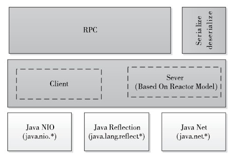

# RPC的整体架构
Hadoop RPC主要分为四个部分，分别是序列化层、函数调用层、网络传输层和服务器端处理框架，具体实现机制如下：
- 序列化层。主要作用是将结构化对象转为字节流以便于通过网络进行传输或写入持久存储，在RPC框架中，它主要用于将用户请求中的参数或者应答转化成字节流以便跨机器传输。Protocol Buffers和Apache Avro均可用在序列化层，Hadoop本身也提供了一套序列化框架，一个类只要实现Writable接口即可支持对象序列化与反序列化。
- 函数调用层。函数调用层主要功能是定位要调用的函数并执行该函数，Hadoop RPC采用了Java反射机制与动态代理实现了函数调用。
- 网络传输层。网络传输层描述了Client与Server之间消息传输的方式，Hadoop RPC采用了基于TCP/IP 的Socket机制。
- 服务器端处理框架。服务器端处理框架可被抽象为网络I/O模型，它描述了客户端与服务器端间信息交互方式，它的设计直接决定着服务器端的并发处理能力，常见的网络I/O模型有阻塞式I/O、非阻塞式I/O、事件驱动I/O等，而Hadoop RPC采用了基于Reactor设计模式的事件驱动I/O模型。

Hadoop RPC总体架构,自下而上可分为两层，第一层是一个基于Java NIO（New I/O）实现的C/S通信模型。其中，客户端将用户的调用方法及其参数封装成请求包后发送到服务器端。服务器端收到请求包后，经解包、调用函数、打包结果等一系列操作后，将结果返回给客户端。为了增强Sever端的扩展性和并发处理能力，Hadoop RPC采用了基于事件驱动的Reactor设计模式，在具体实现时，用到了JDK提供的各种功能包，主要包括java.nio（NIO）、java.lang.reflect（反射机制和动态代理）、java.net（网络编程库）等。第二层是供更上层程序直接调用的RPC接口，这些接口底层即为C/S通信模型
