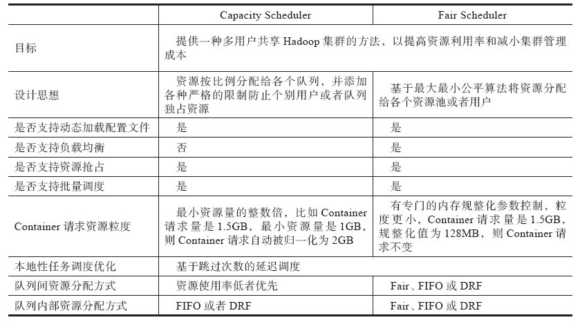

# 资源调度器基本架构

## 资源表示模型

- `yarn.nodemanager.resource.memory-mb`。可分配的物理内存总量，默认是8MB×1024，即8GB。

- `yarn.nodemanager.vmem-pmem-ratio`。任务使用单位物理内存量对应最多可使用的虚拟内存量，默认值是2.1，表示每使用1MB的物理内存，最多可以使用2.1MB的虚拟内存总量。
- `yarn.nodemanager.resource.cpu-vcores`。可分配的虚拟CPU个数，默认是8。为了更细粒度地划分CPU资源和考虑到CPU性能异构性，YARN允许管理员根据实际需要和CPU性能将每个物理CPU划分成若干个虚拟CPU，而管理员可为每个节点单独配置可用的虚拟CPU个数，且用户提交应用程序时，也可指定每个任务需要的虚拟CPU个数。

## 资源调度模型

### 双层资源调度模型

YARN采用了双层资源调度模型：在第一层中，ResourceManager中的资源调度器将资源分配给各个ApplicationMaster；在第二层中，ApplicationMaster再进一步将资源分配给它内部的各个任务。资源调度器主要关注的是第一层的调度问题，至于第二层的调度策略，完全由用户应用程序自己决定。
YARN的资源分配过程是异步的，资源调度器将资源分配给一个应用程序后，它不会立刻push给对应的ApplicationMaster，而是暂时放到一个缓冲区中，等待ApplicationMaster通过周期性的心跳主动来取。也就是说，YARN采用了pull-based通信模型，

### 资源保证机制

在分布式计算中，资源调度器需选择合适的资源保证这样的机制：当应用程序申请的资源暂时无法保证时，是优先为应用程序预留一个节点上的资源直到累计释放的空闲资源满足应用程序需求（称为“增量资源分配”，即Incremental placement），还是暂时放弃当前资源直到出现一个节点剩余资源一次性满足应用程序需求（称为“一次性资源分配”，all-or-nothing）。这两种机制均存在优缺点，对于增量资源分配而言，资源预留会导致资源浪费，降低集群资源利用率；而一次性资源分配则会产生饿死现象，即应用程序可能永远等不到满足资源需求的节点出现。
YARN采用了增量资源分配机制

### 资源分配算法
为了支持多维资源调度，YARN资源调度器采用了主资源公平调度算法（Dominant Resource Fairness，DRF），该算法扩展了最大最小公平（max-min fairness）算法，使其能够支持多维资源的调度。由于DRF被证明非常适合应用于多资源和复杂需求的环境中，因此被越来越多的系统采用，包括Apache Mesos。
在DRF算法中，将所需份额（资源比例）最大的资源称为主资源，而DRF的基本设计思想则是将最大最小公平算法应用于主资源上，进而将多维资源调度问题转化为单资源调度问题，即DRF总是最大化所有主资源中最小的

## 资源抢占模型

关于资源抢占的实现，通常涉及以下几个需认真考虑的问题

- 如何决定是否抢占某个队列的资源？
- 如何使资源抢占代价最小？

# Capacity Scheduler

CapacityScheduler是Yahoo!开发的多用户调度器，它以队列为单位划分资源，每个队列可设定一定比例的资源最低保证和使用上限，同时，每个用户也可设定一定的资源使用上限以防止资源滥用。而当一个队列的资源有剩余时，可暂时将剩余资源共享给其他队列。总之，Capacity Scheduler主要有以下几个特点：

- 容量保证
    管理员可为每个队列设置资源最低保证和资源使用上限，而所有提交到该队列的应用程序共享这些资源。
- 灵活性
    如果一个队列中的资源有剩余，可以暂时共享给那些需要资源的队列，而一旦该队列有新的应用程序提交，则其他队列释放的资源会归还给该队列。相比于HOD调度器，这种资源灵活分配的方式可明显提高资源利用率。
- 多重租赁
    支持多用户共享集群和多应用程序同时运行。为防止单个应用程序、用户或者队列独占集群中的资源，管理员可为之增加多重约束（比如单个应用程序同时运行的任务数等）。
- 安全保证
    每个队列有严格的ACL列表规定它的访问用户，每个用户可指定哪些用户允许查看自己应用程序的运行状态或者控制应用程序（比如杀死应用程序）。此外，管理员可指定队列管理员和集群系统管理员。
- 动态更新配置文件
    管理员可根据需要动态修改各种配置参数，以实现在线集群管理。

capacity-scheduler.xml

Capacity Scheduler的配置文件存放在`hadoop-yarn-project/hadoop-yarn/hadoop-yarn-server/hadoop-yarn-server-resourcemanager/conf/capacity-scheduler.xml`，在Capacity Scheduler的配置文件中，队列`queueX`的参数Y的配置名称为`yarn.scheduler.capacity.queueX.Y`，每个队列的配置参数有：

- 资源分配的相关参数
- 限制应用程序数目相关参数
- 队列访问和权限控制参数

# Fair Scheduler

Fair Scheduler的配置选项包括两部分：其中一部分在yarn-site.xml中，主要用于配置调度器级别的参数；另外一部分在一个自定义配置文件（默认是fair-scheduler.xml）中，主要用于配置各个队列的资源量、权重等信息。

FairScheduler是Facebook开发的多用户调度器，同Capacity Scheduler类似，它以队列为单位划分资源，每个队列可设定一定比例的资源最低保证和使用上限，同时，每个用户也可设定一定的资源使用上限以防止资源滥用；当一个队列的资源有剩余时，可暂时将剩余资源共享给其他队列。当然，Fair Scheduler也存在很多与CapacityScheduler不同之处，这主要体现在以下几个方面：

- 资源公平共享
    在每个队列中，Fair Scheduler可选择按照FIFO、Fair或DRF策略为应用程序分配资源。其中，Fair策略是一种基于最大最小公平算法实现的资源多路复用方式，默认情况下，每个队列内部采用该方式分配资源。这意味着，如果一个队列中有两个应用程序同时运行，则每个应用程序可得到1/2的资源；如果三个应用程序同时运行，则每个应用程序可得到1/3的资源。
- 支持资源抢占
    当某个队列中有剩余资源时，调度器会将这些资源共享给其他队列，而当该队列中有新的应用程序提交时，调度器要为它回收资源。为了尽可能降低不必要的计算浪费，调度器采用了先等待再强制回收
    的策略，即如果等待一段时间后尚有未归还的资源，则会进行资源抢占：从那些超额使用资源的队列中杀死一部分任务，进而释放资源。
- 负载均衡
    Fair Scheduler提供了一个基于任务数目的负载均衡机制，该机制尽可能将系统中的任务均匀分配到各个节点上。此外，用户也可以根据自己的需要设计负载均衡机制。
- 调度策略配置灵活
    Fair Scheduler允许管理员为每个队列单独设置调度策略（当前支持FIFO、Fair或DRF三种）。
- 提高小应用程序响应时间
    由于采用了最大最小公平算法，小作业可以快速获取资源并运行完成。

Fair Scheduler提供了更多样化的调度策略，它允许每个队列单独配置调度策略。当前共有三种策略可选，分别是FIFO、Fair和DRF，即先来先服务、公平调度和主资源公平调度。具体含义如下：

- FIFO：按照优先级高低调度，如果优先级相同，则按照提交时间先后顺序调度，如果提交时间也相同，则按照（队列或者应用程序）名称大小（字符串比较）调度。
- Fair：按照内存资源使用量比率调度，即按照used_memory/minShare大小调度（核心思想是按照该调度算法决定调度顺序，但还需考虑一些边界情况）。
- DRF：按照主资源公平调度算法进行调度，

