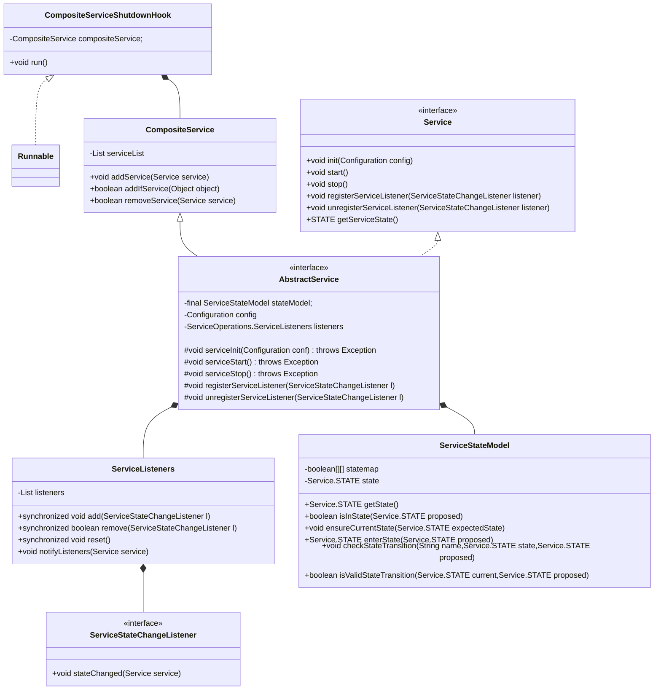
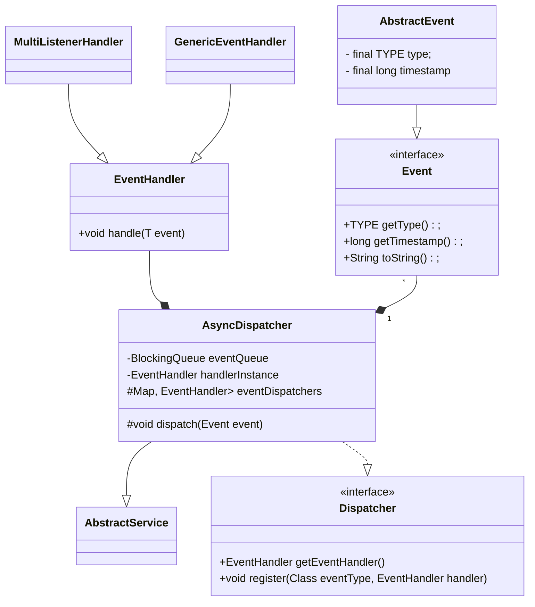

# 服务库和事件库
## 服务库
```java
package org.apache.hadoop.service;
```
相关实现位于`ohadoop-common-project/hadoop-common/src/main/java/org/apache/hadoop/service/`

```java
public interface Service extends Closeable {
        ......
public enum STATE {
    /** Constructed but not initialized */
    NOTINITED(0, "NOTINITED"),

    /** Initialized but not started or stopped */
    INITED(1, "INITED"),

    /** started and not stopped */
    STARTED(2, "STARTED"),

    /** stopped. No further state transitions are permitted */
    STOPPED(3, "STOPPED");
}

}
```


## 事件库
`package org.apache.hadoop.yarn.event`相关实现位于`hadoop-yarn-project/hadoop-yarn/hadoop-yarn-common/src/main/java/org/apache/hadoop/yarn/event`


