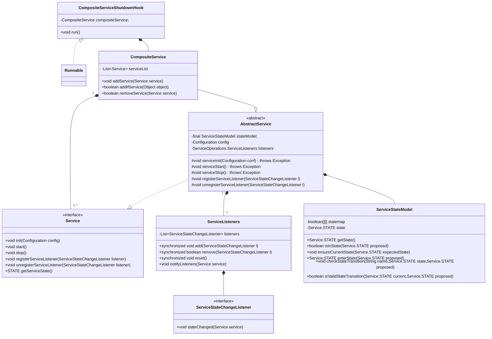
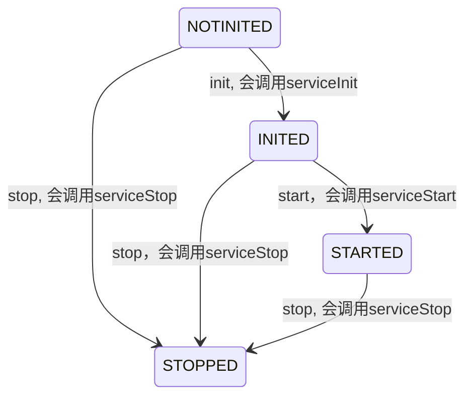
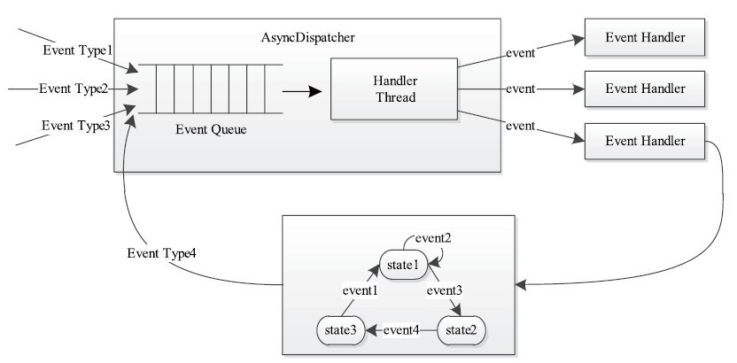
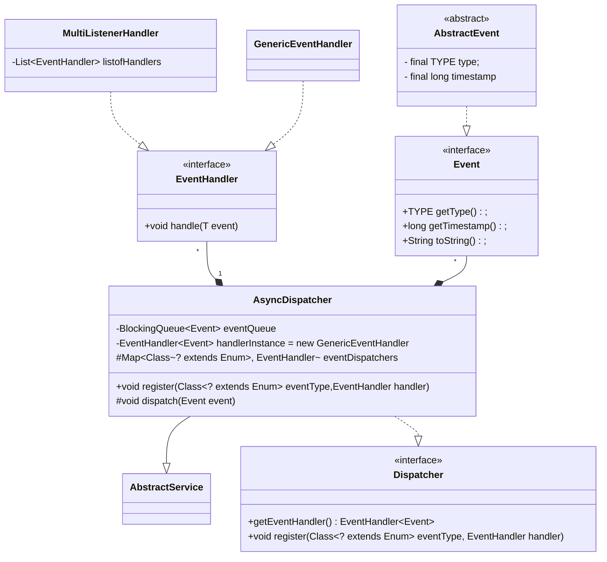
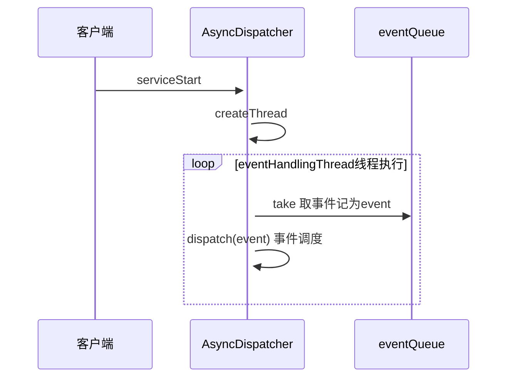
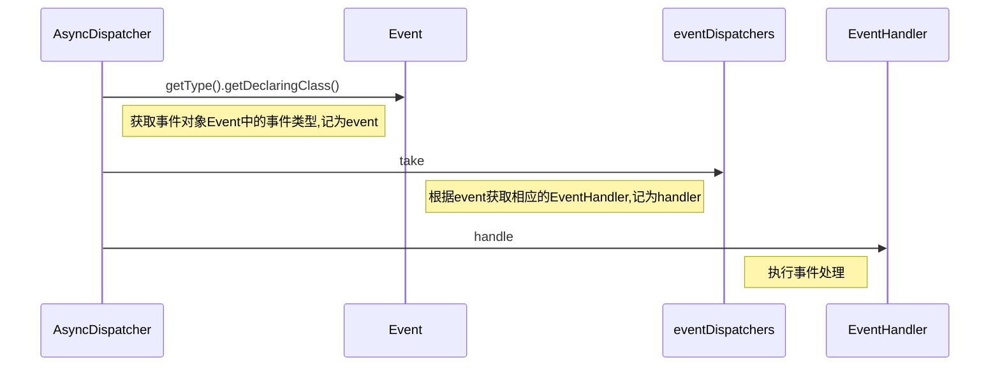

# 服务库和事件库
服务化和事件驱动软件设计思想的引入，使得YARN具有低耦合、高内聚的特点，各个模块只需完成各自功能，而模块之间则采用事件联系起来，系统设计简单且维护方便。
## 服务库
对于生命周期较长的对象，YARN采用基于服务的对象管理模型对其进行管理，该模型主要有以下几个特点。
- 将每个被服务化的对象分为4个状态：NOTINITED（被创建）、INITED（已初始化）、STARTED（已启动）、STOPPED（已停止）。
- 任何服务状态变化都可以触发另外一些动作。通过`AbstractService`实现，借助`init`,`start`,`stop`中进行状态机切换，在其内部实现用户特定逻辑的调用。
- 可通过组合的方式对任意服务进行组合，以便进行统一管理。通过`CompositeService`实现。

服务库源码位于包`package org.apache.hadoop.service`相关实现代码位于`ohadoop-common-project/hadoop-common/src/main/java/org/apache/hadoop/service/`目录内。

`Service`定义了最基本的服务初始化、启动、停止等操作，而`AbstractServic`e类提供一个最基本的`Service`实现。YARN中所有对象，如果是非组合服务，直接继承`AbstractService`类，否则需要继承`CompositeService`。比如，`ResourceManager`是一个组合服务，它组合了各种服务对象，包括`ClientRMService`,`ApplicationMasterLauncher`、`ApplicationMasterService`等。

服务库类图：


Yarn在`Service`中定义了`STATE`枚举表示服务状态
```java
public interface Service extends Closeable {
        ......
public enum STATE {
    /** Constructed but not initialized */
    NOTINITED(0, "NOTINITED"),

    /** Initialized but not started or stopped */
    INITED(1, "INITED"),

    /** started and not stopped */
    STARTED(2, "STARTED"),

    /** stopped. No further state transitions are permitted */
    STOPPED(3, "STOPPED");
}
```
在`AbstractService`的`init`,`start`,`stop`中进行状态机切换，通过`ServiceStateModel`进行状态切换有效性的检查和设置，并且在`AbstractService`提供了三个接口`serviceInit`, `serviceStart`, `serviceStop`，在允许的状态切换时调用相应的接口，因此用户只需要实现这三个接口，通过调用`init`,`start`,`stop`这三个接口实现一个状态机
```java
public abstract class AbstractService implements Service {
            ......
    protected void serviceInit(Configuration conf) throws Exception {
        if (conf != config) {
            LOG.debug("Config has been overridden during init");
            setConfig(conf);
        }
    }
    protected void serviceStart() throws Exception {}
    protected void serviceStop() throws Exception {}
}
```

状态机转换:


## 事件库
YARN采用基于事件驱动的并发模型，该模型能够大大增强并发性，从而提高系统整体性能。为了构建该模型，YARN将各种处理逻辑抽象成事件和对应事件调度器，并将每类事件的处理过程分割成多个步骤，用有限状态机表示。
<center>

<div>YARN的事件处理模型</div>
</center>
<br/>
处理的大致过程：处理请求会作为事件进入系统，由中央异步调度器(AsyncDispatcher)负责传递给相应事件调度器(EventHandler)。该事件调度器可能将该事件转发给另外一个事件调度器，也可能交给一个带有有限状态机的事件处理器，其处理结果也以事件的形式输出给中央异步调度器, 新的事件会再次被中央异步调度器转发给下一个事件调度器，直至处理完成(达到终止条件)。
<br/><br/>

YARN所有核心服务实际上都是一个中央异步调度器，包括`ResourceManager`、`NodeManager`等，它们维护了事先注册的事件与事件处理器，并根据接收的事件类型驱动服务的运行。
<br/>
事件库位于包`package org.apache.hadoop.yarn.event`相关实现位于`hadoop-yarn-project/hadoop-yarn/hadoop-yarn-common/src/main/java/org/apache/hadoop/yarn/event`目录下。

事件库类图：

中央异步调度器会在`serviceStart`时，在后台创建一个调度线程(`createThread`)进行取事件和事件调度。

`AsyncDispatcher`异步调度流程


事件调度执行流程，对应于`AsyncDispatcher::dispatch`接口
