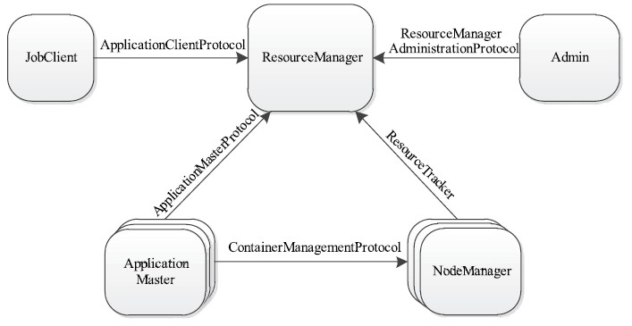

由于MRv1在扩展性、可靠性、资源利用率和多框架等方面存在明显不足，Apache开始尝试对MapReduce进行升级改造，于是诞生了更加先进的下一代MapReduce计算框架MRv2。由于MRv2将资源管理模块构建成了一个独立的通用系统YARN，这直接使得MRv2的核心从计算框架MapReduce转移为资源管理系统YARN。

# Yarn产生背景
YARN在MRv1基础上演化而来的，它克服了MRv1中的各种局限性[1]：
- 扩展性差。
在MRv1中，JobTracker同时兼备资源管理和作业控制两个功能，成为系统最大瓶颈，严重制约Hadoop集群扩展性。
- 可靠性差。
MRv1采用了master/slave结构，其中，master存在单点故障问题，一旦它出现故障将导致整个集群不可用。
- 资源利用率低
MRv1采用了基于槽位的资源分配模型，槽位是一种粗粒度的资源划分单位，通常一个任务不会用完槽位对应的资源，且其他任务也无法使用这些空闲资源。此外，Hadoop将槽位分为Map Slot和Reduce Slot两种，且不允许它们之间共享，常常会导致一种槽位资源紧张而另外一种闲置（比如一个作业刚刚提交时，只会运行MapTask，此时Reduce Slot闲置）。
- 无法支持多种计算框架
随着互联网高速发展，MapReduce这种基于磁盘的离线计算框架已经不能满足应用要求，从而出现了一些新的计算框架，包括内存计算框架、流式计算框架和迭代式计算框架等，而MRv1不能支持多种计算框架并存。

为克服上述缺点，Apache对Hadoop进行升级改造，进而诞生了更加先进的下一代MapReduce计算框架MRv2。Rv2将资源管理功能抽象成了一个独立的通用系统YARN，直接导致下一代MapReduce核心从单一的计算框架MapReduce转移为通用的资源管理系统YARN。以MapReduce为核心的软件栈中，资源管理系统YARN是可插拔替换的，比如选择Mesos替换YARN，一旦MapReduce接口改变，所有的资源管理系统的实现均需要跟着改变；但以YARN为核心的软件栈则不同，所有框架都需要实现YARN定义的对外接口以运行在YARN之上，这意味着Hadoop 2.0可以打造一个以YARN为核心的生态系统。

YARN实际上是一个弹性计算平台，朝着对多种框架进行统一管理的方向发展。相比于“一种计算框架一个集群”的模式，共享集群的模式存在多种好处：
- 资源利用率高
如果每个框架一个集群，则往往由于应用程序数量和资源需求的不均衡性，使得在某段时间内，有些计算框架的集群资源紧张，而另外一些集群资源空闲。共享集群模式则通过多种框架共享资源，使得集群中的资源得到更加充分的利用。
- 运维成本低
如果采用“一个框架一个集群”的模式，则可能需要多个管理员管理这些集群，进而增加运维成本，而共享模式通常需要少数管理员即可完成多个框架的统一管理。
- 数据共享
随着数据量的暴增，跨集群间的数据移动不仅需花费更长时间，且硬件成本也会大大增加，而共享集群模式可让多种框架共享数据和硬件资源，将大大减小数据移动带来的成本。

# Yarn基本设计思想
对比两代MapReduce的基本框架和编程模型理解YARN的基本设计思想。
## 两代MR基本框架对比
在Hadoop 1.0中，JobTracker由资源管理（由TaskScheduler模块实现）和作业控制（由JobTracker中多个模块共同实现）两部分组成，Hadoop对JobTracker赋予的功能过多而造成负载过重。从设计角度上看，Hadoop未能够将资源管理相关的功能与应用程序相关的功能分开，造成Hadoop难以支持多种计算框架。

下一代MapReduce框架的基本设计思想是将JobTracker的两个主要功能，即资源管理和作业控制（包括作业监控、容错等），分拆成两独立的进程，资源管理进程与具体应用程序无关，它负责整个集群的资源（内存、CPU、磁盘等）管理，而作业控制进程则是直接与应用程序相关的模块，且每个作业控制进程只负责管理一个作业。通过将原有JobTracker中与应用程序相关和无关的模块分开，不仅减轻了JobTracker负载，也使得Hadoop支持更多的计算框架。

从资源管理角度看，下一代MapReduce框架实际上衍生出了一个资源统一管理平台YARN，它使得Hadoop不再局限于仅支持MapReduce一种计算模型，而是可无限融入多种计算框架，且对这些框架进行统一管理和调度。

## 编程模型
- 编程模型与数据处理引擎：
MRv2重用了MRv1中的编程模型和数据处理引擎。为了能够让用户应用程序平滑迁移到Hadoop 2.0中，MRv2应尽可能保证编程接口的向后兼容性，但由于MRv2本身进行了改进和优化，它在向后兼容性方面存在少量问题。MapReduce应用程序编程接口有两套，分别是新API（mapred）和旧API（mapredue），MRv2可做到以下兼容性：采用MRv1旧API编写的应用程序，可直接使用之前的JAR包将程序运行在MRv2上；但采用MRv1新API编写的应用程序则不可以，需要使用MRv2编程库重新编译并修改不兼容的参数和返回值。
- 运行时环境：
MRv1的运行时环境主要由两类服务组成，分别是JobTracker和TaskTracker。其中，JobTracker负责资源和任务的管理与调度，TaskTracker负责单个节点的资源管理和任务执行。MRv1将资源管理和应用程序管理两部分混杂在一起，使得它在扩展性、容错性和多框架支持等方面存在明显缺陷。
MRv2则通过将资源管理和应用程序管理两部分剥离开，分别由YARN和ApplicationMaster负责，其中，YARN专管资源管理和调度，而ApplicationMaster则负责与具体应用程序相关的任务切分、任务调度和容错等。

# Yarn基本架构
YARN是Hadoop 2.0中的资源管理系统，总体上是Master/Slave结构它的基本设计思想是将MRv1中的JobTracker拆分成了两个独立的服务：
- 全局的资源管理器ResourceManager，负责整个系统的资源管理和分配。
- 每个应用程序特有的ApplicationMaster，负责单个应用程序的管理。

## 基本组成结构
在资源管理框架中，ResourceManager为Master，NodeManager为Slave，ResourceManager负责对各个NodeManager上的资源统一管理和调度。当用户提交应用程序时，需要提供用以跟踪和管理这个程序的ApplicationMaster，负责向ResourceManager申请资源，并要求NodeManger启动可以占用一定资源的任务。由于不同的ApplicationMaster被分布到不同的节点上，因此它们之间不会相互影响。

### ResourceManager（RM）
RM是一个全局的资源管理器，负责整个系统的资源管理和分配。它主要由两个组件构成：调度器（Scheduler）和应用程序管理器（Applications Manager，ASM）。

#### 调度器
调度器根据容量、队列等限制条件，将系统中的资源分配给各个正在运行的应用程序。调度器仅根据各个应用程序的资源需求进行资源分配，而资源分配单位用一个抽象概念“资源容器”（ResourceContainer，简称Container）表示，Container是一个动态资源分配单位，它将内存、CPU、磁盘、网络等资源封装在一起，从而限定每个任务使用的资源量。调度器是一个可插拔的组件，用户可根据自己的需要设计新的调度器，YARN提供了多种直接可用的调度器，比如Fair Scheduler和Capacity Scheduler等。要注意的是，该调度器是一个“纯调度器”，它不再从事任何与具体应用程序相关的工作，比如不负责监控或者跟踪应用的执行状态等，也不负责重新启动因应用执行失败或者硬件故障而产生的失败任务，这些均交由应用程序相关的ApplicationMaster完成。

#### 应用程序管理器
应用程序管理器负责管理整个系统中所有应用程序，包括应用程序提交、与调度器协商资源以启动ApplicationMaster、监控ApplicationMaster运行状态并在失败时重新启动它等。

### ApplicationMaster（AM）
用户提交的每个应用程序均包含一个AM，主要功能包括：
- 与RM调度器协商以获取资源（用Container表示）；
- 将得到的任务进一步分配给内部的任务；
- 与NM通信以启动/停止任务；
- 监控所有任务运行状态，并在任务运行失败时重新为任务申请资源以重启任务。
当前YARN自带了两个AM实现，一个是用于演示AM编写方法的实例程序distributedshell，它可以申请一定数目的Container以并行运行一个Shell命令或者Shell脚本；另一个是运行MapReduce应用程序的AM—MRAppMaster,一些其他的计算框架对应的AM正在开发中，比如Open MPI、Spark等。

### NodeManager（NM）
NM是每个节点上的资源和任务管理器，一方面，它会定时地向RM汇报本节点上的资源使用情况和各个Container的运行状态；另一方面，它接收并处理来自AM的Container启动/停止等各种请求。

### Container
Container是YARN中的资源抽象，它封装了某个节点上的多维度资源，如内存、CPU、磁盘、网络等，当AM向RM申请资源时，RM为AM返回的资源便是用Container表示的。YARN会为每个任务分配一个Container，且该任务只能使用该Container中描述的资源。需要注意的是，Container不同于MRv1中的slot，它是一个动态资源划分单位，是根据应用程序的需求动态生成的。

## RPC通信协议
YARN实际上采用的是拉式（pull-based）通信模型。YARN主要由以下几个RPC协议组成：
- JobClient（作业提交客户端）与RM之间的协议—ApplicationClientProtocol：JobClient通过该RPC协议提交应用程序、查询应用程序状态等。
- Admin（管理员）与RM之间的通信协议—ResourceManagerAdministrationProtocol：Admin通过该RPC协议更新系统配置文件，比如节点黑白名单、用户队列权限等。
- AM与RM之间的协议—ApplicationMasterProtocol：AM通过RPC协议向RM注册和撤销自己，并为各个任务申请资源。
- AM与NM之间的协议—ContainerManagementProtocol：AM通过RPC要求NM启动或者停止Container，获取各个Container的使用状态等信息。
- NM与RM之间的协议—ResourceTracker：NM通过该RPC协议向RM注册，并定时发送心跳信息汇报当前节点的资源使用情况和Container运行情况。

# Yarn工作流程
当用户向YARN中提交一个应用程序后，YARN将分两个阶段运行该应用程序：第一个阶段是启动ApplicationMaster；第二个阶段是由ApplicationMaster创建应用程序，为它申请资源，并监控它的整个运行过程，直到运行完成。

YARN的工作流程分为以下几个步骤：
- 步骤1　用户向YARN中提交应用程序，其中包括ApplicationMaster程序、启动ApplicationMaster的命令、用户程序等。
- 步骤2　ResourceManager为应用程序分配第一个Container，并与对应的NodeManager通信，要求它在这个Container中启动应用程序的ApplicationMaster。
- 步骤3　ApplicationMaster首先向ResourceManager注册，这样用户可以直接通过ResourceManage查看应用程序的运行状态，然后它将为各个任务申请资源，并监控它的运行状态，直到运行结束，即重复步骤4~7。
- 步骤4　ApplicationMaster采用轮询的方式通过RPC协议向ResourceManager申请和领取资源。
- 步骤5　一旦ApplicationMaster申请到资源后，便与对应的NodeManager通信，要求它启动任务。
- 步骤6　NodeManager为任务设置好运行环境（包括环境变量、JAR包、二进制程序等）后，将任务启动命令写到一个脚本中，并通过运行该脚本启动任务。
- 步骤7　各个任务通过某个RPC协议向ApplicationMaster汇报自己的状态和进度，以让ApplicationMaster随时掌握各个任务的运行状态，从而可以在任务失败时重新启动任务。在应用程序运行过程中，用户可随时通过RPC向ApplicationMaster查询应用程序的当前运行状态。
- 步骤8　应用程序运行完成后，ApplicationMaster向ResourceManager注销并关闭自己。

# 参考资料
1. 《Hadoop技术内幕：深入解析Yarn架构设计和实现原理》
2. 
