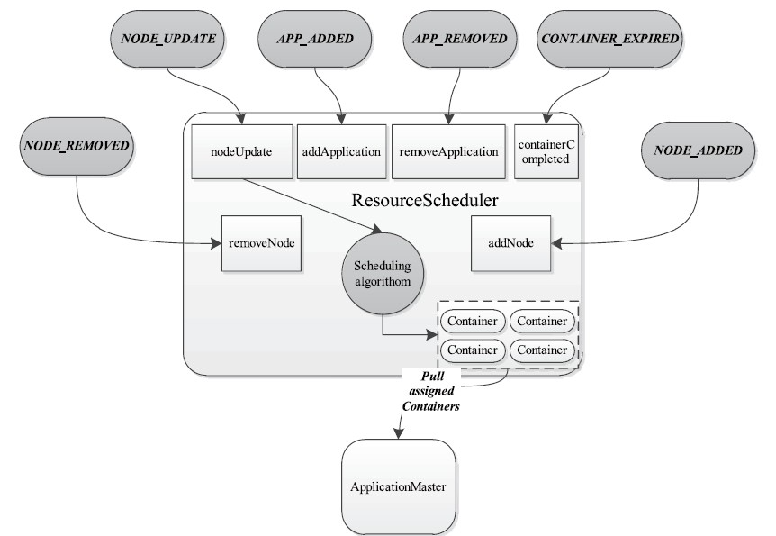
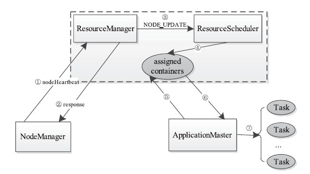
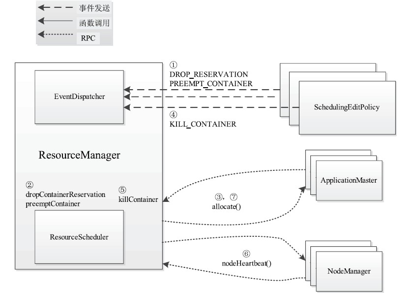

资源调度器是Hadoop YARN中最核心的组件之一，它是ResourceManager中的一个插拔式服务组件，负责整个集群资源的管理和分配。

从目前看来，主要有两种多用户资源调度器的设计思路：
- 在一个物理集群上虚拟多个Hadoop集群，这些集群各自拥有全套独立的Hadoop服务，典型代表是HOD（Hadoop On Demand）调度器
- 扩展YARN调度器，使之支持多个队列多用户,允许管理员按照应用需求对用户或者应用程序分组，并为不同的分组分配不同的资源量，同时通过添加各种约束防止单个用户或者应用程序独占资源，进而能够满足各种QoS需求，典型的代表是Yahoo!的Capacity Scheduler和Facebook的Fair Scheduler

|配置参数|默认配置|简介|
|:--:|:--:|:--:|
|yarn.resourcemanager.scheduler.class|org.apache.hadoop.yarn.server.resourcemanager.scheduler.capacity.CapacityScheduler|资源调度器配置，默认采用Capacity调度器|
|yarn.scheduler.configuration.store.class|file|调度器配置存储|
|yarn.scheduler.maximum-allocation-mb|8192M ||
|yarn.scheduler.minimum-allocation-mb|1024 ||
|yarn.scheduler.minimum-allocation-vcores|1||
|yarn.scheduler.maximum-allocation-vcores|4||

## YARN资源调度器的基本架构
资源调度器是YARN中最核心的组件之一，且是插拔式的，它定义了一整套接口规范以便用户可按照需要实现自己的调度器。YARN自带了FIFO、Capacity Scheduler和FairScheduler三种常用资源调度器，用户可按照接口规范编写一个新的资源调度器，并通过简单的配置使它运行起来。

（1） 可插拔性实现
YARN中的资源调度器是插拔式的，ResourceManager在初始化时会根据用户的配置创建一个资源调度器对象。
```java
  /**
   * @brief:    根据用户的配置创建一个资源调度器对象，默认采用Capacity Scheduler
   * */
  protected ResourceScheduler createScheduler() {
    // 通过yarn.resourcemanager.scheduler.class来配置资源调度器
    // 默认采用org.apache.hadoop.yarn.server.resourcemanager.scheduler.capacity.CapacityScheduler
    String schedulerClassName = conf.get(YarnConfiguration.RM_SCHEDULER,
        YarnConfiguration.DEFAULT_RM_SCHEDULER);
    LOG.info("Using Scheduler: " + schedulerClassName);
    try {
      // 采用反射创建调度器
      Class<?> schedulerClazz = Class.forName(schedulerClassName);
      if (ResourceScheduler.class.isAssignableFrom(schedulerClazz)) {
        return (ResourceScheduler) ReflectionUtils.newInstance(schedulerClazz,
            this.conf);
      } else {
        throw new YarnRuntimeException("Class: " + schedulerClassName
            + " not instance of " + ResourceScheduler.class.getCanonicalName());
      }
    } catch (ClassNotFoundException e) {
      throw new YarnRuntimeException("Could not instantiate Scheduler: "
          + schedulerClassName, e);
    }
  }
```
所有的资源调度器均应该实现接口`org.apache.hadoop.yarn.server.resourcemanager.scheduler.ResourceScheduler`
```java
public interface ResourceScheduler extends YarnScheduler, Recoverable {

  void setRMContext(RMContext rmContext);

  // 重新初始化ResourceScheduler，通常在ResourceManager初始化时调用(包括主备ResourceManager切换)
  void reinitialize(Configuration conf, RMContext rmContext) throws IOException;

  List<NodeId> getNodeIds(String resourceName);

  boolean attemptAllocationOnNode(SchedulerApplicationAttempt appAttempt,
      SchedulingRequest schedulingRequest, SchedulerNode schedulerNode);

  void resetSchedulerMetrics();
}
```

```java
public interface YarnScheduler extends EventHandler<SchedulerEvent> {
  
  // 获取一个队列的基本信息，queueName为队列名称
  // includeChildQueues表示是否包含子队列
  // recursive表示是否递归返回其子队列的信
  public QueueInfo getQueueInfo(String queueName, boolean includeChildQueues,
      boolean recursive) throws IOException;

  // 返回当前用户队列的ACL权限
  public List<QueueUserACLInfo> getQueueUserAclInfo();

  // 获取当前调度器可分配的所有资源
  public Resource getClusterResource();

  // 获取当前调度器最少可分配的资源
  public Resource getMinimumResourceCapability();
  
  // 获取当前调度器最多可分配的资源
  public Resource getMaximumResourceCapability();

  public Resource getMaximumResourceCapability(String queueName);

  ResourceCalculator getResourceCalculator();

  // 获取当前集群可用节点总数
  public int getNumClusterNodes();
  
  /*    ApplicationMaster和资源调度器之间最主要的API
        ApplicationMaster通过该API更新资源需求和待释放的Container列表，其中
            appAttemptId为应用程序实例ID，ask为新请求资源的描述
            release为待释放Container列表
            blacklistAdditions为待加入黑名单的节点列表
            blacklistRemovals为待移除黑名单的节点列
  */
  Allocation allocate(ApplicationAttemptId appAttemptId,
      List<ResourceRequest> ask, List<SchedulingRequest> schedulingRequests,
      List<ContainerId> release, List<String> blacklistAdditions,
      List<String> blacklistRemovals, ContainerUpdates updateRequests);

  // 获取节点资源使用情况报告
  public SchedulerNodeReport getNodeReport(NodeId nodeId);
  
  // 获取运行实例appAttemptId的SchedulerAppReport对象
  SchedulerAppReport getSchedulerAppInfo(ApplicationAttemptId appAttemptId);

  // 获取运行实例appAttemptId的SchedulerAppReport对象
  ApplicationResourceUsageReport getAppResourceUsageReport(
      ApplicationAttemptId appAttemptId);
  
  // 获取root队列的Metric信息
  QueueMetrics getRootQueueMetrics();

  boolean checkAccess(UserGroupInformation callerUGI,
      QueueACL acl, String queueName);
  
  // Gets the apps under a given queue
  public List<ApplicationAttemptId> getAppsInQueue(String queueName);

  // Get the container for the given containerId.
  public RMContainer getRMContainer(ContainerId containerId);

  public String moveApplication(ApplicationId appId, String newQueue)
      throws YarnException;

  public void preValidateMoveApplication(ApplicationId appId,
      String newQueue) throws YarnException;

  // Completely drain sourceQueue of applications, by moving all of them to destQueue.
  void moveAllApps(String sourceQueue, String destQueue) throws YarnException;

  // Terminate all applications in the specified queue.
  void killAllAppsInQueue(String queueName) throws YarnException;

  /**
   * Remove an existing queue. Implementations might limit when a queue could be
   * removed (e.g., must have zero entitlement, and no applications running, or
   * must be a leaf, etc..).
   */
  void removeQueue(String queueName) throws YarnException;

  /**
   * Add to the scheduler a new Queue. Implementations might limit what type of
   * queues can be dynamically added (e.g., Queue must be a leaf, must be
   * attached to existing parent, must have zero entitlement).
   */
  void addQueue(Queue newQueue) throws YarnException, IOException;

  void setEntitlement(String queue, QueueEntitlement entitlement)
      throws YarnException;

  // Gets the list of names for queues managed by the Reservation System
  public Set<String> getPlanQueues() throws YarnException;  

  // Return a collection of the resource types that are considered when scheduling
  public EnumSet<SchedulerResourceTypes> getSchedulingResourceTypes();

  // Verify whether a submitted application priority is valid as per configured Queue
  public Priority checkAndGetApplicationPriority(Priority priorityRequestedByApp,
      UserGroupInformation user, String queuePath, ApplicationId applicationId)
      throws YarnException;

  // Change application priority of a submitted application at runtime
  public Priority updateApplicationPriority(Priority newPriority,
      ApplicationId applicationId, SettableFuture<Object> future,
      UserGroupInformation user) throws YarnException;

  // Get previous attempts' live containers for work-preserving AM restart.
  List<Container> getTransferredContainers(ApplicationAttemptId appAttemptId);

  // Set the cluster max priority
  void setClusterMaxPriority(Configuration conf) throws YarnException;

  List<ResourceRequest> getPendingResourceRequestsForAttempt(
      ApplicationAttemptId attemptId);

  // Get pending scheduling request for specified application attempt.
  List<SchedulingRequest> getPendingSchedulingRequestsForAttempt(
      ApplicationAttemptId attemptId);

  // Get cluster max priority.
  Priority getMaxClusterLevelAppPriority();

  // Get SchedulerNode corresponds to nodeId.
  SchedulerNode getSchedulerNode(NodeId nodeId);

  /**
   * Normalize a resource request using scheduler level maximum resource or
   * queue based maximum resource.
   */ 
  Resource getNormalizedResource(Resource requestedResource,
      Resource maxResourceCapability);

  // Verify whether a submitted application lifetime is valid as per configured Queue lifetime.
  long checkAndGetApplicationLifetime(String queueName, long lifetime);

  // Get maximum lifetime for a queue,单位秒
  long getMaximumApplicationLifetime(String queueName);
}
```
`Recoverable`接口定义
```java
public interface Recoverable {
  // ResourceManager重启后将调用该函数恢复调度器内部的信息
  public void recover(RMState state) throws Exception;
}
```

（2）事件处理器
YARN的资源管理器实际上是一个事件处理器，它需要处理`SchedulerEventType`类型的事件，并根据事件的具体含义进行相应的处理


- NODE_REMOVED：表示集群中移除了一个计算节点（可能是节点故障或者管理员主动移除），资源调度器收到该事件时需要从可分配资源总量中移除相应的资源量。
- NODE_ADDED：表示集群中增加了一个计算节点，资源调度器收到该事件时需要将新增的资源量添加到可分配资源总量中。
- APPLICATION_ADDED：表示ResourceManager收到一个新的Application。通常而言，资源管理器需要为每个Application维护一个独立的数据结构，以便于统一管理和资源分配。资源管理器需将该Application添加到相应的数据结构中。
- APPLICATION_REMOVED：表示一个Application运行结束（可能成功或者失败），资源管理器需将该Application从相应的数据结构中清除。
- CONTAINER_EXPIRED：当资源调度器将一个Container分配给某个Application-Master后，如果该ApplicationMaster在一定时间间隔内没有使用该Container，则资源调度器会对该Container进行（回收后）再分配。
- NODE_UPDATE：ResourceManager收到NodeManager通过心跳机制汇报的信息后，会触发一个NODE_UDDATE事件，由于此时可能有新的Container得到释放，因此该事件会触发资源分配。也就是说，该事件是6个事件中最重要的事件，它会触发资源调度器最核心的资源分配机制。

## 资源表示模型
NodeManager启动时会向ResourceManager注册，注册信息中包含该节点可分配的CPU和内存总量，这两个值均可通过配置选项设置
|配置参数|默认值|描述|
|:--:|:--:|:--:|
|yarn.nodemanager.resource.memory-mb|8MB×1024，即8GB|可分配的物理内存总量|
|yarn.nodemanager.vmem-pmem-ratio|2.1|任务使用单位物理内存量对应最多可使用的虚拟内存量，默认值是2.1，表示每使用1MB的物理内存，最多可以使用2.1MB的虚拟内存总量|
|yarn.nodemanager.resource.cpu-vcores|8|可分配的虚拟CPU个数,为了更细粒度地划分CPU资源和考虑到CPU性能异构性，YARN允许管理员根据实际需要和CPU性能将每个物理CPU划分成若干个虚拟CPU，而管理员可为每个节点单独配置可用的虚拟CPU个数，且用户提交应用程序时，也可指定每个任务需要的虚拟CPU个数|
|yarn.nodemanager.resource.pcores-vcores-multiplier|1|物理核心到虚拟Core的放大倍数|

YARN支持的调度语义和不支持的调度语义：

(1) YARN支持的调度语义[1]
- 请求某个特定节点上的特定资源量。比如，请求节点nodeX上5个这样的Container：虚拟CPU个数为2，内存量为2GB。
- 请求某个特定机架上的特定资源量。比如，请求机架rackX上3个这样的Container：虚拟CPU个数为4，内存量为3GB。
- 将某些节点加入（或移除）黑名单，不再为自己分配这些节点上的资源。比如，ApplicationMaster发现节点nodeX和nodeY失败的任务数目过多，可请求将这两个节点加入黑名单，从而不再收到这两个节点上的资源，过一段时间后，可请求将nodeX移除黑名单，从而可再次使用该节点上的资源。
- 请求归还某些资源。比如，ApplicationMaster已获取的来自节点nodeX上的2个Container暂时不用了，可将之归还给集群，这样这些资源可再次分配给其他应用程序。

(2) YARN不支持的调度语义[1]
- 请求任意节点上的特定资源量。比如，请求任意节点上5个这样的Container：虚拟CPU个数为3，内存量为1GB。
- 请求任意机架上的特定资源量。比如，请求同一个机架上（具体哪个机架并不关心，但是必须来自同一个机架）3个这样的Container：虚拟CPU个数为1，内存量为6GB。
- 请求一组或几组符合某种特质的资源
  > 比如，请求来自两个机架上的4个Container，其中，一个机架上2个这样的Container：虚拟CPU个数为2，内存量为2GB；另一个机架上2个这样的资源：虚拟CPU个数为2，内存量为3GB。如果目前集群没有这样的资源，要从其他应用程序处抢占资源。
- 超细粒度资源。比如CPU性能要求、绑定CPU等。
- 动态调整Container资源，应允许根据需要动态调整Container资源量（对于长作业尤其有用）。

## 资源调度模型

### 双层资源调度模型
YARN采用了双层资源调度模型：在第一层中，ResourceManager中的资源调度器将资源分配给各个ApplicationMaster；在第二层中，ApplicationMaster再进一步将资源分配给它内部的各个任务。

YARN的资源分配过程是异步的，资源调度器将资源分配给一个应用程序后，它不会立刻push给对应的ApplicationMaster，而是暂时放到一个缓冲区中，等待ApplicationMaster通过周期性的心跳主动来取。YARN采用了pull-based通信模型。

在YARN中，资源分配过程可概括为以下7个步骤：
步骤1　NodeManager通过周期性心跳汇报节点信息。
步骤2　ResourceManager为NodeManager返回一个心跳应答，包括需释放的Container列表等信息。
步骤3　ResourceManager收到来自NodeManager的信息后，会触发一个NODE_UPDATE事件。
步骤4　ResourceScheduler收到NODE_UPDATE事件后，会按照一定的策略将该节点上的资源（步骤2中有释放的资源）分配各应用程序，并将分配结果放到一个内存数据结构中。
步骤5　应用程序的ApplicationMaster向ResourceManager发送周期性的心跳，以领取最新分配的Container。
步骤6　ResourceManager收到来自ApplicationMaster心跳信息后，为它分配的container将以心跳应答的形式返回给ApplicationMaster。
步骤7　ApplicationMaster收到新分配的container列表后，会将这些Container进一步分配给它内部的各个任务。


资源调度器关注的是步骤4中采用的策略，即如何将节点上空闲的资源分配给各个应用程序，至于步骤7中的策略，则完全由用户应用程序自己决定。

### 资源保证机制
在分布式计算中，资源调度器需选择合适的资源保证这样的机制：当应用程序申请的资源暂时无法保证时，是优先为应用程序预留一个节点上的资源直到累计释放的空闲资源满足应用程序需求（称为“增量资源分配”，即Incremental placement），还是暂时放弃当前资源直到出现一个节点剩余资源一次性满足应用程序需求（称为“一次性资源分配”，all-or-nothing）。这两种机制均存在优缺点，对于增量资源分配而言，资源预留会导致资源浪费，降低集群资源利用率；而一次性资源分配则会产生饿死现象，即应用程序可能永远等不到满足资源需求的节点出现。

YARN采用了增量资源分配机制，尽管这种机制会造成浪费，但不会出现饿死现象

### 资源分配算法
为了支持多维资源调度，YARN资源调度器采用了主资源公平调度算法（DominantResource Fairness，DRF），该算法扩展了最大最小公平（max-min fairness）算法，使其能够支持多维资源的调度。由于DRF被证明非常适合应用于多资源和复杂需求的环境中，因此被越来越多的系统采用，包括Apache Mesos。
在DRF算法中，将所需份额（资源比例）最大的资源称为主资源，而DRF的基本设计思想则是将最大最小公平算法应用于主资源上，进而将多维资源调度问题转化为单资源调度问题，即DRF总是最大化所有主资源中最小的，其算法伪代码如下：
```java
function void DRFScheduler()
  R ← <r1, …, rm>;   //m种资源对应的容量
  C ← <c1, …, cm>;  //已用掉的资源，初始值为0
  si (i = 1..n);  //用户（或者框架）i的主资源所需份额，初始化为0
  Ui← <ui,1, …, ui,m> (i = 1..n)  // 分配给用户i的资源，初始化为0
  挑选出主资源所需份额si最小的用户i；
  Di ← {用户i的下一个任务需要的资源量}；
  if C + Di <= R then
    //将资源分配给用户i
    C ← C + Di; //更新C
    Ui ← Ui + Di; //更新U
    si = maxmj=1{ui,j/rj};
   else
    return; //资源全部用完
   end if
end function
```

### 资源抢占模型
资源调度器中，每个队列可设置一个最小资源量和最大资源量，其中，最小资源量是资源紧缺情况下每个队列需保证的资源量，而最大资源量则是极端情况下队列也不能超过的资源使用量。资源抢占发生的原因则完全是由于“最小资源量”这一概念。通常而言，为了提高资源利用率，资源调度器（包括Capacity Scheduler和Fair Scheduler）会将负载较轻的队列的资源暂时分配给负载重的队列（即最小资源量并不是硬资源保证，当队列不需要任何资源时，并不会满足它的最小资源量，而是暂时将空闲资源分配给其他需要资源的队列），仅当负载较轻队列突然收到新提交的应用程序时，调度器才进一步将本属于该队列的资源分配给它。但由于此时资源可能正被其他队列使用，因此调度器必须等待其他队列释放资源后，才能将这些资源“物归原主”，这通常需要一段不确定的等待时间。为了防止应用程序等待时间过长，调度器等待一段时间后若发现资源并未得到释放，则进行资源抢占

当启用的调度器实现了PreemptableResourceScheduler接口，且参数yarn.resourcemanager.scheduler.monitor.enable的值被置为true（默认值为false）时，ResourceManager才启用资源抢占功能。资源抢占是通过第三方策略触发的，这些策略通常被实现成一些插拔式的组件类（实现SchedulingEditPolicy接口），并通过参数yarn.resourcemanager.scheduler.monitor.policies指定（默认情况下，YARN提供了默认实现ProportionalCapacityPreemptionPolicy）。ResourceManager将依次遍历这些策略类，并由监控类SchedulingMonitor进一步封装它们，SchedulingMonitor将周期性调用策略类中的editSchedule()函数，以决定抢占哪些Container的资源

YARN中，资源抢占整个过程可概括为如下步骤：
- 步骤1　SchedulingEditPolicy探测到需要抢占的资源，将需要抢占的资源通过事件DROP_RESERVATION和PREEMPT_CONTAINER发送给ResourceManager。
- 步骤2　ResourceManager调用ResourceScheduler的dropContainerReservation和preempt-Container函数，标注待抢占的Container。
- 步骤3　ResourceManager收到来自ApplicationMaster的心跳信息，并通过心跳应答将待释放的资源总量和待抢占Container列表发返回给它。ApplicationMaster收到该列表后，可选择如下操作：
    - 1）杀死这些Container。
    - 2）选择并杀死其他Container以凑够总量。
    - 3）不做任务处理，过段时间可能有Container自行释放资源或者由ResourceManager杀死Container。
- 步骤4　SchedulingEditPolicy探测到一段时间内，ApplicationMaster未自行杀死约定的Container，则将这些Container封装到KILL_CONTAINER事件中发送给ResourceManager。
步骤5　ResourceManager调用ResourceScheduler的killContainer函数，而Resource-Scheduler则标注这些待杀死的Container。
- 步骤6　ResourceManager收到来自NodeManager的心跳信息，并通过心跳应答将待杀死的Container列表返回给它，NodeManager收到该列表后，将这些Container杀死，并通过心跳告知ResourceManager。
- 步骤7　ResourceManager收到来自ApplicationMaster的心跳信息，并通过心跳应答将已经杀死的Container列表发送给它（可能ApplicationMaster早已通过内部通信机制知道了这些被杀死的Container）。


**关于资源抢占的实现，通常涉及以下几个需认真考虑的问题：**
1. 如何决定是否抢占某个队列的资源？
> 在YARN中，队列是按照树形结构组织的，一个队列当前实际可以使用的资源量R取决于最小资源量A（由管理员配置）、队列资源需求量B（处于等待或者运行状态的应用程序尚需的资源总量）和同父兄弟队列的空闲资源量C（多余资源可共享给其他队列），这意味着R在不同时间点的取值是不同的，可以按照递归算法求出R=F(A,B,C)，如果一个队列当前正在使用资源量U>R，则需从该队列中抢占(U–R)资源

2. 如何使资源抢占代价最小？
> 资源抢占是通过杀死正在使用的资源Container实现的，由于这些Container已经处于运行状态，直接杀死Container会导致已经完成的计算白白浪费。为了尽可能避免资源浪费，YARN优先选择优先级低的Container作为资源抢占对象，且不会立刻杀死Container，而是将释放资源的任务留给应用程序自己：ResourceManager将待杀死的Container列表发送给对应的ApplicationMaster，以期望它采取一定的机制自行释放这些Container占用的资源，比如先进行一些状态保存工作后，再将对应的Container杀死，以避免计算浪费，如果一段时间后，ApplicationMaster尚未主动杀死这些Container，则ResourceManager再强制杀死这些Container

## 调度器实现

### Capacity Scheduler
实现位于`hadoop-yarn-project/hadoop-yarn/hadoop-yarn-server/hadoop-yarn-server-resourcemanager/src/main/java/org/apache/hadoop/yarn/server/resourcemanager/scheduler/capacity/CapacityScheduler.java`

#### 事件处理
```java
public void handle(SchedulerEvent event) {

}
```