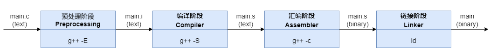

# CPP编译
C/C++源文件是按编译单元(translation unit)分开、独立编译的。所谓translation unit，其实就是输入给编译器的source code，只不过该source code是经过预处理(preprocessed​，包括去掉注释、宏替换、头文件展开)的。在本例中，即便你使用 g++ add.cpp main.cpp -o main.exe ，编译器也是分别编译 add.cpp 和 main.cpp （注意是预处理后的）的。在编译 add.cpp 时，编译器根本感知不到 main.cpp 的存在，反之同理。

    

