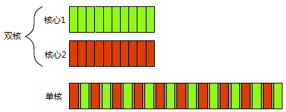

1. 什么是并发？并发和并行的区别？
2. 如何实现并发，并发的方式有哪些？
3. 为什么要并发？
4. 什么时候需要采用并发？什么时候要避免并发？

---

# 什么是并发

并发(concurrency)是两个或多个活动在同一时段内发生。与之相近的概念是并行，它指的是同一时刻内同事处理多个操作，强调同一时间点同时发生。

<table>
    <tr>
        <td>
             <center>
            	
                 <b><div>并发</div></b>
            </center>
        </td>
        <td>
            <center>
            	
                <b><div>并行</div></b>
            </center>
        </td>
    </tr>
</table>

就多线程代码而言，并发与并行(parallel)的含义很大程度上相互重叠..使用可调配的硬件资源同时运行多个任务，但并行更强调性能。

- 当人们谈及并行时，主要关心的是<b><font color=FF8633>利用可调配的硬件资源提升大规模数据处理的性能</font></b>
- 当谈及并发时，<b><font color=FF8633>主要关心的是分离关注点或响应能力</font></b>。

这两个术语之间并非泾渭分明，它们之间仍有很大程度的重叠


## 硬件并发和任务切换

很久之前，大多计算机都仅有一个处理器，处理器内只有单一处理单元或单个内核, 这种计算机在同一时刻只能处理一个任务。每秒内它可以在各个任务之间多次切换，先处理某任务的一小部分，接着切换任务，同样只处理一小部分，其他任务同理, 看起来所有任务都同时执行，称为<b><font color=FF8633>任务切换</font></b>。由于任务飞速切换，我们难以分辨处理器到底在哪一刻暂停某个任务而切换到另一个。任务切换制造出并发的表象。现今，基于一芯多核处理器（简称多核处理器）的计算机日渐普及，多核处理器也用在台式计算机上。无论是装配多个处理器，还是单个多核处理器，或是多个多核处理器，这些计算机都能真正并行运作多个任务，称之为<b><font color=FF8633>硬件并发(hardware concurrency)</font></b>。

下面是一种理想化情景，计算机有两个任务要处理，将它们进行十等分。在双核机（具有两个处理核）上，两个任务在各自的核上分别执行。另一台单核机则切换任务，交替执行任务小段，但任务小段之间略有间隔。

- 双核处理器并行执行(<b>硬件并发</b>）对比单核处理器并发执行(<b>任务上下文切换</b>)

<center>
    
    <b><div>两种并发方式:双核机上的并发执行与单核机上的任务切换</div></b>
</center>

- 双核处理器均并发执行(一般任务数远大于处理器核心数，多核并发更常见)

<center>
    
    <div>两种并发方式:双核机上的并发执行与单核机上的任务切换</div>

单核机的任务小段被灰色小条隔开，它们比双核机的分隔条粗大。<b><font color=FF8633>为了交替执行，每当系统从某一个任务切换到另一个时，就必须完成一次上下文切换(context switch)，于是耗费了时间。</font></b>若要完成一次上下文切换，则操作系统需保存当前任务的CPU状态和指令指针，判定需要切换到哪个任务，并为之重新加载CPU状态。接着，CPU有可能需要将新任务的指令和数据从内存加载到缓存，这或许会妨碍CPU，令其无法执行任何指令，加剧延迟。

**尽管多处理器或多核系统明显更适合硬件并发，不过有些处理器也能在单核上执行多线程。真正需要注意的关键因素是硬件支持的线程数(hardware threads)，也就是硬件自身真正支持同时运行的独立任务的数量.** 即便是真正支持硬件并发的系统，任务的数量往往容易超过硬件本身可以并行处理的数量，因而在这种情形下任务切换依然有用. **实践中，很多问题会导致任务切分不均匀或调度不规则。**


# 并发的方式

首先了解几个概念:

- 任务：从认知角度抽象出来的一个概念，放到计算机上主要指由软件完成的一个活动。一个任务既可以是一个进程,也可以是一个线程。简而言之，它指的是一系列共同达到某一目的的操作。例如,读取数据并将数据放入内存中。这个任务可以作为一个进程来实现,也可以作为一个线程（或作为一个中断任务）来实现。
- <b><font color=FF8633>进程：资源分配的基本单位，也可能作为调度运行的单位。</font></b>可以把一个进程看成是一个独立的程序,在内存中有其完备的数据空间和代码空间。一个进程所拥有的数据和变量只属于它自己。例如，用户运行自己的程序，系统就创建一个进程，并为它分配资源，包括各种表格、内存空间、磁盘空间、I／O设备等。然后，把该进程放人进程的就绪队列。进程调度程序选中它，为它分配CPU以及其它有关资源，该进程才真正运行。所以，进程是系统中的并发执行的单位。
- <b><font color=FF8633>线程：执行处理器调度的基本单位。</font></b>一个进程由一个或多个线程构成，各线程共享相同的代码和全局数据，但各有其自己的堆栈。由于堆栈是每个线程一个，所以局部变量对每一线程来说是私有的。由于所有线程共享同样的代码和全局数据，它们比进程更紧密，比单独的进程间更趋向于相互作用，线程间的相互作用更容易些,因为它们本身就有某些供通信用的共享内存：进程的全局数据。

### 多进程并发
在应用软件内部，将应用软件拆分成多个独立进程同时运行。独立进程可以通过所有常规的进程间通信途径相互传递信息(信号、套接字、文件、管道等).进程间通信普遍存在短处：
- 或设置复杂，或速度慢，甚至二者兼有，因为操作系统往往要在进程之间提供大量防护措施，以免某进程意外改动另一个进程的数据
- 运行多个进程的固定开销大，进程的启动花费时间，操作系统必须调配内部资源来管控进程等等。

操作系统在进程间提供额外保护和高级通信机制。比起线程，采用进程更容易编写出安全的并发代码.运用独立的进程实现并发，还有一个额外优势——通过网络连接，独立的进程能够在不同的计算机上运行.

```
进程1 [线程] <---> 操作系统[进程间通信] <---> 进程2 [线程]
```
### 多线程并发
在单一的进程内运行多个线程。线程非常像轻量级进程：每个线程都独立运行，并能各自执行不同的指令序列。不过，同一进程内的所有线程都共用相同的地址空间，且所有线程都能直接访问大部分数据。全局变量依然全局可见，指向对象或数据的指针和引用能在线程间传递。
```
# 单一进程内两个线程借共享内存通信
进程 [
    线程1 <---> 共享内存 <---> 线程2
]
```


# 为什么采用并发技术
应用软件使用并发技术的主要原因有两个：<b><font color=FF8633>分离关注点</font></b>和<b><font color=FF8633>性能提升</font></b>。


## 分离关注点

分离关注点(separation of concerns)几乎总是不错的构思：归类相关代码，将相关的代码放在一起并将无关的代码分开，隔离无关代码，使程序更易于理解和测试，从而减少出错的可能性。并发技术可以用于隔离不同领域的操作，即便这些不同领域的操作需同时进行；若不直接使用并发技术，我们将不得不编写框架做任务切换，或者不得不在某个操作步骤中，频繁调用无关领域的代码。

这样，线程的实际数量便与CPU既有的内核数量无关，因为用线程分离关注点的依据是设计理念，其目的不是增加运算吞吐量。


## 提升性能

为了充分发挥多核心处理器的优势，使用并发将单个任务分成几部分且各自并行运行，从而降低总运行时间。增强性能有两种方式：

1. 将单一任务分解成多个部分，各自并行运作，从而节省总运行耗时，此方式即为任务并行。任务分解可以针对处理过程，调度某线程运行同一算法的某部分，另一线程则运行其他部分，对同样的数据应用不同的处理算法(<b><font color=FF8633>任务并行</font></b>)；也可以针对数据，用同样的处理算法共同处理数据的几部分(<b><font color=FF8633>数据并行</font></b>)，分别对数据的不同部分执行同样的操作。

    易于采用上述并行方式的算法常常被称为尴尬并行算法。其含义是，将算法的代码并行化实在简单，甚至简单得会让我们尴尬，还有的将其称作“天然并行”(naturally parallel)与“方便并发”(conveniently concurrent)。尴尬并行算法具备的优良特性是可按规模伸缩——只要硬件支持的线程数目增加，算法的并行程度就能相应提升。算法中除尴尬并行以外的部分，可以另外划分成一类，其并行任务的数目固定(所以不可按规模伸缩)。


2. 增强性能的并发方式是利用并行资源解决规模更大的问题。
   
    例如，只要条件适合，便同时处理2个文件，或者10个，甚至20个，而不是每次1个。同时对多组数据执行一样的操作，实际上是采用了数据并行，其着眼点有别于任务并行。采用这种方式处理单一数据所需的时间依旧不变，而同等时间内能处理的数据相对更多。这种方式明显存在局限，虽然并非任何情形都会因此受益，但数据吞吐量却有所增加，进而带来突破。


# 什么时候避免并发

知道何时避免并发，与知道何时采用并发同等重要。归根结底，不用并发技术的唯一原因是收益不及代价。多数情况下，采用了并发技术的代码更难理解，编写和维护多线程代码会更劳心费神，并且复杂度增加可能导致更多错误。
1. 编写正确运行的多线程代码需要额外的开发时间和相关维护成本，除非潜在的性能提升或分离关注点而提高的清晰度值得这些开销，否则别使用并发技术。

2. 性能增幅可能不如预期。线程的启动存在固有开销，因为系统须妥善分配相关的内核资源和栈空间，然后才可以往调度器添加新线程，这些都会耗费时间。

3. 线程是一种有限的资源。若一次运行太多线程，便会消耗操作系统资源，可能令系统整体变慢。而且，由于每个线程都需要独立的栈空间[5]，如果线程太多，就可能耗尽所属进程的可用内存或地址空间。

4. 运行的线程越多，操作系统所做的上下文切换就越频繁，每一次切换都会减少本该用于实质工作的时间。结果，当线程数目达到一定程度时，再增加新线程只会降低应用软件的整体性能，而不会提升性能。在追求最优系统性能，则须以可用的硬件并发资源为依据（或反之考虑其匮乏程度），调整运行线程的数目。

# 参考资料

1. C++并发编程实现
2. [C++多线程并发(一) --- 线程创建与管理](https://blog.csdn.net/m0_37621078/article/details/104909834)

