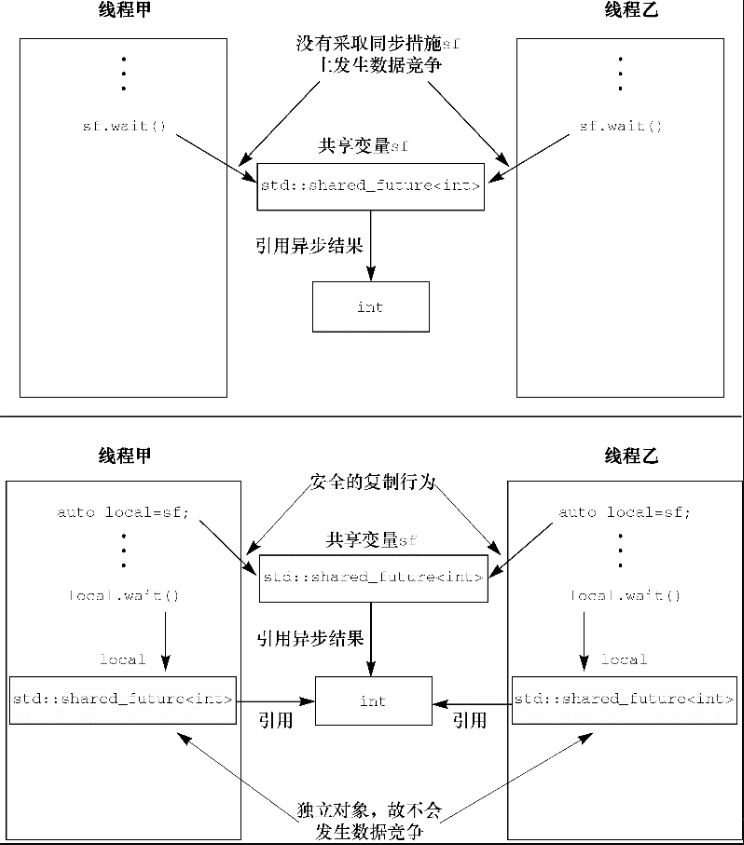

# 使用future等待一次性事件发生

C++标准程序库使用future来模拟这类一次性事件：若线程需等待某个特定的一次性事件发生，则会以恰当的方式取得一个代表目标事件的`future`，接着，该县城就能够一边执行其他任务，一遍在future上等待；同时，它以较短暂的间隔反复查验目标事件是否已经发生。这个线程也可以转换运行模式，先不等目标事件发生，直接暂缓当前任务，而切换到别的任务，及至必要时，才回头等待`future`准备就绪。`future`可能与数据关联，也可能未关联。一旦目标事件发生，其`future`即进入就绪状态，无法重置。

C++标准程序库有两种`future`，分别由两个类模板实现，其声明位于标准库的头文件`<future>`内：独占`future(unique future`，即`std::future<>`)和共享`future`(shared future，即`std::shared_future<>`）。同一事件仅仅允许关联唯一`std::future`实例，但可以关联多个`std::shared_future`实例，只要目标事件发生，与后者关联的所有实例会同时就绪，并且，它们全都可以访问与该目标事件关联的任何数据。如果没有关联数据，我们应使用特化的模板`std::future<void>`和`std::shared_future<void>`。`future`能用于线程间通信，但是`future`对象本身不提供同步访问。若多个线程需访问同一个`future`对象，必须用互斥或其他同步方式进行保护。

C++的并发技术规约在`std::experimental`名字空间中给出了上述类模板的扩展版本：`std::experimental::future<>`和`std::experimental::shared_future<>`。它们的行为与std名字空间中的版本一致，但具备额外的成员函数，可提供更多功能。这里的`experimental`意在强调其中所含的类和函数尚未被C++标准正式采纳。


## 从后台任务返回值

```C++
template< class T > class future;
template< class T > class future<T&>;
template<>          class future<void>;

// 等待结果
wait();
wait_for();
wait_until();

// 只可move(move-only),不可复制
future& operator=( future&& other ) noexcept;
future& operator=( const future& other ) = delete;
```


例如，运用`std::future`取得异步任务的函数返回值

```C++
#include <future>
#include <iostream>
int find_the_answer_to_ltuae();
void do_other_stuff();

int main() {
    // 通过std::async获得std::future对象
    // 运行函数一旦完成, 其返回值就由该对象最后持有
    // 只要在这个future对象上调用get()当前线程便会阻塞，以便future准备妥当且返回该值
    std::future<int> the_answer = std::async(find_the_answer_to_ltuae);
    do_other_stuff();
    std::cout<<"The answer is "<<the_answer.get()<<std::endl;
}
```

调用`std::async()`可以传递附加参数，进而向任务函数传递参数。
```C++
第一个参数f:函数指针，第二个参数是相应的对象，用以在它之上调用成员函数；余下的参数会传递给成员函数，用作成员函数的参数。

async(Function&& f, Args&&... args );
```
如果`std::async()`的参数是右值，则通过移动原始参数构建副本，与复制`std::thread`实例相同。这使得仅可移动的类型(move-only type)既能作为函数对象，又能充当`std::async()`的参数。

例如，通过`std::async()`向任务函数传递参数

```C++
#include <string>
#include <future>
struct X {
    void foo(int,std::string const&);
    std::string bar(std::string const&);
};

X x;
// 调用p->foo(42,"hello"),其中p的值是&x，即x的地址
auto f1=std::async(&X::foo, &x, 42, "hello");
// 调用tmpx.bar("goodbye"),其中tmpx是x的副本
auto f2=std::async(&X::bar, x, "goodbye");

struct Y {
    double operator()(double);
}; 
Y y;
// 调用tmpy(3.141). 其中,由Y()生成一个匿名变量，传递给std::async()，进而发生移动构造
// 在std::async()内部产生对象tmpy，在tmpy上执行Y::operator()(3.141) 
auto f3=std::async(Y(), 3.141);
// 调用y(2.718)
auto f4=std::async(std::ref(y), 2.718);

X baz(X&);
// 调用baz(x)
std::async(baz,std::ref(x));

class move_only {
public:
    move_only();
    move_only(move_only&&)
    move_only(move_only const&) = delete;
    move_only& operator=(move_only&&);
    move_only& operator=(move_only const&) = delete;
    void operator()();
}; 
// 调用tmp()，其中tmp等价于std::move(move_only())
auto f5=std::async(move_only());
```


默认情况下，`std::async()`会自行决定--等待`future`时，是启动新线程或者是同步执行任务。我们还可以给`std::async`传递参数来执行采用哪种方式运行，相关定义如下：

```C++
async(std::launch policy, Function&& f, Args&&... args );
```

该参数的类型是`std::launch`，其可能的取值是：

- `std::launch::deferred `：在当前线程上延后调用任务函数，等到在`future`上调用了`wait()`或`get()`，任务函数才会执行。如果延后调用任务函数，该任务函数有可能永远都不会被调用。
- `std::launch::async`：指定必须另外开启专属的线程，在其上运行任务函数.
- `std::launch::deferred | std::launch::async`：表示由`std::async()`的实现自行选择运行方式，这是该参数的默认值。

```C++
// 运行新线程, 在其上运行任务函数
auto f6=std::async(std::launch::async,Y(),1.2);
// 在当前线程延后调用任务函数
// 等在future上调用wait()或get(),才会运行该任务函数
auto f7=std::async(std::launch::deferred, baz, std::ref(x)); // 2
// std::sync()实现自行选择运行方式
auto f8=std::async(
   std::launch::deferred | std::launch::async,
   baz, std::ref(x));

// std::sync()实现自行选择运行方式
auto f9=std::async(baz,std::ref(x));

// 2处被延后调用的函数，在这里才被运行
f7.wait();
```


使`std::future`和任务关联并非唯一的方法：

- 运用类模板`std::packaged_task<>`的实例，也能将任务包装起来
- 利用`std::promise<>`类模板编写代码，显式地异步求值


## 任务包装:关联future实例和任务

`std::packaged_task<>`连结了`future`对象与函数（或可调用对象）。`std::packaged_task<>`对象在执行任务时，会调用关联的函数（或可调用对象），把返回值保存为`future`的内部数据，并令`future`准备就绪。可以用作线程池的构建单元，也可以用作其他的任务管理方案。

`std::packaged_task<>`是类模板，其模板参数是函数签名(`function signature`)。

```C++
// f:可调用的对象
template< class F >
explicit packaged_task(F&& f);
template< class R, class ...ArgTypes >
class packaged_task<R(ArgTypes...)>;

// 获取其返回的future实例
// future的特化参数类型区局与函数签名指定的返回值
std::future<R> get_future();

// 具备函数调用操作符，参数取决于函数签名参数列表
void operator()( ArgTypes... args );

// 只可move(move-only),不可复制
packaged_task& operator=( const packaged_task& ) = delete;
packaged_task& operator=( packaged_task&& rhs ) noexcept;
```


`std::packaged_task<>`具备函数调用操作符，`std::packaged_task<>`对象是可调用对象，可以直接使用，还可以包装在`std::function`对象中，当作线程函数传递给`std::thread`对象，也可以传递给需要可调用对象的函数。

定义特化的`std::packaged_task<>`类模板

```C++
// 书本只给出了部分代码，模板不会呢
template<>
class packaged_task<std::string(std::vector<char>*,int)> {
public:
    template<typename Callable>
    explicit packaged_task(Callable&& f);
    std::future<std::string> get_future();
    void operator()(std::vector<char>*,int);
};
```


线程间传递任务可以先将任务包装在`std::packaged_task`对象中，获取到`future`，之后才将该对象传递给其他线程来执行，等需要使用结果的时候，等待`future`就绪就可以。例如，许多图形用户界面(GUI)框架都设立了专门的线程，作为更新界面的实际执行者。若别的线程需要更新界面，就必须向它发送消息，由它执行操作。运用`std::packaged_task`实现：

```C++
#include <deque>
#include <mutex>
#include <future>
#include <thread>
#include <utility>

std::mutex m;
std::deque<std::packaged_task<void()>> tasks;
bool gui_shutdown_message_received();
void get_and_process_gui_message();
// 实现在GUI线程上轮询任务队列和待处理的界面消息(如用户点击)
void gui_thread() {
    // 如果消息提示关闭界面，则终止循环
    while(!gui_shutdown_message_received()) {
        // 处理界面消息(如用户点击)
        get_and_process_gui_message();
        std::packaged_task<void()> task;
        {
            // 对任务队列上锁
            std::lock_guard<std::mutex> lk(m);
            // 如果任务队列没有任务，则继续循环
            if(tasks.empty())
                continue;
           	// 存在任务，则取出任务
            task = std::move(tasks.front());
            tasks.pop_front();
        } // 释放任务队列上的锁
        
        // 运行任务
        task();
    }
}

std::thread gui_bg_thread(gui_thread);
// 将任务包装在std::packaged_task对象内,获取到future
// 之后将包装了任务的std::packaged_task对象放置到任务队列
// 调用者获取future来获取结果并采取后续动作
template<typename Func>
std::future<void> post_task_for_gui_thread(Func f) {
    // 依据给定函数创建任务并将任务包装在std::packaged_task中
    std::packaged_task<void()> task(f);
    // 获取该任务关联的future
    std::future<void> res = task.get_future();
    std::lock_guard<std::mutex> lk(m);
    // 将任务放入任务队列
    tasks.push_back(std::move(task));
    // 向该接口的调用者返回future
    return res;
}
```


有些任务无法以简单的函数调用表达出来，还有一些任务的执行结果可能来自多个部分的代码。如何处理？这种情况就需创建`future`：借助`std::promise`显式地异步求值。

## 创建std::promise显式地异步求值

>假设，有个应用需要处理大量网络连接，我们往往倾向于运用多个独立线程，一对一地处理各个连接，这能简化网络通信的构思，程序编写也相对容易。如果连接数量较少（因而线程数量也少），此方式行之有效；随着连接数量攀升，过多线程导致消耗巨量系统资源，一旦线程数量超出硬件所支持的并发任务数量，还可能引起繁重的上下文切换，影响性能。极端情况下，在网络连接超出负荷之前，操作系统就可能已经先耗尽别的资源，无法再运行新线程。故此，若应用要处理大量网络连接，通常交由少量线程负责处理（可能只有一个），每个线程同时处理多个连接。

`std::promise<T>`给出了一种异步求值的方法（类型为T），某个`std::future<T>`对象与结果关联，能延后读出需要求取的值。配对的`std::promise`和`std::future`可实现下面的工作机制：等待数据的线程在`future`上阻塞，而提供数据的线程利用相配的`promise`设定关联的值，使`future`准备就绪。

```C++
promise();
template <class Alloc>
promise (allocator_arg_t aa, const Alloc& alloc);

// 获取future(shared state)
future<T> get_future();

// 给promise设置值，只要设置好，future便准备就绪
// 如果std::promise销毁时仍未曾设置值，保存的数据则由异常代替
void set_value (const T& val);
void set_value (T&& val);
    
// 只可移动(move-only)，不可复制
promise& operator= (promise&& rhs) noexcept;	
promise& operator= (const promise&) = delete;
```


```C++
#include <vector>
#include <thread>
#include <future>
#include <numeric>
#include <iostream>
#include <chrono>
 
void accumulate(std::vector<int>::iterator first,
                std::vector<int>::iterator last,
                std::promise<int> accumulate_promise) {
    int sum = std::accumulate(first, last, 0);
    accumulate_promise.set_value(sum);  // Notify future
}
 
void do_work(std::promise<void> barrier) {
    std::this_thread::sleep_for(std::chrono::seconds(1));
    barrier.set_value();
}
 
int main() {
    // Demonstrate using promise<int> to transmit a result between threads.
    std::vector<int> numbers = { 1, 2, 3, 4, 5, 6 };
    std::promise<int> accumulate_promise;
    std::future<int> accumulate_future = accumulate_promise.get_future();
    std::thread work_thread(accumulate, numbers.begin(), numbers.end(),
                            std::move(accumulate_promise));
 
    // future::get() will wait until the future has a valid result and retrieves it.
    // Calling wait() before get() is not needed
    //accumulate_future.wait();  // wait for result
    std::cout << "result=" << accumulate_future.get() << '\n';
    work_thread.join();  // wait for thread completion
 
    // Demonstrate using promise<void> to signal state between threads.
    std::promise<void> barrier;
    std::future<void> barrier_future = barrier.get_future();
    std::thread new_work_thread(do_work, std::move(barrier));
    barrier_future.wait();
    new_work_thread.join();
}
```


例如，单个线程处理多个连接，采用一对`std::promise<bool>/std::future<bool>`，以确证数据包成功向外发送；与future关联的值是一个表示成败的简单标志。对于传入的数据包，与future关联的数据则是包内的有效荷载（payload

```C++
// error 没明白连接的发送和接受在不同的机器，也就是不同的进程，如何进行数据处理的
#include <future>

void process_connections(connection_set& connections) {
    while(!done(connections)) {
        // 依次检查各个连接，如果有数据传入则接收;如果有数据发出，则向外发送数据
        for(connection_iterator connection=connections.begin(), end=connections.end();
            connection!=end; ++connection) {
            // 有数据传入
            if (connection->has_incoming_data()) {
                data_packet data = connection->incoming();
                // 定传入的数据包本身已含有ID和荷载数据
                // 令每个ID与各std::promise对象(可能存储到关联容器）一一对应
                std::promise<payload_type>& p = connection->get_promise(data.id);
                p.set_value(data.payload);
            }

            // 有数据需要向外发送
            if(connection->has_outgoing_data()) {
                outgoing_packet data = connection->top_of_outgoing_queue();
                connection->send(data.payload);
                // 发送完成,将和数据发送相关的promise设置为true
                data.promise.set_value(true);
            }
        }
    }
}
```


上面所有的处理都未考虑异常，而线程在运行过程中可能会初选异常。如果为了采用`std::packaged_task`和`std::promise`，而强令保障所有代码都无异常，也不太现实。C++标准库给出了一种干净利落的方法，以在这种情形下处理异常，并且异常更能够被保存为相关结果的组成部分。

##  将异常保存到future中

由`std::async()`调用的函数抛出异常，则会被保存到`future`中，代替本该设定的值，`future`随之进入就绪状态，等到其成员函数`get()`被调用，存储在内的异常即被重新抛出（C++标准没有明确规定应该重新抛出原来的异常，还是其副本；为此，不同的编译器和库有不同的选择）。如果把任务函数包装在`std::packaged_task`对象内，也是如此。

`std::promise`也具有同样的功能，它通过成员函数的显式调用实现。假如我们不想保存值，而想保存异常，就不应调用`set_value()`，而应调用成员函数`set_exception()`。若算法的并发实现会抛出异常，则该函数通常可用于其`catch`块中，捕获异常并装填`promise`

```C++
extern std::promise<double> some_promise;
try {
    some_promise.set_value(calculate_value());
} catch(...) {
    some_promise.set_exception(std::current_exception());
}
```

能用`std::make_exception_ptr()`直接保存新异常，而不触发抛出行为，相较于`try/catch`，该实现可以简化代码且鲤鱼编译器优化，应该优先采用。

```C++
some_promise.set_exception(std::make_exception_ptr(std::logic_error("foo ")));
```


还有另外一种方式可以将异常保存在future中：

- `std::promise`不调用`set_value`和`set_value_at_thread_exit`成员函数
- `std::packaged_task`不执行包装任务

直接销毁与`future`关联的`std::promise`对象或`std::packaged_task`对象。如果关联的`future`未能准备就绪，无论销毁两者中的哪一个，其析构函数都会将异常`std::future_error`存储为异步任务的状态数据，它的值是错误代码`std::future_errc::broken_promise`。我们一旦创建`future`对象，便是`future`会按异步方式给出值或异常，但刻意销毁产生它们的来源，就无法提供所求的值或出现的异常，导致`future`被破坏。在这种情形下，倘若编译器不向`future`存入任何数据，则等待的线程有可能永远等不到结果。


`std::future`只容许一个线程等待结果。若要让多个线程等待同一个目标事件，需要用`std::shared_future`。

## 多个线程一起等待

> 只要同步操作是一对一地在线程间传递数据，`std::future`就都能处理。对于某个`std::future`实例，如果其成员函数由不同线程调用，不会自动同步。若在多个线程上访问同一个`std::future`对象，而不采取额外的同步措施，将引发数据竞争并导致未定义行为。这是`std::future`特性：它模拟了对异步结果的独占行为，`get()`仅能被有效调用唯一一次，这令并发访问失去意义，只有一个线程可以获取目标值，原因是第一次调用get()会进行移动操作，之后该值不复存在。
>
> 假设必须让多个线程等待同一目标事件，`std::shared_future`可以处理。`std::future`仅能移动构造和移动赋值，归属权可在多个实例间转移，在相同时刻，只有唯一`future`实例指向特定异步结果；`std::shared_future`实例则能复制出副本，因此可以持有该类的多个对象，它们全指向同一异步任务的状态数据。

即便改用`std::shared_future`，同一个对象的成员函数却依然没有同步。若从多个线程访问同一个对象，就必须采取锁保护以避免数据竞争。首选方式是，向每个线程传递`std::shared_future`对象的副本，它们为各线程独自所有，并被视作局部变量。因此，这些副本就作为各线程的内部数据，由标准库正确地同步，可以安全地访问。若多个线程共享异步状态，只要它们通过自有的`std::shared_future`对象读取状态数据，则该访问行为是安全的。


<center>
    <div><b>使用多个std::shared_future对象避免数据竞争</b></div>
    
</center>


```C++
std::promise<int> p;
std::future<int> f(p.get_future());
assert(f.valid());    // future对象f有效
std::shared_future<int> sf(std::move(f));
assert(!f.valid());  // 对象f不再有效
assert(sf.valid()); // 对象sf开始生效

// 隐式转移归属权
std::promise<std::string> p;
// 依据std::future<std::string>类型的右值创建出std::shared_future<>对象
std::shared_future<std::string> sf(p.get_future());
```


std::future可以根据初始化列表自动推断变量的类型，从而使`std::shared_future`更便于使用。`std::future`成员函数`share()`可以直接创建新的`std::shared_future`对象，并向它转移归属权

```C++
std::promise< std::map<SomeIndexType, SomeDataType, SomeComparator,
    SomeAllocator>::iterator> p;
// 根据初始化列表推断出std::shared_future的类型

auto sf=p.get_future().share();
```


# 限时等待

有两种超时(`timeout`)机制可供选用：一是迟延超时(`duration-based timeout`)，线程根据指定的时长而继续等待（如30毫秒）；二是绝对超时(`absolute timeout`)。


