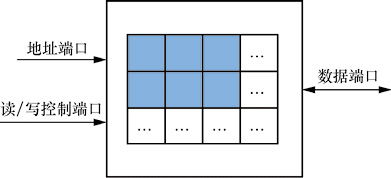
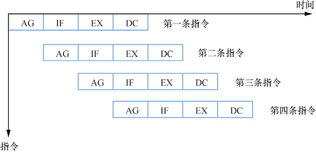
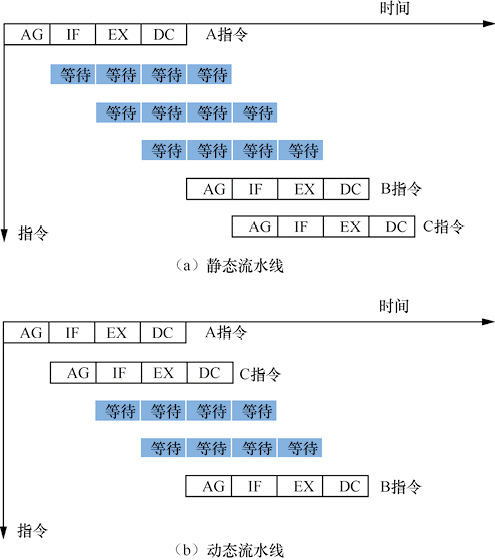
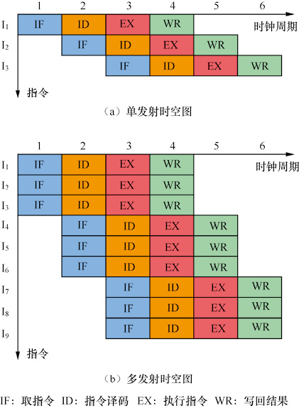

寄存器(Register)是位于CPU内部的单元，在CPU中用于存储数据的单元。在运算器、控制器中，都需要有记忆功能的单元来保存从存储器中读取的数据，以及保存运算器生成的数据，这样的单元就是寄存器。

寄存器有以下种类。

- 数据寄存器：用于保存从存储器中读取的数据，以及运算器生成的结果。针对不同的数据类型，又可以分为整数寄存器、浮点寄存器。
- 指令寄存器：用于保存从存储器中读取的指令，指令在执行之前先暂时存放在指令寄存器中。
- 地址寄存器：用于保存要访问内存的地址。它也分为两种，一种用于保存CPU下一条要执行的指令地址，这种寄存器又称为程序地址计数器（Program Counter，PC）；另一种用于保存指令要访问的内存数据的地址。
- 标志位寄存器：用于保存指令执行结果的一些特征，例如一条加法指令执行后，结果是否为0、是否溢出（Overflow，即超出数据寄存器的最大位宽）等。这些特征在标志位寄存器中以特定的位进行表示，可以供程序对计算结果进行判断。

寄存器的一个重要概念是“位宽”，即一个寄存器包含的二进制位的个数。通常所说的“CPU是多少位”也就是指CPU中寄存器的位宽。更大的位宽意味着计算机能表示的数据范围更大、计算能力更强，但也增加了CPU的设计和实现成本。

CPU中经常将一组寄存器单元使用一个模块来实现，形成寄存器堆。寄存器堆的典型结构包含3个端口，

1. 地址端口（用来选择要读写的寄存器编号）
2. 读/写控制端口（控制是向寄存器单元写入还是从寄存器单元读出）
3. 数据端口（从寄存器单元读出或向寄存器单元写入的数据）

    

# 流水线(Pipeline)

流水线(Pipeline)是指CPU将一条指令切分成不同的执行阶段，不同的阶段由独立的电路模块负责执行，宏观上实现多条指令同时执行。CHN-1原型计算机(作者举出的汉字生成器的例子)一条指令分成以下4个执行阶段:

1. 计算指令地址(Address Generating，AG)：地址计数器增加1。
2. 取指令(Instruction Fetch，IF)：从存储器中取出指令，放入指令寄存器。
3. 执行指令(Instruction Execute，EX)：指令寄存器内容输入运算器(即点阵生成器)，生成汉字点阵，存入数据寄存器。
4. 显示汉字(Display Character, DC)：数据寄存器的内容输出到显示器，显示汉字。

对于一条指令，这4个阶段必须按严格的先后顺序执行，可以表示为“AG →IF →EX →DC”。在每两个阶段之间，采用寄存器来保存上一个阶段的临时结果。通过简单的改进，可以设计一台流水线计算机CHN-4。由于在任何时刻，4个阶段中必须只有一个在工作，这可以通过时钟节拍来控制，把CPU的主频进行“4分频”，即4个独立工作的频率，任何时刻只有一个频率驱动相应阶段来工作，其余阶段则处于等待工作状态。完整执行一条指令的时间是4个时钟节拍。

流水线是叠加执行的，从而极大提高了CPU的工作效率。

    

增大流水线级数最直接的好处是可以提高指令的并行度。将一条指令切分为更多阶段，使用更多的独立模块“叠加运行”指令，相当于增多了可以同时执行的指令数量，一定时间内能够执行的指令更多，术语叫作“提高吞吐率”，这样是可以提高CPU性能的。另外一个好处是可以提高CPU主频。由于每个阶段执行更少的功能，这样可以缩短用于控制每个阶段的时钟节拍，CPU能够在更高的主频下工作。

但是增大流水线级数也有负面影响。首先，由于在每两个相邻阶段之间都需要增加寄存器，因此会增大电路的复杂度，占用芯片的电路面积也就越大，容易增加成本、功耗。其次，增加的寄存器也会使数据的传输时间变得更长，增加了执行指令的额外时间。再加上其他一些复杂机制的影响（转移猜测、指令相关性等），这些负面影响有可能会抵消增加流水线级数带来的正面影响。

# 乱序执行

动态流水线中指令的实际执行顺序和软件中出现的顺序不同。“动态流水线”是消除指令之间依赖关系对流水线效率的影响，通过重新排列指令执行顺序来提高CPU性能的一种优化技术。

由于指令之间存在相关性，会造成流水线中需要插入等待时间，从而降低CPU性能：

- 相邻的指令之间存在依赖关系，这种依赖关系称为“指令相关性”。指令相关性导致流水线必须阻塞等待来保证功能正确。假设有相邻的两条指令A和B，A指令计算的结果数据要作为B指令的输入数据，这种情况称为“数据相关”。那么在A指令执行的过程中，B指令不能进入流水线，只有等到A指令执行结束才能开始执行B指令。这意味着数据相关性造成指令必须严格地依次执行，不能发挥流水线“在同一时间并行执行多条指令”的优势。
- 还有一种相关性称为“结构相关”，是指CPU结构的限制导致指令不能并行执行。例如相邻的两条指令A和B都要进行乘法操作，而CPU中只有一个乘法运算部件，那么也无法在流水线中同时执行A和B，只有当A指令使用完乘法运算部件后B指令才能使用。

计算机科学家发现，重新排列指令的执行顺序可以消除相关性、减少等待时间。本质思想是“前面的指令如果阻塞，后面的指令可以先执行”。例如，有3条指令A、B、C，A和B存在相关性，但是A和C没有相关性，那么在A执行期间，必须让B阻塞等待，而C指令是完全可以进入流水线执行的

    

通过这样的重新安排，A和C又实现了“在同一时间并行执行”，3条指令可以使用更短的时间执行完成。动态流水线是CPU使用电路硬件判断指令相关性，对没有相关性的指令进行重新排列的一种技术，也称为“动态调度”技术。不支持动态调度的流水线则称为“静态流水线”。

乱序执行（Out-of-Order Execution）是指在CPU内部执行过程中，指令执行的实际顺序可能和软件中的顺序不同。动态调度就是实现乱序执行的一种典型方法。乱序执行的特点是“有序取指、重新排列执行顺序、有序结束”，意思是指令的结束顺序也要符合软件中的原始顺序。乱序执行是CPU内部的执行机制，对程序员是不可见的。程序在支持乱序执行的CPU上得到的结果，和顺序执行每条指令得到的结果必须是相同的。

# 多发射

多发射（Multiple Issue）是指流水线的每个阶段都能处理多于一条的指令。在乱序执行的CPU中，每一个时钟节拍处理的指令数量超过了一条。在取指阶段，一次可以从内存中读取多条指令；在译码阶段，可以同时对多条指令分析相关性，并送入不同的发射队列；在发射阶段，每一个时钟节拍都可以从发射队列中分别发出一条指令；在执行阶段，多个计算单元独立工作，并行地进行运行。多发射并不是说CPU有多条流水线，而是在一条流水线上增加了处理指令的宽度，在一个时钟节拍中可以同时处理多份指令。

    

# 转移猜测

转移猜测（Branch Prediction）是CPU流水线针对转移指令的优化机制。转移指令是指软件中的指令不再依次执行，而是跳转到其他内存位置，经常用于在软件中进行某种条件判断。转移指令有两个可能的目标，一个目标是其后一条指令，另一个目标是跳转目标地址的指令。转移指令就像是使一段指令序列产生了分叉，所以其也称为“分支指令”。

在多发射的流水线中，一次可以取多条指令，但是如果遇到转移指令，处理起来就发生了困难。因为转移指令后面的指令不一定执行，而是要看转移指令本身是否满足跳转条件，所以显然不能把转移指令后面的指令都送入保留站。但是这样又会使流水线发生空闲，在多发射的各阶段都没有充足的指令来输入，造成执行效率下降。

计算机科学家提出“转移猜测”机制，解决了上面的矛盾。在遇到跳转指令时，假设跳转一定不会发生，这样就可以把跳转指令及其后面的指令都取到流水线中执行。但是如果跳转指令在执行时遇到了不满足跳转的条件，则只需要借助ROB和COMMIT阶段的作用，对跳转指令后面的指令不做提交即可。这样的猜测算法是最简单的“单一目标”方式，平均的预测成功率只有50%，意味着有一半的预测并没有发挥好的效果。

在高性能CPU中有更高效的“转移猜测”电路，预测转移指令可能的跳转方向。常用的一种方式是使用分支目标缓冲器(Branch Target Buffer，BTB)，在一个队列中保存转移指令最近发生的跳转目标地址，译码单元通过查看BTB来确定转移指令最有可能的跳转目标地址，在取值时可以读取跳转目标地址及其后面的指令。由于保存了更多历史信息，预测成功率平均可以提升到90%以上。

转移猜测本质是一种“激进优化”思想，对于概率性发生的事件做乐观估计。把尽可能充足的指令提供给流水线，如果估计正确就可以大幅度提高流水线的效率。在估计错误时可采用妥善方法做“善后处理”，消除错误的影响，保证软件的功能正常。

