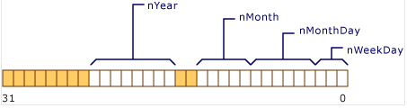
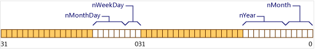

在类和`Struct`中成员采用位域(Bit Field)，可以实现成员比整型类型占用更少存储空间。位域成员声明符的语法：

```C++
identifier(optional) attr(optional) : size
```

`declarator`(可选)是在程序中访问成员的名称，必须是整型类型(包括枚举类型)。`constant-expression`指定结构中成员所占据的位数。 匿名位字段（即没有标识符的位字段成员）可用于填充。

```C++
struct Date {
   unsigned short nWeekDay  : 3;    // 0..7   (3 bits)
   unsigned short nMonthDay : 6;    // 0..31  (6 bits)
   unsigned short nMonth    : 5;    // 0..12  (5 bits)
   unsigned short nYear     : 8;    // 0..100 (8 bits)
};
```

上述`struct Date`的内存布局如下：

<center>
    
</center>

由于`unsigned short`是16位，`nYear`是8位，这会导致溢出`unsigned short`的边界，因此会从一个新的`unsigned short`开始。


如果结构的声明包含长度为 0 的未命名字段，强制将下一个位域与下一个type边界对齐，其中type是成员的类型。

```C++
struct Date {
   unsigned nWeekDay  : 3;    // 0..7   (3 bits)
   unsigned nMonthDay : 6;    // 0..31  (6 bits)
   unsigned           : 0;    // Force alignment to next boundary.
   unsigned nMonth    : 5;    // 0..12  (5 bits)
   unsigned nYear     : 8;    // 0..100 (8 bits)
};
```

上述`struct Date`的内存布局如下：

<center>
    
</center>


# 参考资料

1. [Microsoft:C++ Bit Fields](https://learn.microsoft.com/en-us/cpp/cpp/cpp-bit-fields?redirectedfrom=MSDN&view=msvc-170&viewFallbackFrom=vs-2019)

