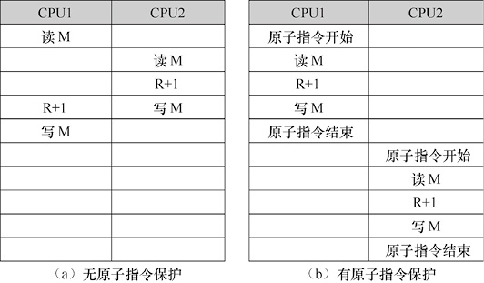
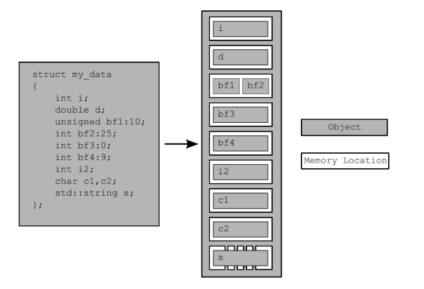

并行计算机中，每个CPU单元都可能含有Cache，所以需要考虑所有CPU之间的Cache数据同步机制。
目前最常用的方法是基于目录的Cache一致性协议。当一个CPU写内存时，要查找目录表，如果该内存单元在其他CPU中含有备份，则向其他CPU发送广播通知。目标CPU收到通知后，更新自身包含的Cache数据。Cache目录一致既适用于SMP也适用于NUMA。Cache目录一致性实现了多个CPU之间的Cache同步，但是不同计算机对Cache更新通知的时序规定了不同的原则。

- 强一致性：系统中所有更新Cache的通知要执行结束，才允许各CPU执行后续的访存指令。这种方式使所有处理器核之间严格保证Cache一致性，但是会使各CPU花费大量时间等待Cache通知结束，从而降低了系统性能。
- 弱一致性：各CPU不需要等待所有Cache通知执行结束，就可以执行访存指令。在这种情况下，CPU硬件不维护所有Cache的强制一致性，某一个CPU写内存的行为可能不会及时通知到所有其他CPU，这时不同的CPU会在Cache中读取出不同的数值。如果程序员觉得在有些程序中必须保证强一致性，可以调用CPU提供的一条“内存同步指令”，强行使CPU等待所有Cache更新结束。

目前绝大多数实际的并行CPU都采用弱一致性。弱一致性让程序员承担了维护代价，但是性能比强一致性要高很多倍。程序员在编写并行算法时，对于多个线程要访问相同内存单元的位置，只需要适当插入“内存同步指令”来使线程程“看”到一致的数据。

# 原子指令

原子指令(Atomic Instruction)用于在多个CPU之间维护同步关系。在一些科学计算问题中，通过并行算法把子问题分配到多个CPU上执行，但是各个子问题之间存在合作关系，因此需要硬件机制来实现多个CPU之间的同步。

一个典型的同步例子是“原子加1”问题。例如，一个CPU要对内存单元M中的数据加1，这个动作需要3条指令来完成：

1. 读M的值到寄存器R
2. 对R执行加1运算
3. 把R的值写回内存单元M。

<center>
    
</center>

如果计算机中只有一个CPU，执行上面3条指令不会有任何问题。但是如果CPU有两个，则可能在一个CPU执行过程中，另一个CPU也执行这3条指令，最后M的结果不是增加2而是增加1。原子指令可以实现一个CPU独占执行时间。使用原子指令把连续多条指令包含起来，计算机保证只有一个CPU处于执行状态，其他CPU必须等待原子指令结束才能继续执行。

# 内存模型

<b><font color=green>内存模型精确定义了基础构建单元应当如何运转。</font></b>

内存模型牵涉两个方面：基本结构和并发。基本结构关系到整个程序在内存中的布局，它对并发很重要，尤其是在分析底层原子操作时。就C++而言，归根结底，基本结构就是对象和内存区域。

C++程序的数据全部都由对象构成，C++标准只将“对象”定义为“某一存储范围”(a region of storage)。不论对象属于什么类型，它都会存储在一个或多个内存区域中。每个内存区域或是对象/子对象，属于标量类型(scalar type)，如`unsigned short`和`my_class*`，或是一串连续的位域(bit field)。其中位域有一个重要性质：尽管相邻的位域分属不同对象，但照样算作同一内存区域。

<center>
    
	</br>
    <div><b>将Struct分解为对象和内存区域</b></div>
</center>

`bf3`是0宽度位域（其变量名被注释掉，因为0宽度位域必须匿名），与`bf4`彻底分离，将`bf4`排除在`bf3`的内存区域之外，但`bf3`实际上并不占有任何内存区域。

需要牢记的要点：

1. 每一个变量都是一个对象，其成员变量也是对象。
2. 每个对象至少占用一个内存区域(Memory Location)。
3. 若变量属于内建基本类型(如`int`或`char`)，则不论其大小，都占用一块内存区域(且仅此一块)，即便它们的位置相邻或它们是数列中的元素。
4. 相邻位域属于同一内存区域。(在C++和C中规定，宽度为0的一个未命名位域强制下一位域对齐到其下一type边界)


## 对象内存区域和并发

C++程序有一个重要性质：**所有与多线程相关的事项都会牵涉内存区域**。如果两个线程各自访问分离的内存区域，则相安无事，一切运作良好；反之，如果两个线程访问同一内存区域，任一线程改动数据都有可能引发条件竞争，导致未定义行为。要避免条件竞争，就必须强制两个线程按一定的次序访问，这个次序可以固定不变，即某一访问总是先于另一个；也可变动，即随应用软件的运行而间隔轮换访问的次序。但必须保证访问次序条理清晰分明。

1. 利用互斥保证访问的次序清晰分明。若在两个访问发生前，先行锁定相关互斥，那么每次仅容许一个线程访问目标内存区域，那么一个访问必然先于另一个（即便如此，但我们通常无从预知具体哪个访问在前）。
2. 利用原子操作的同步性质，在目标内存区域（或相关内存区域）采取原子操作，从而强制两个线程遵从一定的访问次序。


## 改动序列

在一个C++程序中，每个对象都具有一个改动序列，它由所有线程在对象上的全部写操作构成，其中第一个写操作即为对象的初始化。大部分情况下，这个序列会随程序的多次运行而变化，但是在程序的任意一次运行中，所含的全部线程都必须形成相同的改动序列。若多个线程共同操作某一不属于原子类型的对象，就需要自己负责充分施行同步操作，进而确保对于一个变量，所有线程就其达成一致的改动序列。变量的值会随时间推移形成一个序列。在不同的线程上观察属于同一个变量的序列，如果所见各异，就说明出现了数据竞争和未定义行为。若我们采用了原子操作，那么编译器有责任保证必要的同步操作有效、到位。

为了实现上述保障，要求**禁止某些预测执行**(speculative execution)。原因是在改动序列中，只要某线程看到过某个对象，则该线程的后续读操作必须获得相对新近的值，且该线程就同一对象的后续写操作，必然出现在改动序列后方。另外，如果某线程先向一个对象写数据，过后再读取它，那么必须读取前面写的值。若在改动序列中，上述读写操作之间还有别的写操作，则必须读取最后写的值。

在程序内部，对于同一个对象，全部线程都必须就其形成相同的改动序列，并且在所有对象上都要求如此，而多个对象上的改动序列只是相对关系，线程之间不必达成一致。

<b><font color=green>原子操作由什么构成？如何利用它们强制操作服从预定次序？</font></b>

# 原子操作及其类别

原子操作是不可分割的操作(indivisible operation)。在系统的任一线程内，我们都不会观察到这种操作处于半完成状态；它或者完全做好，或者完全没做。考虑读取某对象的过程，假如其内存加载行为属于原子操作，并且该对象的全部修改行为也都是原子操作，那么通过内存加载行为就可以得到该对象的初始值，或得到某次修改而完整存入的值。与之相反，非原子操作（non-atomic operation）在完成到一半的时候，有可能为另一线程所见（不同线程看到的数值不同，导致出现数据竞争，引发未定义的行为）。

## 标准原子类型

标准原子类型的定义位于头文件`<atomic>`内，标准原子对象不具备拷贝构造函数或拷贝赋制操作符。这些类型的操作全是原子化的，根据语言的定义，C++内建的原子操作也仅仅支持这些类型，尽管通过采用互斥，我们能够令其他操作实现原子化。事实上，我们可以凭借互斥保护，模拟出标准的原子类型：它们全部(几乎)都具备成员函数`is_lock_free()` ，准许使用者判定某一给定类型上的操作是能由原子指令(atomic instruction)直接实现(`x.is_lock_free()`返回`true`），还是借助编译器和程序库内部锁实现(`x.is_lock_free()`返回`false`)。

原子操作的关键用途是取代需要互斥的同步方式。假如原子操作本身也在内部使用了互斥，就很可能无法达到所期望的性能提升，而更好的做法是采用基于互斥的方式，该方式更加直观且不易出错。无锁数据结构正属于这种情况。

**C++程序库专门为此提供了一组宏，它们的作用是，针对由不同整数类型特化而成的各种原子类型，在编译期判定其是否属于无锁数据结构**。从C++17开始，全部原子类型都含有一个静态常量表达式成员变量(static constexpr member variable)，形如`X::is_always_lock_free`，功能与那些宏相同：考察编译生成的一个特定版本的程序，当且仅当在所有支持该程序运行的硬件上，原子类型X全都以无锁结构形式实现，该成员变量的值才为`true`。例如，一个程序含有原子类型`std::atomic<uintmax_t>`，而相关的原子操作必须用到某些CPU指令，如果多种硬件可以运行该程序，但仅有其中一部分支持这些指令，那么等到运行时才可以确定它是否属于无锁结构，因此`std::atomic<uintmax_t>::is_always_lock_free`的值在编译期即确定为`false`。相反地，若在任意给定的目标硬件上，`std::atomic<int>`都以无锁结构形式实现，`std::atomic<int>::is_always_lock_free`的值会是`true`。

上述的宏分别是：`ATOMIC_BOOL_LOCK_FREE`、`ATOMIC_CHAR_LOCK_FREE`、`ATOMIC_CHAR16_T_LOCK_FREE`、`ATOMIC_CHAR32_T_LOCK_FREE`、`ATOMIC_WCHAR_T_LOCK_FREE`、`ATOMIC_SHORT_LOCK_FREE`、`ATOMIC_INT_LOCK_FREE`、`ATOMIC_LONG_LOCK_FREE`、`ATOMIC_LLONG_LOCK_FREE`和`ATOMIC_POINTER_LOCK_FREE`。

依据C++某些内建整数类型和相应的无符号类型，`std::atomic<>`特化成各种原子类型，上面的宏按名字与之一一对应，功能是标示该类型是否属于无锁结构(`LLONG`代表`long long`，而POINTER代表所有指针类型)。假设某原子类型从来都不属于无锁结构，对应的宏取值为0；若它一直都属于无锁结构，则宏取值为2；等到运行时才能确定该原子类型是否属于无锁结构，就取值为1。


`std::atomic_flag`是无锁bool标志，必须采取无锁操作，不提供`is_lock_free()`成员函数，且不提供复制，拷贝构造。

```C++
// 对象必须由ATOMIC_FLAG_INIT初始化，进行清零
std::atomic_flag lock = ATOMIC_FLAG_INIT;

// 属于读-改-写操作,返回之前持有的值并将其值设置为true
bool test_and_set(std::memory_order order = std::memory_order_seq_cst) volatile noexcept;
bool test_and_set(std::memory_order order = std::memory_order_seq_cst) noexcept;

// 属于存储操作，清零，将其值修改为false
void clear( std::memory_order order = std::memory_order_seq_cst ) volatile noexcept;
void clear( std::memory_order order = std::memory_order_seq_cst ) noexcept;
```

其余的原子类型都是通过类模板`std::atomic<>`特化得到的，功能更加齐全，但可能不属于无锁结构。各种原子类型依据内建类型特化而成（如`std::atomic<int>`和`std::atomic<void*>`）。虽然我们希望它们在大多数主流平台上都具备无锁结构，C++标准并未要求具备无锁结构。由内建类型特化得出原子类型，其接口即反映出自身性质，例如，C++标准并没有为普通指针定义位运算（如`&=`），所以不存在专门为原子化的指针而定义的位运算。

如果原子类型的实现由编译器厂商给出，那么除了直接用类模板`std::atomic<>`写出别名，还有一组别名可供采用(详见见[cppreference:atomic](https://en.cppreference.com/w/cpp/atomic/atomic))。若我们使用比较旧的编译器，这些别名作为替换，就会具有两种含义：可能指对应的`std::atomic<>`特化，也可能指该特化的基类。不过，只要编译器完全支持C++17，它们肯定唯一地表示对应的`std::atomic<>`特化。所以在同一程序内，如果混用这些别名和`std::atomic<>`特化的原名会使代码不可移植。

标准原子操作不具备拷贝构造函数或拷贝赋制操作符，可以接受内建类型赋值，也支持隐式地转换成内建类型，还可以直接经由成员函数处理，还支持复合赋值操作，如`+=`、`−=`、`*=`和`|=`等。

```C++
// 检查原子变量是否是无锁
bool is_lock_free()
 
void store( T desired, std::memory_order order = std::memory_order_seq_cst ) noexcept;
void store( T desired, std::memory_order order = std::memory_order_seq_cst ) volatile noexcept;

T load( std::memory_order order = std::memory_order_seq_cst ) const noexcept;
T load( std::memory_order order = std::memory_order_seq_cst ) const volatile noexcept;
 
 
T exchange(T desired, std::memory_order order = std::memory_order_seq_cst ) noexcept;
T exchange(T desired, std::memory_order order = std::memory_order_seq_cst ) volatile noexcept;

bool compare_exchange_weak( T& expected, T desired, std::memory_order success,
                            std::memory_order failure ) noexcept;
bool compare_exchange_strong( T& expected, T desired, std::memory_order success,
                              std::memory_order failure ) noexcept;

 
T fetch_and(T arg, std::memory_order order = std::memory_order_seq_cst ) noexcept;
T fetch_and(T arg, std::memory_order order = std::memory_order_seq_cst ) volatile noexcept;

T fetch_or( T arg, std::memory_order order = std::memory_order_seq_cst ) noexcept;
T fetch_or( T arg, std::memory_order order = std::memory_order_seq_cst ) volatile noexcept;
```


对于原子类型上的每一种操作，都可以提供额外的参数，从枚举类`std::memory_order`取值，用于设定所需的内存次序语义（memory-ordering semantics）。操作的类别决定了内存次序所准许的取值，则默认采用最严格的内存次序，即`std::memory_order_seq_cst`。枚举类`std::memory_order`具有6个可能的值，包括

1. `std::memory_order_relaxed`
2. `std::memory_order_release`
3. `std::memory_order_seq_cst`
4. `std:: memory_order_acquire`
5. `std::memory_order_consume`
6. `std::memory_order_acq_rel`

内存次序根据操作类别被划分为3类：

1. 存储(`store`)操作，可选用的内存次序有`std::memory_order_relaxed`、`std::memory_order_release`或`std::memory_order_seq_cst`。
2. 载入(`load`)操作，可选用的内存次序有`std::memory_order_relaxed`、`std::memory_order_consume`、`std::memory_order_acquire`或`std::memory_order_seq_cst`。
3. 读-改-写(`read-modify-write`)操作，可选用内存次序`std::memory_order_relaxed``std::memory_order_consume`、`std::memory_order_acquire`、``std::memory_order_release`、`std::memory_order_acq_rel`或`std::memory_order_seq_cst`。

<b><font color=green>内存次序的语义是什么，它如何确保互斥锁强制施行必要的内存次序？</font></b>


## 操作`std::atomic_flag`

`std::atomic_flag`可以完美扩展成自旋锁互斥(spin-lock mutex)。最开始令原子标志置零，表示互斥没有加锁。反复调用`test_and_set()`试着锁住互斥，一旦读取的值变成false，则说明线程已将标志设置成立（其新值为true），则循环终止。而简单地将标志置零即可解锁互斥。

```C++
// 采用std::atomic_flag实现自旋锁互斥
class spinlock_mutex {
    std::atomic_flag flag;
public:
    spinlock_mutex() : flag(ATOMIC_FLAG_INIT) {}

    // 在函数内忙等，适合于不希望出现人和程度竞争的场景
    void lock() {
        while(flag.test_and_set(std::memory_order_acquire));
    }

    void unlock() {
        flag.clear(std::memory_order_release);
    }
};
```

由于`std::atomic_flag`严格受限，甚至不支持单纯的无修改查值操作(nonmodifying query)，无法用作普通的布尔标志，因此最好还是使用`std::atomic<bool>`。


## 操作`std::atomic<bool>`

`std::atomic<bool>`是基于整数的最基本的原子类型，相比`std::atomic_flag`，它是一个功能更齐全的布尔标志。`std::atomic<bool>`的实现可能需要在内部用互斥，以保证操作的原子性，可以调用成员函数`is_lock_free()`，检查是否具备真正的无锁操作。

```C++
// 依据非原子布尔量(true或false都可以)创建其对象
std::atomic<bool> b(true);
// 非原子变量赋值
b = false;
```

原子类型的赋值操作符不返回引用，而是按值返回(该值属于对应的非原子类型)。


`store()`是存储操作，而`load()`是载入操作，但`exchange()`是“读-改-写”操作。

````C++
std::atomic<bool> b;
bool x = b.load(std::memory_order_acquire);
b.store(true);
x = b.exchange(false,std::memory_order_acq_rel);
````


`std::atomic<bool>`还引入了一种比较-交换操作：若原子对象当前的值符合预期，就赋予新值。它与`exchange()`一样，同为“读-改-写”操作。有`compare_exchange_weak()`和`compare_exchange_strong()`两种形式。比较-交换操作是原子类型的编程基石。使用者给定一个期望值，原子变量将它和自身的值比较，如果相等，就存入另一既定的值；否则，更新期望值所属的变量，向它赋予原子变量的值。比较-交换函数返回布尔类型，如果完成了保存动作（前提是两值相等），则操作成功，函数返回`ture`；反之操作失败，函数返回`false`。

```C++
bool compare_exchange_weak(T& expected, T desired, std::memory_order success,
                            std::memory_order failure) noexcept;
bool compare_exchange_strong(T& expected, T desired, std::memory_order success,
                              std::memory_order failure) noexcept;
```


对于`compare_exchange_weak()`，即使原子变量的值等于期望值，保存动作还是有可能失败，在这种情形下，原子变量维持原值不变，返回false。**原子化的比较-交换必须由一条指令单独完成，而某些处理器没有这种指令，无从保证该操作按原子化方式完成。实现比较-交换，负责的线程则须改为连续运行一系列指令，但在这些计算机上，只要出现线程数量多于处理器数量的情形，线程就有可能执行到中途因系统调度而切出，导致操作失败。这种计算机最有可能引发上述的保存失败，称之为佯败(spurious failure)，其败因是函数执行时机不对。**因为`compare_exchange_weak()`可能佯败，所以它往往必须配合循环使用。

```C++
bool expected=false;
extern atomic<bool> b; //由其他源文件的代码设定变量的值
while(!b.compare_exchange_weak(expected,true) && !expected);
```

只有当原子变量的值不符合预期时，`compare_exchange_strong()`才返回`false`。这让我们得以明确知悉变量是否成功修改，或者是否存在另一线程抢先切入而导致佯败，从而能够摆脱上例所示的循环。

不论原子变量具有什么初始值，假设我们就是想要修改它（也许是要根据当前值进行更新），那么针对变量expected的更新则会发挥作用，每次循环它都会重新载入，所以如果两者不相等，又没有其他线程同时进行改动，变量expected即被赋予原子变量的值，`compare_exchange_weak()`或`compare_exchange_strong()`的调用在下一轮循环将成功。**在某些硬件平台上，虽然使用`compare_exchange_weak()`可能导致佯败，但改用`compare_exchange_strong()`却会形成双重嵌套循环（因其自身内部含有一个循环），那么采用·compare_exchange_weak()·比较有利于性能。反之，如果存入的值需要耗时的计算，选择·compare_exchange_strong()·则更加合理。因为只要预期值没有变化，就可避免重复计算。**

# 同步操作和强制次序

假设有两个线程共同操作一个数据结构，其中一个负责增添数据，另一个负责读取数据。为了避免恶性条件竞争，写线程设置一个标志，用以表示数据已经存储妥当，而读线程则一直待命，等到标志成立才着手读取。

```C++
#include <vector>
#include <atomic>
#include <iostream>
std::vector<int> data;
std::atomic<bool> data_ready(false);

// 线程甲存入一个值，再由线程乙读取，两个线程的读写操作之间存在同步关系
void reader_thread() {
    // 以循环方式等待数据准备就绪
    while (!data_ready.load()) {
        std::this_thread::sleep(std::chrono::milliseconds(1));
    }
    std::cout<<"The answer="<<data[0]<<"\n";
}
void writer_thread() {
    data.push_back(42);
    // data_ready原子变量提供了强制次序
    data_ready = true;
}
```


## 同步关系

同步关系只存在于原子类型的操作之间。如果一种数据结构含有原子类型，并且其整体操作都涉及恰当的内部原子操作，那么该数据结构的多次操作之间（如锁定互斥）就可能存在同步关系。

同步关系的基本思想是：对变量x执行原子写操作W和原子读操作R，且两者都有适当的标记。只要满足下面其中一点，它们即彼此同步。

1. R读取了W直接存入的值。
2. W所属线程随后还执行了另一原子写操作，R读取了后面存入的值。
3. 任意线程执行一连串“读-改-写”操作(如`fetch_add()`或`compare_exchange_weak()`)，而其中第一个操作读取值由W写出。

<b><font color=green>了解各种内存次序，分析它们与同步关系如何对应。</font></b>


## 先行关系

先行关系和严格先行（strongly-happens-before）关系是在程序中确立操作次序的基本要素；它们的用途是清楚界定哪些操作能看见其他哪些操作产生的结果。在单一线程内，这种关系通常非常直观：若某项操作按控制流程顺序在另一项之前执行，前者即先于后者发生，且前者严格先于后者发生。但如果同一语句内出现多个操作，则它们之间通常不存在先行关系，因为C++标准没有规定执行次序（换言之，执行次序不明）

```C++
#include <iostream>
void foo(int a,int b) {
    std::cout<<a<<","<<b<<std::endl;
}

int get_num() {
    static int i=0;
    return ++i;
}

int main() {
    // get_num()发生两次调用，但没有明确的先后次序
    // 输出结果可能是1,2 也可能是2,1
    foo(get_num(),get_num());
}
```


线程间先行（inter-thread happens-before）关系相对简单：如果甲、乙两操作分别由不同线程执行，且它们同步，则甲操作跨线程地先于乙操作发生。这也是可传递关系：若甲操作跨线程地先于乙操作发生，且乙操作跨线程地先于丙操作发生，则甲操作跨线程地先于丙操作发生。

线程间先行关系还可与控制流程的先后关系结合：若甲操作按控制流程在乙操作之前发生，且乙操作跨线程地先于丙操作发生，则甲操作跨线程地先于丙操作发生。类似地，若甲操作与乙操作同步，且乙操作在丙操作之前发生，则甲操作跨线程地先于丙操作发生。以上两点结合起来，假设我们在某线程上改动多个数据，那么要令这些改动为另一线程的后续操作所见，两个线程仅需确立一次同步关系。

严格先行关系与先行关系略有不同，但在大部分情况下两者还是一样的。上面的两条规则同样适用于严格先行关系：若甲操作与乙操作同步，或甲操作按流程顺序在乙操作之前发生，则甲操作严格地在乙操作之前发生。传递规律也都适用：若甲操作严格地在乙操作之前发生，且乙操作严格地在丙操作之前发生，则甲操作严格地在丙操作之前发生。区别在于，在线程间先行关系和先行关系中，各种操作都被标记为`memory_order_consume`，而严格先行关系则无此标记。由于绝大多数代码都不会用`memory_order_consume`标记.

<b><font color=green>原子操作的内存次序标记以及它们与同步关系之间的关联。</font></b>


## 原子操作的内存次序

原子类型的操作服从6中内存次序：

1. `std::memory_order_seq_cst`，可选的最严格的内存次序，默认遵循此次序。
2. `std::memory_order_relaxed`
3. `std::memory_order_release`
4. `std:: memory_order_acquire`
5. `std::memory_order_consume`
6. `std::memory_order_acq_rel`

它们代表3种模式：

1. 先后一致次序：`std::memory_order_seq_cst`
2. 获取-释放次序:`std::memory_order_consume`， `std:: memory_order_acquire`，`std::memory_order_release`， `std::memory_order_acq_rel`。
3. 宽松次序：`std::memory_order_relaxed`

在不同的CPU架构上，这几种内存模型也许会有不同的运行开销。

### 先后一致次序

默认内存次序之所以命名为“先后一致次序”，是因为如果程序服从该次序，就简单地把一切事件视为按先后顺序发生，其操作与这种次序保持一致。尽管这种内存次序易于理解，但代价无可避免。在弱保序的多处理器计算机上，保序操作会导致严重的性能损失，因为它必须在多处理器之间维持全局操作次序，而这很可能要在处理器之间进行大量同步操作，代价高昂。

实例示范先后一致次序。显式采用默认内存次序(memory_order_seq_cst)，标记变量x和y的载入和存储操作。

```C++
#include <atomic>
#include <thread>
#include <assert.h>
std::atomic<bool> x,y;
std::atomic<int> z;
// 1. 将内存序列修改为memory_order_relaxed便脱离了先后一致次序

void write_x() {
    x.store(true,std::memory_order_seq_cst);
}

void write_y() {
    y.store(true,std::memory_order_seq_cst);
}

void read_x_then_y() {
    // 若y载入失败返回false,x的载入肯定是true
    // 那么read_y_then_x中x载入true,++z
    while(!x.load(std::memory_order_seq_cst));
    if(y.load(std::memory_order_seq_cst))
        ++z;
}

void read_y_then_x() {
    // 若x的载入返回false,y的载入肯定是true
    // 那么read_x_then_y中y载入true，++z
    while(!y.load(std::memory_order_seq_cst));
    if(x.load(std::memory_order_seq_cst))
        ++z;
}

int main() {
    x = false;
    y = false;
    z = 0;
    std::thread a(write_x);
    std::thread b(write_y);
    std::thread c(read_x_then_y);
    std::thread d(read_y_then_x);
    a.join();
    b.join();
    c.join();
    d.join();
    // 肯定不会发生assert
    assert(z.load()!=0);
}
```

按照`memory_order_seq_cst`次序，所有以它为标记的操作形成单一的全局总操作序列，因此变量y的载入操作和存储操作会构成某种次序关系。在上述单一全局总操作序列中，如果线程先见到`x==true`，再见到`y==false`，那就说明变量x的存储操作发生在y的存储操作之前。

<b><font color=green>为了避免产生这种同步开销，我们需要突破先后一致次序的思维模式，考虑使用别的内存次序。</font></b>


### 非先后一致次序

如果完全脱离了保持先后一致次序的环境，要面对的最大问题很可能是事件不再服从单一的全局次序。换言之，不同线程所看到的同一组操作的次序和效果可能呈现差异。即使多个线程上运行的代码相同，由于某些线程上的操作没有显式的次序约束，因此它们有可能无法就多个事件的发生次序达成一致，而在不同的CPU缓存和内部缓冲中，同一份内存数据也可能具有不同的值。**线程之间不必就事件发生次序达成一致。**


### 宽松次序

如果采用宽松次序，那么原子类型的操作不存在同步关系。**单一线程内，同一个变量上的操作仍服从先行关系，但几乎不要求线程间存在任何次序关系。**该内存次序的唯一要求是，在一个线程内，对相同变量的访问次序不得重新编排。对于给定线程，一旦它见到某原子变量在某时刻持有的值，则该线程的后续读操作不可能读取相对更早的值。`memory_order_relaxed`次序无须任何额外的同步操作，线程间仅存的共有信息是每个变量的改动序列。

```C++
#include <atomic>
#include <thread>
#include <assert.h>
std::atomic<bool> x,y;
std::atomic<int> z;

void write_x_then_y() {
    // 变量x和y分别执行操作，让各自的值发生变化
    // 但它们是两个不同的原子变量，因此宽松次序不保证其变化可为对方所见
    x.store(true,std::memory_order_relaxed);
    y.store(true,std::memory_order_relaxed);
}

void read_y_then_x() {
    // 即使变量y的载入操作读取了true值
    // 且变量x的存储操作①在y的存储操作之前发生
    // 变量x的载入操作也可能读取false值
    while(!y.load(std::memory_order_relaxed));
    if(x.load(std::memory_order_relaxed))
        ++z;
}
int main() {
    x=false;
    y=false;
    z=0;
    std::thread a(write_x_then_y);
    std::thread b(read_y_then_x);    
    a.join();
    b.join();
    // 可能会触发assert
    assert(z.load()!=0);
}
```

让5个线程共同操作3个全局原子变量。每个线程分别循环10轮，每一轮都按·memory_order_relaxed·次序读取3个原子变量的值，并将它们存入数组。

```C++
#include <thread>
#include <atomic>
#include <iostream>
std::atomic<int> x(0),y(0),z(0);
std::atomic<bool> go(false);
unsigned const loop_count=10;
struct read_values {
    int x,y,z;
};

read_values values1[loop_count];
read_values values2[loop_count];
read_values values3[loop_count];
read_values values4[loop_count];
read_values values5[loop_count];
void increment(std::atomic<int>* var_to_inc,read_values* values) {
    while (!go)  // 自旋以等待信号
        std::this_thread::yield();
    for(unsigned i = 0;i < loop_count; ++i) {
        values[i].x=x.load(std::memory_order_relaxed);
        values[i].y=y.load(std::memory_order_relaxed);
        values[i].z=z.load(std::memory_order_relaxed);
        var_to_inc->store(i + 1,std::memory_order_relaxed);
        std::this_thread::yield();
    }
}

void read_vals(read_values* values) {
    while(!go) // 自旋以等待信号
        std::this_thread::yield();
    for(unsigned i=0;i<loop_count;++i) {
        values[i].x=x.load(std::memory_order_relaxed);
        values[i].y=y.load(std::memory_order_relaxed);
        values[i].z=z.load(std::memory_order_relaxed);    
        std::this_thread::yield();
    }
}

void print(read_values* v) {
    for(unsigned i=0;i<loop_count;++i) {
        if(i)
            std::cout<<",";
        std::cout<<"("<<v[i].x<<","<<v[i].y<<","<<v[i].z<<")";
    }
    std::cout<<std::endl;
}
int main() {
    std::thread t1(increment,&x,values1);
    std::thread t2(increment,&y,values2);
    std::thread t3(increment,&z,values3);
    std::thread t4(read_vals,values4);
    std::thread t5(read_vals,values5);
    go = true;		// 主循环的触发信号
    t5.join();
    t4.join();
    t3.join();
    t2.join();
    t1.join();
    print(values1);	// 输出最终值
    print(values2);
    print(values3);
    print(values4);
    print(values5);
}
```

每个给定的变量都有对应的线程，令其从0到9依次递增，并且3个变量的值都各自服从一致性，分别从0到9取值（可能跳变），则任何满足以上条件的三元组输出即为合法输出。


### 获取-释放序列

获取-释放次序比宽松次序严格一些，会产生一定程度的同步效果，而不会形成服从先后一致次序的全局总操作序列。在该内存模型中，原子化载入即为获取操作(`memory_order_acquire`)，原子化存储即为释放操作(`memory_order_release`)，而原子化“读-改-写”操作(比如`fetch_add()`和`exchange()`)则为获取或释放操作或二者皆是(`memory_order_acq_rel`)。这种内存次序**在成对的读写线程之间起到同步作用**。释放与获取操作构成同步关系，前者写出的值由后者读取。若多个线程服从获取-释放次序，则其所见的操作序列可能各异，但其差异的程度和方式都受到一定条件的制约。

获取-释放操作不会构成单一的全局总操作序列

```C++
#include <atomic>
#include <thread>
#include <assert.h>
std::atomic<bool> x,y;
std::atomic<int> z;
void write_x() {
    x.store(true,std::memory_order_release);
}

void write_y() {
    y.store(true,std::memory_order_release);
}

void read_x_then_y() {
    while (!x.load(std::memory_order_acquire));
    // y的载入读取到的值可能是false
    if (y.load(std::memory_order_acquire))
        ++z;
}
void read_y_then_x() {
    while (!y.load(std::memory_order_acquire));
    // x的载入读取到的值可能是false
    if (x.load(std::memory_order_acquire))
        ++z;
}

int main() {
    x = false;
    y = false;
    z = 0;
    std::thread a(write_x);
    std::thread b(write_y);
    std::thread c(read_x_then_y);
    std::thread d(read_y_then_x);
    a.join();
    b.join();
    c.join();
    d.join();
    // 这里断言可能会发生
    assert(z.load() != 0);
}
```


| write_x                 | read_x_then_y           | read_x_then_y           | write_y                 |
| ----------------------- | ----------------------- | ----------------------- | ----------------------- |
| `x.store(true,release)` |                         |                         | `y.store(true,release)` |
|                         | `x.load(acquire) true`  | `y.load(acquire) true`  |                         |
|                         | `y.load(acquire) false` | `x.load(acquire) false` |                         |


为了分析获取-释放次序的优势，我们需要考虑同一线程上的两个存储操作。若我们将变量y的存储操作改用`memory_order_release`次序，将y的载入操作改用`memory_order_acquire`次序，就会强制变量x上的宽松操作服从一定的次序。获取-释放操作可以令宽松操作服从一定的次序。

```C++
#include <atomic>
#include <thread>
#include <assert.h>
std::atomic<bool> x,y;
std::atomic<int> z;
void write_x_then_y() {
    // 变量x的存储操作和y的存储操作同属一个线程,所以x的存储会在y存储前发生
    x.store(true,std::memory_order_relaxed);
    y.store(true,std::memory_order_release);
}
void read_y_then_x() {
    // 以自旋方式等待变量y的值设置为true
    // write_x_then_y中对y的存储操作需要在这里被看见
    while(!y.load(std::memory_order_acquire));
    // x被加载的值肯定是true
    if(x.load(std::memory_order_relaxed))
        ++z;
}

int main() {
    x=false;
    y=false;
    z=0;
    std::thread a(write_x_then_y);
    std::thread b(read_y_then_x);
    a.join();
    b.join();
    // 断言肯定不会发生
    assert(z.load()!=0);
}
```


运用获取-释放次序传递同步

```C++
std::atomic<int> data[5];
std::atomic<bool> sync1(false),sync2(false);
void thread_1() {
    data[0].store(42,std::memory_order_relaxed);
    data[1].store(97,std::memory_order_relaxed);
    data[2].store(17,std::memory_order_relaxed);
    data[3].store(-141,std::memory_order_relaxed);
    data[4].store(2003,std::memory_order_relaxed);
    // 设置sync1为true
    sync1.store(true, std::memory_order_release);
}
void thread_2() {
    // 一直循环，到sync1为true,thread_1完成改动data
    while(!sync1.load(std::memory_order_acquire));
    // 设置sync2为true
    sync2.store(true,std::memory_order_release);
}

void thread_3() {
   	// 一直循环直到sync2为true
    while(!sync2.load(std::memory_order_acquire));
    // assert肯定不成立
    assert(data[0].load(std::memory_order_relaxed) == 42);
    assert(data[1].load(std::memory_order_relaxed) == 97);
    assert(data[2].load(std::memory_order_relaxed) == 17);
    assert(data[3].load(std::memory_order_relaxed) == -141);
    assert(data[4].load(std::memory_order_relaxed) == 2003);
}
```


## 栅栏

如果缺少栅栏(fence)功能，原子操作的程序库就不完整。栅栏具备多种操作，用途是强制施加内存次序，却无须改动任何数据。通常，它们与服从`memory_order_relaxed`次序的原子操作组合使用。栅栏操作全部通过全局函数执行。当线程运行至栅栏处时，它便对线程中其他原子操作的次序产生作用。栅栏也常常被称作“内存卡”或“内存屏障”，其得名原因是它们在代码中划出界线，限定某些操作不得通行。针对不同变量上的宽松操作，编译器或硬件往往可以自主对其进行重新编排。栅栏限制了这种重新编排。在一个多线程程序中，可能原来并非处处具备先行关系和同步关系，栅栏则在欠缺之处引入这两种关系。

栅栏可以令宽松操作服从一定的次序。
```C++
#include <atomic>
#include <thread>
#include <assert.h>
std::atomic<bool> x,y;
std::atomic<int> z;

void write_x_then_y() {
    // 1.1: 变量x的存储操作
    x.store(true,std::memory_order_relaxed);
    // 2.1 加入释放栅栏
    //  释放栅栏,令变量y的存储操作不再服从memory_order_relaxed次序
    //  改用了次序memory_order_release一样
    std::atomic_thread_fence(std::memory_order_release);
    y.store(true,std::memory_order_relaxed);
}

void read_y_then_x() {
    while(!y.load(std::memory_order_relaxed));
    // 2.2 加入获取栅栏,两个栅栏形成同步,使得1.1肯定在1.2之前
    //   获取栅栏使得变量y的载入如改用memory_order_acquire次序一样
    std::atomic_thread_fence(std::memory_order_acquire);
    // 1.2:载入x,栅栏同步使得x读取的值必定为true
    if(x.load(std::memory_order_relaxed)) {
        ++z;
    }
}

int main(int argc, char*argv[]) {
    x = false;
    y = false;
    z = 0;
    std::thread a(write_x_then_y);
    std::thread b(read_y_then_x);
    a.join();
    b.join();
    // 两个栅栏形成同步,这里的断言定不会发生
    assert(z.load()!=0);
    return 0;
}
```

加入栅栏之前，变量x的存储操作和读取操作是没有确定次序的，故此断言有可能触发。加入的两个栅栏都有必要：一个线程需要进行释放操作，另一个线程则需进行获取操作，唯有配对才可以构成同步关系。

栅栏的整体运作思路是：若存储操作处于释放栅栏后面，而存储操作的结果为获取操作所见，则该释放栅栏与获取操作同步；若载入操作处于获取栅栏前面，而载入操作见到了释放操作的结果，则该获取栅栏与释放操作同步。

