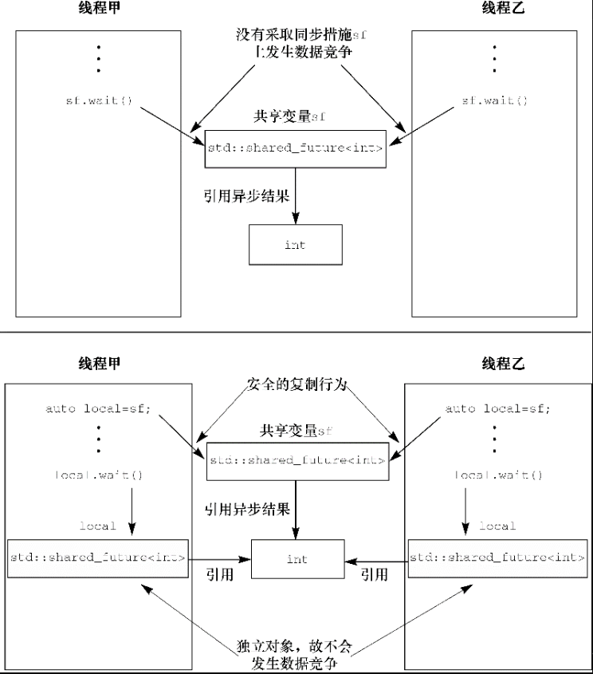

# 互斥量
C++11提供了`std::mutex`同步原语，可用于保护共享数据不被多个线程同时访问，并对外提供了这些接口
```C++
void lock();
bool try_lock();

// unlock mutex,如果采用次接口需要保证每次都调用unlock,特别是异常处理
// 考虑到异常处理，推荐采用RAII的方式处理C++标准库提供了类模板std::lock_guard<>
// 针对互斥类融合实现了RAII手法：在构造时给互斥加锁，在析构时解锁，从而保证互斥总被正确解锁
void unlock();
```
>mutex offers exclusive, non-recursive ownership semantics:
>
>- A calling thread owns a mutex from the time that it successfully calls either lock or try_lock until it calls unlock.
>- When a thread owns a mutex, all other threads will block (for calls to lock) or receive a false return value (for try_lock) if they attempt to claim ownership of the mutex.
>- A calling thread must not own the mutex prior to calling lock or try_lock.
>  
>
>来自[cppreference:mutex](https://en.cppreference.com/w/cpp/thread/mutex)

上面是说，互斥量提供了排他的、非递归的所有权语义:
- 成功调用`lock`或`try_lock`开始的线程将拥有该互斥量，直到调用`unlock`为止。
- 当一个线程拥有互斥量时，其他所有线程调用`lock`将阻塞或者对于`try_lock`返回false。
- 在调用`lock`或`try_lock`时，调用线程不能拥有互斥量。


## 组织代码实现保护共享数据

如果成员函数返回指针或引用，指向受保护的共享数据，那么即便成员函数全都按良好、有序的方式锁定互斥，仍然无济于事，只要存在任何能访问该指针和引用的代码，它就可以无须锁定互斥，就访问或修改受保护的共享数据，这样会打破保护，从而导致代码出现漏洞。因此，<b><font color=FF9033>若利用互斥保护共享数据，则需谨慎设计程序接口，从而确保互斥已先行锁定，再对受保护的共享数据进行访问，并保证不留后门。</font></b>

```C++
class some_data {
public:
    void do_something();
private:
    int a;
    std::string b;
};

class data_wrapper {
public:
    template<typename Function>
    void process_data(Function func) {
        std::lock_guard<std::mutex> l(m);
        func(data); // 向使用者提供的函数传递受保护共享数据
    }
private:
    some_data data;
    std::mutex m;
};

some_data* unprotected;
data_wrapper x;

void malicious_function(some_data& protected_data) {
    unprotected=&protected_data;
}

void foo() {
    // 传入恶意函数
    x.process_data(malicious_function);
    // 以无保护方式访问本应受保护的共享数据
    unprotected->do_something();
}
```

上述实现出现问题的原因是我们无法将所有访问共享数据的代码都标记成互斥(`unprotected->do_something()`)。

<b><font color=FF9033>从乐观的角度看，只要遵循下列指引即可应对上述情形：不得向锁所在的作用域之外传递指针和引用，指向受保护的共享数据，无论是通过函数返回值将它们保存到对外可见的内存，还是将它们作为参数传递给使用者提供的函数。</font></b>实际上，使用互斥保护共享数据的常见错误，但错误远远不止这一个，例如下面接口中会存在条件竞争

```C++
template<typename T,typename Container=std::deque<T>>
class stack {
public:
    explicit stack(const Container&);
			// ......
    bool empty() const;
    size_t size() const;
    T& top();
    T const& top() const;
    void push(T const&);
    void push(T&&);
    void pop();
    void swap(stack&&);
};
```

假设两个线程操作同一个栈

|        线程1         |        线程2         |
| :------------------: | :------------------: |
|   `if(!s.empty())`   |                      |
|                      |   `if(!s.empty())`   |
| `int val = s.top();` |                      |
|                      | `int val = s.top();` |
|      `s.pop()`       |                      |
|                      |                      |
|                      |      `s.pop()`       |

上述时序会导致栈顶元素被访问两次。


避免分割操作可以消除条件竞争，还存在其他不完美的方式来消除条件竞争

1. 传入引用，借一个外部变量接收栈容器弹出的元素，将指涉它的引用通过参数传入pop()调用。
2. 提供不抛出异常的拷贝构造函数，或不抛出异常的移动构造函数
3. 返回指针，指向弹出的元素
4. 结合方法1和方法2，或结合方法1和方法3

[利用互斥实现线程安全的栈容器](./ThreadSync/mutex_threadsafe_stack.cpp)

# 信号量

信号量代表一定的资源数量，可以根据当前资源的数量按需唤醒指定数量的资源消费者线程，资源消费者线程一旦获取信号量，就会让资源减少指定的数量，如果资源数量减少为0，则消费者线程将全部处于挂起状态；当有新的资源到来时，消费者线程将继续被唤醒。

## C++11借助无名信号量
初始化和销毁的API

```C++
#include <semaphore.h>

/**
 * 用于初始化信号量
 *      @pshared: 表示信号量是否可以被共享
 *          0: 只能在同一个进程的多个线程间共享
 *          非0: 可以在多个进程之间共享
 *      @value:   设置信号量的初始值
 * @return  成功返回0，失败返回-1，一般可以不关注该返回值
*/
int sem_init(sem_t* sem, int pshared, unsigned int value);
// 销毁信号量
int sem_destroy(sem_t*sem);
```

```C++
// 阻塞线程调用,直到信号量对象的资源计数大于0时被唤醒,唤醒后将资源计数递减1,然后立即返回
int sem_wait(sem_t* sem);
// sem_wait的非阻塞版，如果资源计数大于0，成功返回0
// 如果当前信号量对象的资源计数等于0，则sem_trywait函数会立即返回
// 不阻塞调用线程，返回值是-1，错误码errno被设置成EAGAIN
int sem_trywait(sem_t*sem);
// sem_wait等待一段时间，abs_timeout是等待时间，如果资源计数大于0，成功返回0
// 如果超时返回，返回值为-1，错误码errno是ETIMEDOUT
int sem_timedwait(sem_t* sem, const struct timespec* abs_timeout);
```

```C++
// 将信号量的资源计数递增1，并解锁该信号量对象
// 使得唤醒因sem_wait函数被阻塞的其他线程
int sem_post(sem_t* sem);
```

[C++11信号量实现生产者消费者模型](./ThreadSync/semaphore_11.cpp)

## C++20信号量

C++20提供了`std::counting_semaphore`和`std::binary_semaphore`支持信号量。

> 信号量亦常用于发信/提醒而非互斥，通过初始化该信号量为 0 从而阻塞尝试 acquire() 的接收者，直至提醒者通过调用 release(n) 通知，在这一点可把信号量当作 `std::condition_variable` 的替用品，通常它有更好的性能。
>
> 1. `counting_semaphore` 是一个轻量同步元件，能控制对共享资源的访问。不同于`std::mutex`、 `counting_semaphore` 允许同一资源有多于一个同时访问，至少允许 `LeastMaxValue` 个同时的访问者若`LeastMaxValue` 为负则程序为谬构。
>
>
> 2. `binary_semaphore` 是`std::counting_semaphore`的特化的别名，其`LeastMaxValue` 为 1 。实现可能将 `binary_semaphore` 实现得比`std::counting_semaphore`的默认实现更高效。
>
>     ​						-- 来自[counting_semaphore](https://zh.cppreference.com/w/cpp/thread/counting_semaphore)

```C++
// desired初始化counting_semaphore的计数器的值
constexpr explicit counting_semaphore(std::ptrdiff_t desired);

// 原子地将内部计数器的值增加update
void release(std::ptrdiff_t update = 1);

// 若内部计数器大于0则尝试将它减少1;否则阻塞直至它大于0且能成功减少内部计数器
void acquire()
// 若内部计数器大于0则尝试原子地将它减少1;不阻塞
// 若减少内部计数器则为true, 否则为false
bool try_acquire() noexcept;

// 若内部计数器大于0则尝试原子地将它减少1;否则阻塞直至它大于0且能成功地减少内部计数器
// 或等待已经超出rel_time,可能会抛出std::system_error异常
template<class Rep, class Period>
bool try_acquire_for(const std::chrono::duration<Rep, Period>& rel_time);

// 若内部计数器大于0则尝试原子地将它减少1;否则阻塞直至它大于0且能成功地减少内部计数器
// 或已经经过 abs_time 时间点, 可能会抛出std::system_error异常
template<class Clock, class Duration>
bool try_acquire_until( const std::chrono::time_point<Clock, Duration>& abs_time );
```


[C++11信号量实现生产者消费者模型](./ThreadSync/semaphore_20.cpp)

# 条件变量

条件变量采用通知-唤醒模型。

> The `condition_variable` class is a synchronization primitive used with a std::mutex to block one or more threads until another thread both modifies a shared variable (the condition) and notifies the `condition_variable`.
>
> The thread that intends to modify the shared variable must:
>
> 1. Acquire a `std::mutex` (typically via std::lock_guard)
> 2. Modify the shared variable while the lock is owned
> 3. Call notify_one or notify_all on the `std::condition_variable` (can be done after releasing the lock)
>
>   -- 来自[std::condition_variable](https://en.cppreference.com/w/cpp/thread/condition_variable)

翻译一下的大体意思是：`condition_variable`是和`std::mutex`一起使用的同步原语，`std::mutex`用于阻塞一个或多个线程，直到另外一个线程修改共享变量(`condition`)并通知`condition_variable`。

想要修改共享变量的线程必须：

1. 获取`std::mutex`(通常通过std::lock_guard)
2. 持有锁时，修改共享变量
3. 在`std::condition_variable`上调用notify_one或notify_all(可以在释放锁之后执行)


下面这个引用[2]中的描述，实现一遍之后会觉得更易理解

> 什么是条件变量呢，引用APUE中的一句话:
>
> Condition variables are another synchronization mechanism available to threads. These synchronization objects provide a place for threads to rendezvous. When used with mutexes, condition variables allow threads to wait in a race-free way for arbitrary conditions to occur.
>
> 条件变量是线程的另外一种有效同步机制。这些同步对象为线程提供了交互的场所（一个线程给另外的一个或者多个线程发送消息），我们指定在条件变量这个地方发生，一个线程用于修改这个变量使其满足其它线程继续往下执行的条件，其它线程则等待接收条件已经发生改变的信号。当条件变量同互斥锁一起使用时，条件变量允许线程以一种无竞争的方式等待任意条件的发生。


从下面几个角度来理解条件变量

1. 为什么需要条件变量(适用场景)
2. 为什么条件变量和互斥体一定要结合使用？(确保解锁和等待在一个原子操作中)
3. 如何使用条件变量？
4. 什么是虚假唤醒？为什么会出现虚假唤醒？
5. 条件变量的信号丢失(条件变量唤醒时，相关线程没有调用`wait`)


## 适用场景

在实际应用中，我们常常会有类似如下的需求
```C++
// 以下是伪代码, m的类型是pthread_mutex_t, 已经初始化过了
int WaitForTrue() {
    do {
        pthread_mutex_lock(&m);
        // 验证condition是否为true
        // 解锁, 让其他线程有机会改变condition   
        pthread_mutex_unlock(&m);     // 睡眠n秒        
        sleep(n);
    } while (condition is false);

    return 1;
}
```

这段逻辑用于反复判断一个多线程的共享条件是否满足，一直到该条件满足为止。由于该条件被多个线程操作，因此在每次判断之前都需要进行加锁操作，判断完毕后需要进行解锁操作。该逻辑存在严重的效率问题，假设解锁离开临界区后，其他线程修改了条件导致条件满足，则此时程序仍然需要睡眠n秒才能得到反馈。因此我们需要这样一种机制：某个线程A在条件不满足的情况下主动让出互斥体，让其他线程操作，线程A在此处等待条件满足；一旦条件满足，线程A就可以被立刻唤醒。

[C++多线程并发(三) --- 线程同步之条件变量](https://blog.csdn.net/m0_37621078/article/details/89766449)这个博客用代码的方式形象展示了上述过程。


## 条件变量和互斥体结合的原因

为什么条件变量和互斥体一定要结合使用？假定条件变量和互斥体不结合，下面是伪代码

```C++
//m的类型是pthread_mutex_t，并且已经初始化过了，cv是条件变量
pthread_mutex_lock(&m);
while(condition_is_false) {
    pthread_mutex_unlock(&m);
    //解锁之后，等待之前，可能条件已经满足，信号已经发出，但是该信号可能被错过
    cond_wait(&cv);
    pthread_mutex_lock(&m);
}
```

在以上代码中，假设线程A在执行完第5行代码后CPU时间片被剥夺，此时另一个线程B获得该互斥体对象 m，然后发送条件信号，等线程A重新获得时间片后，由于该信号已经被错过，可能会导致线程A在代码第7行无限阻塞下去。

问题的根源是释放互斥体对象与条件变量等待唤醒不是原子操作，即解锁和等待这两个步骤必须在同一个原子操作中，才能确保`cond_wait`在唤醒之前不会有其他线程获得这个互斥体对象。

## C++的条件变量
C++标准库提供了条件变量的两种实现`std::condition_variable`和`std::condition_variable_any`。它们都在标准库的头文件`<condition_variable>`内声明。两者都需配合互斥，方能提供妥当的同步操作。`std::condition_variable`仅限于与`s`td::mutex`一起使用；然而，只要某一类型符合成为互斥的最低标准，足以充当互斥，`std::condition_variable_any`即可与之配合使用。由于`std::condition_variable_any`更加通用，它可能产生额外开销，涉及其性能、自身的体积或系统资源等，因此`std::condition_variable`应予优先采用，除非有必要令程序更灵活。

```C++

```

## 条件变量使用

```C++
// 阻塞当前线程,直到唤醒条件变量
void wait (unique_lock<mutex>& lck);

// 阻塞当前线程,直到唤醒条件变量且stop_waiting条件被满足
template <class Predicate>
void wait (unique_lock<mutex>& lck, Predicate stop_waiting);
```

```C++
// 通知当前正在等待此条件的一个线程
// 如果没有线程在等待, 不执行任何操作
// 如果有多个线程在等待, 随机通知一个线程
void notify_one() noexcept;

// 通知所有线程(类似于广播), 如果没有线程在等待，则函数不执行任何操作
void notify_all() noexcept;
```


[生产者消费者模型 1对1](code/src/Sync_ConditionVariable_1toMore.cpp)
[生产者消费者模型 1对多](code/src/Sync_ConditionVariable_1toMore.cpp)


条件变量最关键是需要弄清楚`pthread_cond_wait`在条件满足与不满足时的两种行为，这是难点和重点。

1. `pthread_cond_wait`函数阻塞时，会释放其绑定的互斥体并阻塞线程。因此在调用该函数前应该对互斥体加锁。
2. 收到条件信号时，`pthread_cond_wait`会返回并对其绑定的互斥体进行加锁，因此在其下面一定有互斥体解锁。


## 条件变量的虚假唤醒

将互斥体和条件变量配合使用的地方，使用了while语句，条件变量醒来之后再次判断条件是否满足：

```C++
// 使用while语句在条件变量醒来之后再次判断条件是否满足
// 不能使用 if (tasks.empty())
while (tasks.empty()) {
    pthread_cond_wait(&mycv, &mymutex);
}
```

这里不得不这样做，这是因为：操作系统可能在某些情况下唤醒条件变量，也就是说存在没有其他线程向条件变量发送信号，但等待此条件变量的线程有可能醒来的情形，将条件变量的这种行为称为虚假唤醒(spurious wakeup)。这里将条件(`tasks.empty()`为true)放在while循环中以为着不仅要唤醒条件变量还必须满足条件，程序才可以执行正常的逻辑。

那么为什么会存在虚假唤醒呢？

1. `pthread_cond_wait`是`futex`系统调用，属于阻塞型的系统调用，当系统调用被信号中断时，会返回-1，并且把`errno`错误码置为`EINTR`。很多这种系统调用在被信号中断后，都会再次调用一次这个函数，其代码如下

    ```C++
    pid_t r_wait(int *stat_loc) {
        int retval;
        //wait函数因为被信号中断导致调用失败，会返回-1，错误码是EINTR
        //注意：这里的while循环体是一条空语句
        while(((retval = wait(stat_loc)) == -1 &&(errno == EINTR));
        return retval;
    }
    ```

    假设 `pthread_cond_wait`函数被信号中断，则在`pthread_cond_wait `函数返回之后，到重新调用之前，`pthread_cond_signal `或`pthread_cond_broadcast`函数可能已被调用。一旦错失该信号，则可能由于条件信号不再产生，再次调用`pthread_cond_wait`函数将导致程序无限等待。为了避免这种情况发生，虚假唤醒，而不是再次调用`pthread_cond_wait`函数，以免陷入无穷等待中。

2. 此外，还存在一些情况：在条件满足时发送信号，但等到调用`pthread_cond_wait`函数的线程得到CPU时间片时，条件又再次不满足了。


## 条件变量信号丢失

如果一个条件变量信号在产生时(调用`pthread_cond_signal`或`pthread_cond_broadcast`)，没有相关线程调用 `pthread_cond_wait`捕获该信号，该信号就会永久丢失，再次调用`pthread_cond_wait`会导致永久阻塞。

# Future(等待一次性事件)

C++标准程序库使用`std::future`来模拟这类一次性事件，如果线程需要等待某个特定的一次性时间发生，会以某种方式获取一个代表该事件的`future`。该线程边可以一边执行其他任务，一边在`future`上等待，同时以较短时间间隔周期性地以检查该事件是否已经发生；该线程还可以切换到其他任务，直到必要时，再等待future准备就绪。一旦目标事件发生，代表该事件的future进入就绪状态，无法重置。

`std::future`提供了一种访问异步操作结果的机制：

- 异步操作(可以通过`std::async`, `std::packaged_task`或`std::promise`等创建)可以提供一个`std::future`对象给异步操作的创建者。
- 之后，异步操作的创建者可以通过一系列的查询,等待或取值等对`std::future`操作。如果`std::future`尚未提供值，则上述接口可能会阻塞。
- 当异步操作已经准备好结果，依然可以通过修改链接给创建者的共享状态(shared state，例如`std::promise::set_value`)来修改。这里的共享状态不与其他的异步操作返回的对象共享。

C++标准程序库有两种`future`，分别由两个类模板实现，其声明位于标准库的头文件`<future>`内：独占`future(unique future`，即`std::future<>`)和共享`future`(shared future，即`std::shared_future<>`）。同一事件仅仅允许关联唯一`std::future`实例，但可以关联多个`std::shared_future`实例，只要目标事件发生，与后者关联的所有实例会同时就绪，并且，它们全都可以访问与该目标事件关联的任何数据。如果没有关联数据，可以使用特化的模板`std::future<void>`和`std::shared_future<void>`。`future`能用于线程间通信，但是`future`对象本身不提供同步访问。若多个线程需访问同一个`future`对象，必须用互斥或其他同步方式进行保护。

`std::future`提供了下面的一些接口
```C++
template<class T> class future;
template<class T> class future<T&>;
// 特化模版, 没有关联数据
template<>        class future<void>;

// 等待结果可用
wait();
wait_for();
wait_until();

// 只可move(move-only),不可复制
future& operator=(future&& other ) noexcept;
future& operator=(const future& other ) = delete;
```

## async异步操作
```C++
async(Function&& f, Args&&... args )

/**
 * @param policy:  bitmask,可能得bit位有
 *      std::launch::async:     开启专属线程运行
 *      std::launch::deferred:  延迟调用
*/
async(std::launch policy, Function&& f, Args&&... args );
```

默认情况下，`std::async()`会自行决定--等待`future`时，是启动新线程或者是同步执行任务。我们还可以给`std::async`传递一个`std::launch`类型参数来执行采用哪种方式运行，其可能的取值是：

- `std::launch::deferred`：在当前线程上延后调用任务函数，等到在`future`上调用了`wait()`或`get()`，任务函数才会执行。如果延后调用任务函数，该任务函数有可能永远都不会被调用。
- `std::launch::async`：指定必须另外开启专属的线程，在其上运行任务函数。如果无法开启新线程会抛出`std::system_error`，其中`error code`是`std::errc::resource_unavailable_try_again`。
- `std::launch::deferred | std::launch::async`：表示由`std::async()`的实现自行选择运行方式，默认采取这种方式。

```C++
// 运行新线程, 在其上运行任务函数
auto task1 = std::async(std::launch::async,Y(), 1.2);

// 在当前线程延后调用任务函数
// 等在future上调用wait()或get(),才会运行该任务函数
auto task2 = std::async(std::launch::deferred, baz, std::ref(x));

// std::sync自行选择运行方式
auto task3 = std::async(std::launch::deferred | std::launch::async,
   baz, std::ref(x));

// std::sync自行选择运行方式
auto f9 = std::async(baz, std::ref(x));

// task2延后调用, 在这里才被运行
task2.wait();
```

[从后台取任务返回值的简单示例](code/src/4.2_OneOff_SimpleSync.cpp)

## packaged_task包装任务
`std::packaged_task<>`连结了`future`对象与函数(可调用对象)。`std::packaged_task<>`对象在执行任务时，会调用关联的函数，把返回值保存为`future`的内部数据，并令`future`准备就绪。它可以用作线程池的构建单元，也可以用作其他的任务管理方案。`std::packaged_task<>`是类模板，其模板参数是函数签名(`function signature`)。

```C++
// f:可调用的对象
template<class F>
explicit packaged_task(F&& f);

template<class R, class ...ArgTypes>
class packaged_task<R(ArgTypes...)>;

// 获取其返回的future实例
// future的特化参数类型区局与函数签名指定的返回值
std::future<R> get_future();

// 具备函数调用操作符，参数取决于函数签名参数列表
void operator()( ArgTypes... args );

// 只可move(move-only),不可复制
packaged_task& operator=( const packaged_task& ) = delete;
packaged_task& operator=( packaged_task&& rhs ) noexcept;
```

[packaged_task包装任务示例](code/src/4.2_OneOff_SimplePackagedTask.cpp)

## promise异步求值
有些任务无法以简单的函数调用表达出来，一些任务的执行结果可能来自多个部分的代码需要借助`std::promise`显式地异步求值。

`std::promise<T>`给出了一种异步求值的方法（类型为T），某个`std::future<T>`对象与结果关联，能延后读出需要求取的值。配对的`std::promise`和`std::future`可实现下面的工作机制：等待数据的线程在`future`上阻塞，而提供数据的线程利用相配的`promise`设定关联的值，使`future`准备就绪。

```C++
template<>
promise<void>();

template <class R>
promise<R&>();

// 获取future(shared state)
future<T> get_future();

// 给promise设置值，只要设置好，future便准备就绪
// 如果std::promise销毁时仍未曾设置值，保存的数据则由异常代替
void set_value (const T& val);
void set_value (T&& val);
    
// 只可移动(move-only)，不可复制
promise& operator= (promise&& rhs) noexcept;	
promise& operator= (const promise&) = delete;
```
1. [借助Promise模拟顾客等待奶茶制作,服务员制作奶茶，当奶茶制作完成通知顾客取咖啡](code/src/4.2_OneOff_SimplePromise.cpp)
2. [利用promise在线程间发送信号实现屏障](code/src/4.2_OneOff_SimplePromisBarrier.cpp)

## 异常保存到future
由`std::async()`调用的函数抛出异常，则会被保存到`future`中，代替本该设定的值，`future`随之进入就绪状态，等到其成员函数`get()`被调用，存储在内的异常被重新抛出(C++标准没有明确规定应该重新抛出原来的异常，还是其副本；因此,不同的编译器和库可能不同)。如果把任务函数包装在`std::packaged_task`对象内也是这样。

有下面两种方式将异常保存到future中：
1. 显示调用成员函数
2. 不调用`std::promise`的set函数或不执行`std::packaged_task`，直接销毁future
<br/>
---
`std::promise`也具有同样的功能，它通过成员函数的显式调用实现。假如想保存异常，调用成员函数`set_exception()`。若算法的并发实现会抛出异常，则该函数通常可用于其`catch`块中，捕获异常并装填`promise`。
```C++
extern std::promise<double> some_promise;
try {
    some_promise.set_value(calculate_value());
} catch(...) {
    some_promise.set_exception(std::current_exception());
}
```
`std::make_exception_ptr()`可以直接保存新异常，并不抛出，相较于`try/catch`，该实现可以简化代码且利于编译器优化，优先采用。
```C++
some_promise.set_exception(std::make_exception_ptr(std::logic_error("foo ")));
```
<br/>

----

`std::promise`不调用`set_value`和`set_value_at_thread_exit`成员函数，`std::packaged_task`不执行包装任务，直接销毁与`future`关联的`std::promise`对象或`std::packaged_task`对象。如果关联的`future`未能准备就绪，无论销毁两者中的哪一个，其析构函数都会将异常`std::future_error`存储为异步任务的状态数据，错误代码`std::future_errc::broken_promise`。

---

## 多个线程等待同一事件
> 对于某个`std::future`实例，如果其成员函数由不同线程调用，不会自动同步。若在多个线程上访问同一个`std::future`对象，而不采取额外的同步措施，将引发数据竞争并导致未定义行为。这是`std::future`特性：它模拟了对异步结果的独占行为，`get()`仅能被有效调用唯一一次，这令并发访问失去意义，只有一个线程可以获取目标值，原因是第一次调用`get()`会进行移动操作，之后该值不复存在。
>
> `std::shared_future`可以实现多个线程等待同一目标事件。`std::future`仅能移动构造和移动赋值，归属权可在多个实例间转移，在相同时刻，只有唯一`future`实例指向特定异步结果；`std::shared_future`实例则能复制出副本，因此可以持有该类的多个对象，它们全指向同一异步任务的状态数据。

`std::shared_future`同一个对象的成员函数没有同步，若多个线程访问同一个对象，就必须采取锁保护以避免数据竞争。首选方式是，向每个线程传递`std::shared_future`对象的副本，它们为各线程独自所有并被视作局部变量。这些副本作为各线程的内部数据，由标准库正确地同步，可以安全地访问。若多个线程共享异步状态，只要它们通过自有的`std::shared_future`对象读取状态数据，则该访问行为是安全的。
<center>
    <div><b>使用多个std::shared_future对象避免数据竞争</b></div>
    
</center>

```C++
std::promise<int> p;
std::future<int> f(p.get_future());
assert(f.valid());    // future对象f有效

std::shared_future<int> sf(std::move(f));
assert(!f.valid());  // 对象f不再有效
assert(sf.valid()); // 对象sf开始生效

// 隐式转移归属权
std::promise<std::string> p;
std::shared_future<std::string> sf(p.get_future());
```
`std::future`可以根据初始化列表自动推断变量的类型，从而使`std::shared_future`更便于使用。`std::future`成员函数`share()`可以直接创建新的`std::shared_future`对象，并向它转移归属权
```C++
std::promise< std::map<SomeIndexType, SomeDataType, SomeComparator,
    SomeAllocator>::iterator> p;
// 根据初始化列表推断出std::shared_future的类型
auto sf = p.get_future().share();
```

# 参考资料

1. C++服务器开发精髓
2. [C++多线程并发(三) --- 线程同步之条件变量](https://blog.csdn.net/m0_37621078/article/details/89766449)
3. 《C++并发编程实践》
