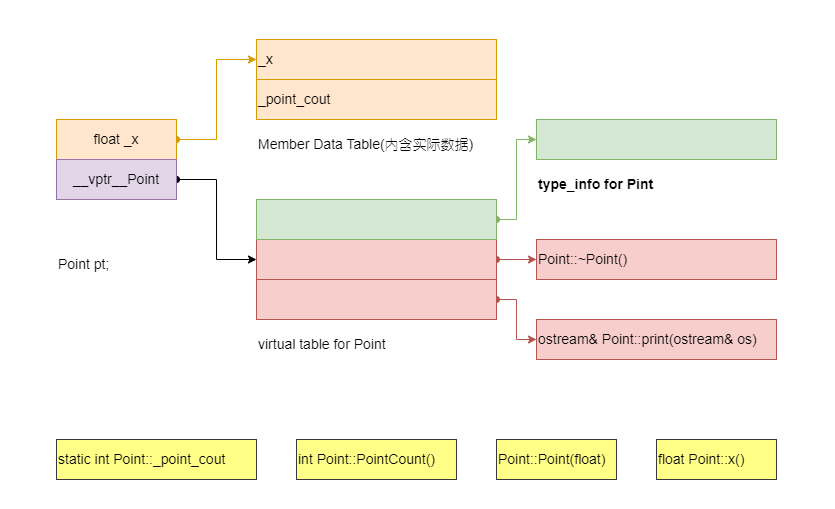

```C++

```


```C++
class Point2d : public Point {
public:
    Point2d(float xval = 0.0, float yval = 0.0);
    virtual ~Point2d();
    
    float x() const;
    float y() const;
    static PointCount();

protected:
    virtual ostream& print(ostream& os) const;
    
    float _y;
    static int _point_count;
};
```


## C++对象模型（C++ Object Model）

在C++中，有两种class data members:static和non-static以及三种class memberfunctions:static、non-static和virtual,例如下面的`class Point`的声明:

```C++
class Point {
public:
    Point(float xval);
    virtual ~Point();
    
    float x() const;
    static PointCount();

protected:
    virtual ostream& print(ostream& os) const;
    
    float _x;
    static int _point_count;
};
```

C++是如何模塑(modeling)各种data members和function members？

### 简单对象模型(Simple Object Model)

该模型十分简单，可能是为了**尽量减低 C++编译器的设计复杂度而开发出来的，赔上空间和执行期的效率**。在该简单模型中，一个object是一系列的slots，每一个slot指向一个members。Members按其声明顺序，各被指定一个slot。每一个data member或functionmember都有自己的一个slot。该模型如下图所示：

<center>
    
    <div><b>简单对象模型(Simple Object Model)</b></div>
</center>

在该简单模型中，成员本身并不放在对象(object)中。将“指向member的指针”放在object内。这么做可以避免“members有不同的类型，而需要不同的存储空间”而导致的问题。Object中的members是以slot索引值来寻址，本例之中_x的索引是6, _point_count的索引是7。一个**class object的大小可以根据指针大小乘以class中声明的members个数**便可以很容易计算出来。

该模型并没有真实地应用到实际产品中，索引或slot个数的观念，还是被应用到C++中指向成员的指针(pointer-to-member)。

### 表格驱动对象模型(Table-driven Object Model)

为了对所有classes的所有objects都有一致的表达方式，表格驱动对象模型是把所有与 members相关的信息抽出来，class object本身内含两个表格指针：

- data member table ，存放member data本身。
- member function table，是一系列的slots，每个slot指出一个member function。

如下图所示：

<center>
    
    <div><b>Member Table对象模型(Member Table Object Model)</b></div>
</center>

该模型也没有实际应用到C++编译器上，但member function table的概念却称为支持virtual functions的有效方案。

### C++对象模型(C++ Object Model)

Stroustrup当初设计(目前依然有优势)的C++对象模型是从简单对象模型派生而来，并对内存空间和存取时间做了优化。在此模型中：

- Non-static data members被配置于每一个class object之内，static data members则被存放在class object之外
- Static和non-static function members也被放在class object之外。
- Virtual functions则以两个步骤支持：
    1. 每一个 class产生出一堆指向 virtual functions的指针，放在表格之中，这个表格被称为virtual table(vtbl)。
    2. 每一个 class object插入一个指针，指向相关的 virtual table。通常这个指针被称为vptr。每个类的constructor、destructor和 copy assignment自动完成vptr 的设定(setting)和重置(resetting)。每一个 class所关联的type_info object(用以支持 runtime type identification, RTTI)也经由 virtual table被指出来，通常放在表格的第一个 slot。

由上述描述`class Poin`的C++对象模型，如下图所示：

<center>
    
    <div><b>class Poin的C++对象模型</b></div>
</center>

C++对象模型的主要优点在于它的**空间和存取时间的效率**；主要缺点是，如果应用程序代码本身未曾改变，但所用到的class objects的non-static data members有所修改(可能是增加、移除或更改)，那么应用程序代码得重新编译。关于这一点双表格驱动模型提供了更多弹性，但由于它提供了一层间接性，因此付出了空间和执行效率方面的代价。


在上述基础上加上继承(Inheritance)

```C++
// 更早于标准版的iostream实现方式
class iostream: public istream, public ostream { ... };

class istream : virtual public ios { ... };
class ostream : virtual public ios { ... }
```

在虚拟继承的情况下，base class不管在继承串链中被派生(derived)多少次，永远只会存在一个实例(称为subobject)。例如`iostream`中就只有`virtual ios` base class实例。那么，一个derived class如何在本质上模塑其base class的实例？

在简单对象模型中，一个base class可以被derived class object内的一个slot指出，该slot内含base class subobject的地址。该设计的优点是class object的大小不会因base class的改变而受到影响，其主要缺点是由于间接性而导致空间和存取时间上的额外负担。

另外一种所谓base table模型。在base class table产生出来时，表格中每个slot内含一个相关base class地址，类似于virtual table内含每一个virtual function的地址。每一个class object内含一个bptr，它被初始化，指向base class table。该设计的主要缺点是由于间接性而导致的空间和存取时间上的额外负担，优点是

- 在每一个class object 中对于继承都有一致的表现方式：每一个class object都在某个固定位置上安放一个与base classes大小和数量无关的base table指针；
- 无须改变class objects本身，就可以放大、缩小或更改base class table。

不管哪种机制，间接性的级数都会导致因为继承深度而增加。

<center>
    
    <div><b>以iostream为例，展示base class table在多种继承中的运用</b></div>
</center>


C++最初采用的继承模型并不运用任何间接性：base class subobject的data members被直接置于derived class object中。这提供了对base class members最紧凑且最有效率的存取。缺点就是：base class members的任何改变，包括增加、移除或改变类型等，都使得所有用到“此base class或其derived class的objects”必须重新编译。

自C++ 2.0起新导入的virtual base class，需要一些间接的base class表现方法。**Virtual base class的原始模型是在class object中为每一个有关联的virtual base class加上一个指针**。其他演化出来的模型则要不是导入一个virtual base class table，就是扩充原已存在的virtual table，以便维护每一个virtual base class的位置。

## 对象模型如何影响程序(How The Object Model Effects Programs)


