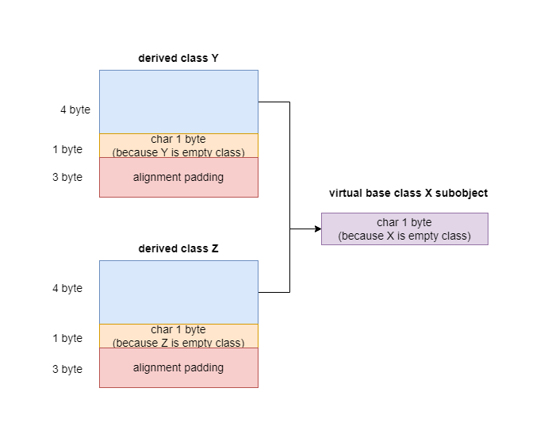
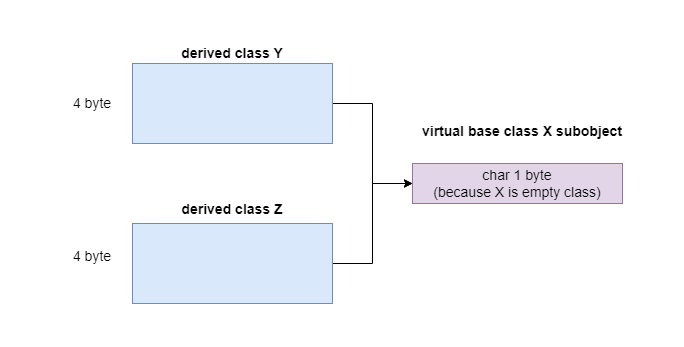

# Data语义学

```C++
class X {};
class Y : public virtual X {};
class Z : public virtual X {};
class A : public Y, public Z {};
```

X、Y、Z、A中没有任何一个class内含明显的数据。

| 可能性1                                                      | 可能性2                                                      |
| ------------------------------------------------------------ | ------------------------------------------------------------ |
| sizeof(X) = 1<br/>sizeof(X) = 8<br/>sizeof(Y) = 8<br/>sizeof(A) = 12 | sizeof(X) = 1<br/>sizeof(X) = 4<br/>sizeof(Y) = 4<br/>sizeof(A) = 8 |

事实上`class X`并不是空的，编译器会插入一个char，它有一个隐藏的1byte，这使得class的不同object在内存中可以配置独一无二的地址。

```C++
// a和b有各自独立的地址
X a, b;
```

Y和Z的大小和机器以及编译其相关，它受到下面三个因素的影响:

1. 语言本身所造成的额外负担(overhead) 当语言支持virtual base classes时，就会导致一些额外负担。在 derived class中，这个额外负担反映在某种形式的指针身上，它或者指向 virtual baseclass subobject，或者指向一个相关表格；表格中存放的若不是 virtual base class subobject的地址，就是其偏移位置(offset)。在上例中，指针是 4 bytes。
2. 编译器对于特殊情况所提供的优化处理Virtual base class X subobject的1 bytes大小也出现在 class Y和Z身上。传统上它被放在 derived class的固定（不变动）部分的尾端。某些编译器会对empty virtual base class提供特殊支持，例子中的编译器并未提供这个处理。
3. Alignment的限制class Y和Z的大小截至目前为 5 bytes。在大部分机器上，聚合的结构体大小会受到 alignment的限制，使它们能够更有效率地在内存中被存取。例子中，alignment是 4 bytes，所以class Y和Z必须填补 3 bytes。最终得到的结果就是 8 bytes。

<center>
    
    <div><b>X、Y、Z对象布局</b></div>
</center>

Empty virtual base class已经成为C++ OO设计的一个特有术语了。它提供一个virtual interface，没有定义任何数据。某些新近的编译器对此提供了特殊处理。在这个策略下，一个empty virtual base class被视为derived class object最开头的一部分，它就不需要任何的额外空间。这就节省了上述第2点的1 bytes，也就不再需要第3点所说的3 bytes的填补。只剩下第1点所说的额外负担。在此模型下，Y和Z的大小都是4而不是8。

<center>
    
    <div><b>X、Y、Z对象布局，其中Visual C++即使这类编译器</b></div>
</center>
[EBO(Empty Base Optimization)](https://en.cppreference.com/w/cpp/language/ebo)允许空基类的大小是0。

> The size of any [object](https://en.cppreference.com/w/cpp/language/object) or member subobject is required to be at least 1 even if the type is an empty class type(that is, a class or struct that has no non-static data members), (unless with `[[no_unique_address]]`, see below) (since C++20) in order to be able to guarantee that the addresses of distinct objects of the same type are always distinct.

`class A`的大小是多少，结果和适用的编译器相关，我们必须要考虑那些为特别处理empty virtual base class的编译器。sizeof(A)=12是怎么得到的呢？

- 被唯一共享的class X实例，其大小为1 byte。
- Base class Y因empty virtual base class的配置，其大小是4 byte，同理，sizeof(Z)=4 byte
- class A自身的大小是0
- 前述三项总和为9 byte，如果有alignment会填补3 byte，结果为12 byte。

对于那些对empty virtual base class做了处理的编译器，class X的1 byte便不需要，同样也不再需要填充3 byte的alignment，因此sizeof(A) = 8;


C++ Standard并不强制规定如“base class subobjects的排列顺序”或“不同存取层级的datamembers的排列顺序”这种琐碎细节。它也不规定virtual functions或virtual base classes的实现细节。C++ Standard只说：那些细节由各家厂商自定。

class的data members，一般而言，可以表现这个class在程序执行时的某种状态。Non-static data members放置的是“个别的class object”感兴趣的数据，static data members则放置的是“整个class”感兴趣的数据。

C++对象模型尽量以空间优化和存取速度优化的考虑来表现 non-static data members，并且保持和C语言struct数据配置的兼容性。它把数据直接存放在每一个class object之中。对于继承而来的non-static data members（不管是virtual还是non-virtual base class）也是如此。不过并没有强制定义其间的排列顺序。至于static data members，则被放置在程序的一个global data segment中，不会影响个别的class object的大小。在程序之中，不管该class被产生出多少个objects（经由直接产生或间接派生）, static data members永远只存在一份实例，但是一个template class的static data members的行为稍有不同。

每一个 class object 因此必须有足够的大小以容纳它所有的 non-static data members。有时候它可能会更大一些，原因是：

1. 由编译器自动加上的额外 data members，用以支持某些语言特性(主要是各种 virtual特性)。
2. 因为alignment的需要

# Data Member绑定(The Binding of Data Member)

```C++
extern float x;

class Point3d {
public:
    Point(float, float);
    // 问题:被获取和设置的x是哪个x？
    float X() const { return x; }
    void X(float new_x) const { x = new_x;}
private:
    float x, y;
};
```

`Point3d::X()`传回哪一个x？是class内部的x，还是外部(extern)的x？答案是class内部的x，但这个不是一直都正确。


在C++早期的编译器上，如果在Point3d::X()的两个函数实例中对x做出参阅（取用）操作，该操作将会指向global xobject! 这样的绑定结果常常不符合大家的预期，因此早期有两种防御性的程序设计风格:

1. 把所有的 data members放在 class声明起头处，以确保正确的绑定

    

    ```C++
    class Point3d {
        // 在class声明先放左右的data member
        float x, y;
    public:
        Point(float, float);
        // 问题:被获取和设置的x是哪个x？
        float X() const { return x; }
        void X(float new_x) const { x = new_x;}    
    };
    ```

2. 把所有的 inline functions，不管大小都放在 class声明之外

    ```C++
    class Point3d {
    public:
        Point(float, float);
        float X() const;
        void X(float new_x) const;
    private:
    	float x, y;
    };
    
    inline float Point3d::X() const {
        return x;
    }
    ```

这个古老的语言规则被称为“member rewriting rule”，大意是“一个inline函数实体，在整个class声明未被完全看见之前，是不会被评估求值（evaluated）的”，在C++2.0之后便消失了。C++ Standard以“member scope resolution rules”来精炼这个“rewriting rule”，其效果是，如果一个inline函数在class声明之后立刻被定义的话，那么就还是对其评估求值（evaluate）。也就是说：

```C++
extern float x;

class Point3d {
public:
    Point(float, float);
	// 对于函数本体分析延迟，直至class声明的有大括号出现才开始
    float X() const { return x; }
    void X(float new_x) const { x = new_x;}
private:
    float x, y;
};
// 对member function本体的分析在这里才开始
```

对member functions本体的分析，会直到整个class的声明都出现了才开始。因此在一个inline member function躯体之内的一个data member绑定操作，会在整个class声明完成之后才发生。

[Summary of Scope Rules](https://learn.microsoft.com/en-us/cpp/cpp/summary-of-scope-rules?view=msvc-170)

> The compiler searches for names in the following order, stopping when the name is found:
>
> 1. Current block scope if name is used inside a function; otherwise, global scope.
> 2. Outward through each enclosing block scope, including the outermost function scope (which includes function parameters).
> 3. **If the name is used inside a member function, the class's scope is searched for the name.**
> 4. The class's base classes are searched for the name.
> 5. The enclosing nested class scope (if any) and its bases are searched. The search continues until the outermost enclosing class scope is searched.
> 6. Global scope is searched.


这并不适用于member function的argument list。Argument list中的名称还是会在它们第一次遭遇时被适当地决议(resolved)完成。因此在extern和nested type names之间的非直觉绑定操作还是会发生。

```C++
typedef int length;
class Point3d {
public:
    // length采用global typedef即int
    // _cal采用的是Point3d::_val
    void mumble(length val) { _val = val;}
    length mumble() { return _val;}
private:
    // 这样的声明导致先前的参考操作非法
    typedef float length;
    length _val;
};
```

上述这个语言状况，仍然需要某种防御性程序风格：请总是把“nested type声明”放在class的起始处。


## Data Member的布局(Data Member Layout)

