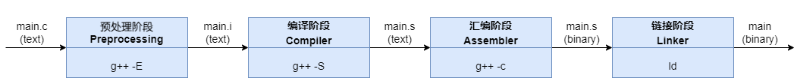

# CPP编译
C/C++源文件是按编译单元(translation unit)分开、独立编译的。所谓translation unit，其实就是输入给编译器的源代码，只不过该源代码是经过预处理(preprocessed​，包括去掉注释、宏替换、头文件展开)的。在本例中，即便你使用`g++ add.cpp main.cpp -o main.exe`，编译器也是分别编译 add.cpp 和 main.cpp(注意是预处理后的)的。在编译 add.cpp 时，编译器根本感知不到 main.cpp 的存在，反之同理。

包含四个阶段：预处理阶段(Preprocessing), 编译阶段(Compilation), 汇编阶段(Assembly), 链接阶段(Linking)
<center>

</center>
# 编译器优化

## NRV优化

也就是Named Return Value,

```C++
#include <iostream>
 
class MyClass {
public:
    MyClass() {
        m_i = 0;
        std::cout << "this is default constructor!" << endl;
    }
	
    MyClass(const MyClass& that) {
		std::cout << "this is copy constructor!" << endl;
		this->m_i = that.m_i;
	}
    
    MyClass& operator=(const MyClass& that) {
		std::cout << "this is assignment constructor!" << endl;
		if (this != &that) {
			return *this;
		} else {
			this->m_i = that.m_i;
			return *this;
		}
}
private:
	int m_i;
};
 
MyClass::
 

 
MyClass gfunc() {
	MyClass obj;
	return obj;
}
 
MyClass func() {
	return MyClass();
}
 
int main() {
	MyClass myObj;
	std::cout << "----------------------- 1 -----------------" << std::endl;
 
	myObj = gfunc();
	std::cout << "----------------------- 1 -----------------" << std::endl;
 
	MyClass myObj2 = gfunc();
	std::cout << "----------------------- 1 -----------------" << std::endl;
 
	MyClass myObj3 = func();   //RVO优化
    std::cout << "----------------------- 1 -----------------" << std::endl;
 
    myObj3 = func();           //RVO优化 
	return 0;
}
```


## ROV优化


## EBO优化

https://en.cppreference.com/w/cpp/language/ebo


https://www.informit.com/articles/article.aspx?p=31473&seqNum=2


