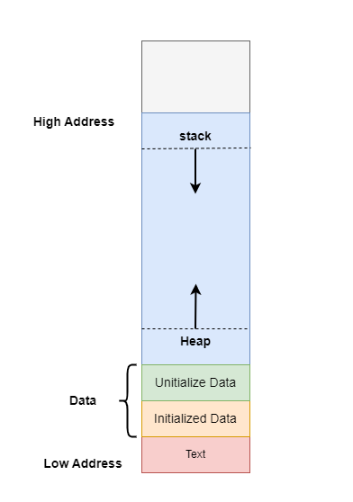

每个运行的程序都有和其他程序独立的自己的内存布局。该内存布局包含

- 栈(stack)：存储本地变量( local variable)，分配在栈上的变量也称为stack variable或automatic variable.
- 堆(Heap)：提供给程序员动态分配的内存。
- Data：存储全局变量，划分为initialized data和uninitialized data
- Text: stores the code being executed

    

# 栈

栈地址自上向下增长。

# 堆

堆地址自下向上增长。

# 参考资料

1. [Stack and Heap Memory](https://courses.engr.illinois.edu/cs225/fa2022/resources/stack-heap/)

