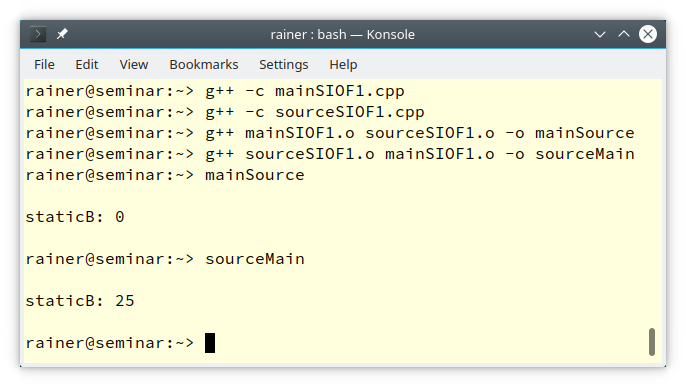

静态变量初始化顺序失败(static initialization order fiasco)。

> Dynamic initialization  ....
>
> 3) Ordered dynamic initialization ... Initialization of static variables in different translation units is indeterminately sequenced.  ...
>
> -- 来自：[cppreference:Initialization](https://en.cppreference.com/w/cpp/language/initialization)

也就是说，**对于non-local变量，不同翻译单元中静态变量的初始化顺序是不确定的。**

> The *static initialization order fiasco* refers to the ambiguity in the order that objects with static storage duration in different translation units [are initialized](https://en.cppreference.com/w/cpp/language/initialization#Non-local_variables) in. If an object in one translation unit relies on an object in another translation unit already being initialized, a crash can occur if the compiler decides to initialize them in the wrong order. For example, the order in which .cpp files are specified on the command line may alter this order. The Construct on First Use Idiom can be used to avoid the static initialization order fiasco and ensure that all objects are initialized in the correct order.
>
> Within a single translation unit, the fiasco does not apply because the objects are initialized from top to bottom.
>
>  						-- 来自:[cppreference:Static Initialization Order Fiasco](https://en.cppreference.com/w/cpp/language/siof#:~:text=The%20static%20initialization%20order%20fiasco,translation%20units%20are%20initialized%20in.)

**静态初始化顺序问题是指在不同翻译单元中具有静态存储期的对象初始化顺序存在歧义**。如果一个翻译单元中的对象依赖于另一个已经初始化的翻译单元中的对象，如果编译器错误的顺序初始化它们，就有可能发生崩溃。例如，在命令行中指定的`.cpp`文件的顺序可能会改变这个顺序。第一次使用时构造(Construct on First Use)惯用法可以避免静态初始化顺序失败，并确保所有对象都按照正确的顺序初始化。**在单个翻译单元中，由于对象是从上到下初始化的，所以不会出现这种失败。**

下面一个例子来展示[1]

```C++
// sourceSIOF1.cpp
int quad(int n) {
    return n * n;
}

auto staticA  = quad(5); 
```

```C++
// mainSOIF1.cpp
#include <iostream>

extern int staticA;   // (1)
auto staticB = staticA;

int main() {
    std::cout << std::endl;
    std::cout << "staticB: " << staticB << std::endl;
    std::cout << std::endl;
    return 0;
}
```

`staticA`和`staticB`都是non-local静态变量。`staticB`的初始化依赖于`staticA`的初始化。`staticB`在编译时zero-initialize，在运行时动态初始化(dynamically initialize)。`staticA`和`staticB`属于不同的翻译单元，不能保证`staticA`或`staticB`的初始化顺序。`staticB`有50:50的几率被初始化为0或者25。执行的结果依赖于object文件的连接顺序(link-order)。


<center>
    
</center>


因此要尽量避免使用non-local静态变量，如果需要使用可以通过下面的方式来解决：

# 使用local静态变量延迟初始化

即Lazy Initialization of static with local scope[1]。

```C++
// sourceSIOF2.cpp
int quad(int n) {
    return n * n;
}

// staticA是local static变量，在其创建时初始化
// C++11确保线程安全
int& staticA() {
    static auto staticA  = quad(5);   // (1)
    return staticA;
    
}
```

```C++
// mainSOIF2.cpp
#include <iostream>

int& staticA();           // (2)
auto staticB = staticA(); // (3)

int main() {
    std::cout << std::endl;
    std::cout << "staticB: " << staticB << std::endl;
    std::cout << std::endl;
}
```

local静态变量在第一次初始化时被创建(C++98保证)。在C++11中local静态变量的初始化是线程安全的。


这个解决方案需要注意构造和初始化的顺序问题。构造的顺序和析构的顺序是相反的。

```C++
class A {
public:
    // Get the global instance abc
    static A& getInstance_abc() {
        static A instance_abc;
        return instance_abc;
    }
};

class B {
public:
    static B& getInstance_B() {
        static B instance_B;
        return instance_B;
    }

    // 在B的析构函数中可以访问instance_abc
    // 可能存在的问题：
    // 必须保证当前对象析构后，再析构instance_abc，确保这一点需要保证
    // 保证instance_abc先构造，做到这一点，构造函数中访问instance_abc(调用A::getInstance_abc)
    ~B() {
         A::getInstance_abc().doSomthing();
         // The object abc is accessed from the destructor.
         // Potential problem.
         // You must guarantee that abc is destroyed after this object.
         // To guarantee this you must make sure it is constructed first.
         // To do this just access the object from the constructor.
    }

    // 先构造了instance_abc，由于构造顺序和析构顺序相反
    // 先析构instance_B再析构instance_abc
    // 在B的析构函数中可以安全地访问instance_abc
    B() {
        A::getInstance_abc();
    }
};

```


# 静态变量编译时初始化(C++20)

`constinit`确保静态变量在编译时初始化[1]。

```C++
// sourceSIOF3.cpp
constexpr int quad(int n) {
    return n * n;
}

// 编译时初始化
constinit auto staticA  = quad(5);  // (2)
```

```C++
// mainSOIF3.cpp
#include <iostream>

// 声明staticA变量
extern constinit int staticA;     // (1)
auto staticB = staticA;

int main() {
    std::cout << std::endl;
    std::cout << "staticB: " << staticB << std::endl;
    std::cout << std::endl;
    return 0;
}
```


# 参考资料

1. [Static Initialization Order Fiasco](https://www.modernescpp.com/index.php/c-20-static-initialization-order-fiasco)
2. [stackoverflow:C++ Static Initialization via Schwartz Counter](https://stackoverflow.com/questions/9251763/c-static-initialization-via-schwartz-counter)
3. [stackoverflow:Finding C++ static initialization order problems](https://stackoverflow.com/questions/335369/finding-c-static-initialization-order-problems)

