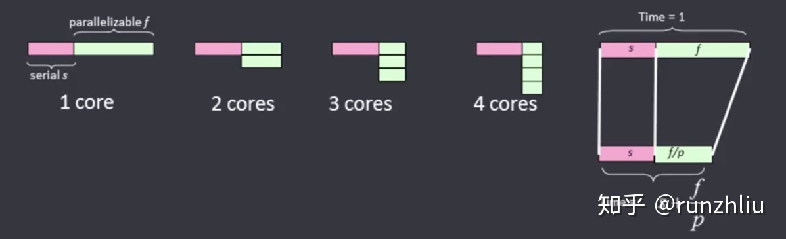
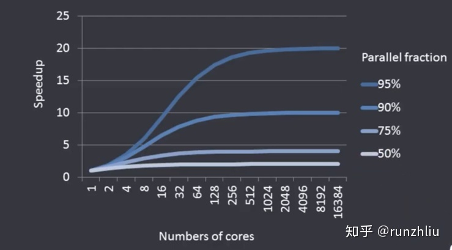

# 可扩展性
可扩展性面对的挑战是使应用程序的运行速度跟得上处理器能力的提升。例如，将一个应用程序从单处理器移植到2路多处理器，理想的情况下会获得两倍的运行速度。但在4路多处理器下，应用程序会有4倍的运行速度吗？在8路多处理器下会有8倍的运行速度吗？这就是可扩展性面对的挑战。绝大多数程序都不会呈现如此完美的线性增长，但可扩展性的目标就是尽可能地接近这个理想状态。

## Amdahl定律
Amdahl 定律(Amdahl's law)是并行计算领略一个非常著名的定律。由Gene Amdahl 于1967年提出。Amdahl 定律描述的是数据规模固定时，渐进加速比的变化趋势。
$$
\begin{array}{l}
加速比s = \frac{1}{\frac{a}{N} + (1-a)} \\
\\
其中:\\
a为并行计算部分所占比例\\
N为并行处理结点个数\\
\end{array}
$$

$$
\begin{array}{l}
执行时间Time = s + \frac{f}{p} \\
其中：s是串行部分, f是并行部分, p是核数
\end{array}
$$

假设我们有一个任务 task 里有25%的代码是并行的。那么在单机和多核情况下，我们可以获得怎样的加速比呢？记i为核心数，$m_i$为有i核的机器。
$$
\begin{array}{l}
单机单核效率:m_1 = 25\% + 75\% = 100\% \\
\\
单机双核效率:m_2 = 25\% *\frac{1}{2}  + 75\% = \frac{7}{8}\\
\\
单机4核效率:m_4 = 25\% *\frac{1}{4}  + 75\% = \frac{13}{16} \\
\\
单机8核效率:m_8 = 25\% *\frac{1}{8}  + 75\% = \frac{25}{32} \\
\\
单机1000核效率:m_{1000} = 25\% *\frac{1}{1000}  + 75\% = \frac{3001}{4000} \\
\\
单机\infty核效率:m_\infty = 25\% *\frac{1}{\infty}  + 75\% = \frac{3}{4}\\
\end{array}
$$

串行部分固定,加速比随核心数变化趋势

可见，当并行代码所占的百分比固定的情况下，随着核数i增加，对并行效率的提升会固定在一定比例。

### 

# 参考资料
- [知乎:Amdahl定律](https://zhuanlan.zhihu.com/p/107535094)