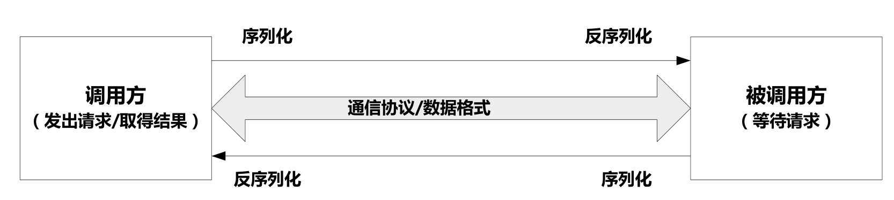

远程过程调用（Remote Procedure Call，RPC）允许程序调用位于网络中其他机器上的进程，当机器A上的进程调用机器B上的进程时，A上的调用进程被挂起，而B上的被调用进程开始执行，调用方可以通过参数将信息传递给被调用方，然后通过B上的进程返回的结果得到所需的信息。RPC通过以上机制可以隐藏下层的具体通信过程，这大大简化并透明化了网络间进程调用过程，是大规模分布式系统中位于不同机器上进程间通信的黏合剂[1]。

一般RPC框架会融合数据序列化与反序列化功能，以实现高效的数据存取与通信。很多应用直接使用JSON或者XML来作为数据通信的格式。相比较专门的序列化与反序列化框架来说，因为其必须反复传输相同的数据Schema信息，所以在通信效率方面不如专用序列化框架高。很多大数据系统在进程间远程通信时都基本遵循此集成了序列化与远程过程调用的框架流程[1]。



通用的序列化与RPC框架都支持以下特性：接口描述语言（Interface Description Language，IDL）、高性能、数据版本支持以及二进制数据格式[1]。IDL是与具体编程语言无关的接口描述语言，使用它可以定义调用方和被调用方都一致遵循的数据结构与接口。通过使用IDL语言，可以在调用方和被调用方编程语言之间实现解耦，比如调用方可以使用C++，被调用方可以使用Java，这样给整个应用的实现带来了极大的灵活性。


# Protocol Buffer

Protocol Buffer(简称PB)在Google内部广泛使用的序列化与RPC框架(Google内部版本的PB包含RPC框架实现，但是开源官方版本并未提供，仅提供了RPC调用接口，开源版本被更多地应用于数据序列化)，2008年Google将PB开源。PB官方版本支持C++、Java、Python和JavaScript这4种语言，随着系统开源，目前也支持很多其他语言的第三方插件。比如ActiveMQ就使用PB作为消息存取工具。与JSON、XML及Thrift等相比，PB对数据的压缩率是最高的。

# Thrift

Thrift是Facebook开源出的序列化与RPC框架，Thrift可以支持十几种常见编程语言，同时也直接提供RPC调用框架服务。因为RPC功能以及IDL语言比PB表达能力更强(Thrift支持List/Set/Map复杂数据结构，PB不支持)，使用场景更丰富，很多开源系统融入Thrift作为RPC构件，比如Hadoop/HBase/Cassandra/Hypertable/ Scribe等。

尽管在数据压缩率、RPC框架实现以及IDL语言方面有差异，PB和Thrift在使用流程方面大致相同。其流程一般如下。

- 首先，使用IDL定义消息体以及PRC函数调用接口。

- 其次，使用工具根据上步的IDL定义文件生成指定编程语言的代码，比如执行下列语句：

    ```shell
    thrift --gen java MyProject.thrift
    ```

- 最后，即可在应用程序中链接使用上一步生成的代码。对于RPC功能来说，调用方和被调用方同时引入后即可实现透明网络访问，如果调用方和被调用方采取不同的语言，只要分别根据IDL定义文件生成不同语言库即可实现两者的编码语言解耦。


## 软件栈

Thrift`软件栈分层从下向上分别为：传输层(`Transport Layer`)、协议层(`Protocol Layer`)、处理层(`Processor Layer`)和服务层(`Server Layer`)。

- 传输层(`Transport Layer`)：传输层负责直接从网络中读取和写入数据，它定义了具体的网络传输协议；比如说`TCP/IP`传输等。
- 协议层(`Protocol Layer`)：协议层定义了数据传输格式，负责网络传输数据的序列化和反序列化；比如说`JSON`、`XML`、二进制数据等。
- 处理层(`Processor Layer`)：处理层是由具体的`IDL`（接口描述语言）生成的，封装了具体的底层网络传输和序列化方式，并委托给用户实现的`Handler`进行处理。
- 服务层(`Server Layer`)：整合上述组件，提供具体的网络线程/IO服务模型，形成最终的服务。


来自[https://github.com/apache/thrift/blob/master/doc/images/thrift-layers.png]


# Avro

> Avro是Apache开源的序列化与RPC框架，使用在Hadoop的数据存储与内部通信中。Avro使用JSON作为IDL定义语言，可以灵活地定义数据Schema及RPC通信协议，提供了简洁快速的二进制数据格式，并能和动态语言进行集成。Avro的IDL语言不仅支持常见的基本数据类型，也能够支持Record、Array、Map等复杂数据类型，所以有很强的数据描述能力。
>
> 数据Schema使用JSON描述并存放在数据文件的起始部分，数据以二进制形式存储，这样进行数据序列化和反序列化时速度很快且占用额外存储空间很少。对于RPC通信场景，调用方和被调用方在进行握手（Hand-shake）时交换数据Schema信息，这样双方即可根据数据Schema正确解析对应的数据字段。同时，Avro也支持C++、Java、Python等6种编程语言API。
>
> 数据内容可以采用二进制格式或者JSON格式，一般采用二进制格式，因为其更小、传输效率更高，当调试应用时可以采用JSON格式，主要便于观察数据的正确性。

功能特性

- 支持动态语言集成。
- 数据Schema独立于数据并在序列化时置于数据之首
- IDL使用JSON表达，无须额外定制IDL解析器

# 参考资料

1. 《大数据日知录》

