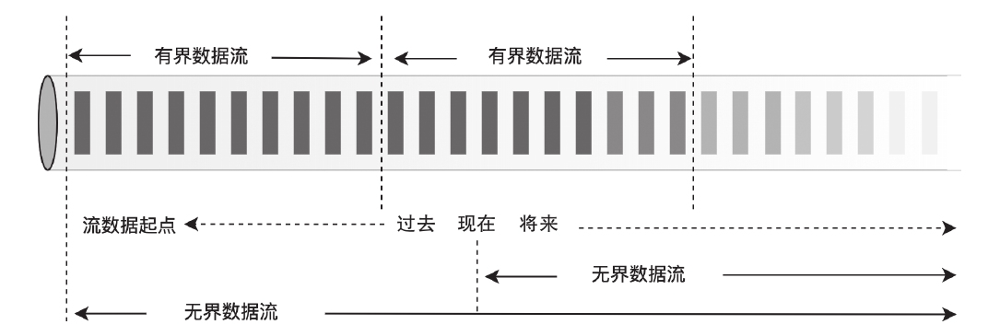
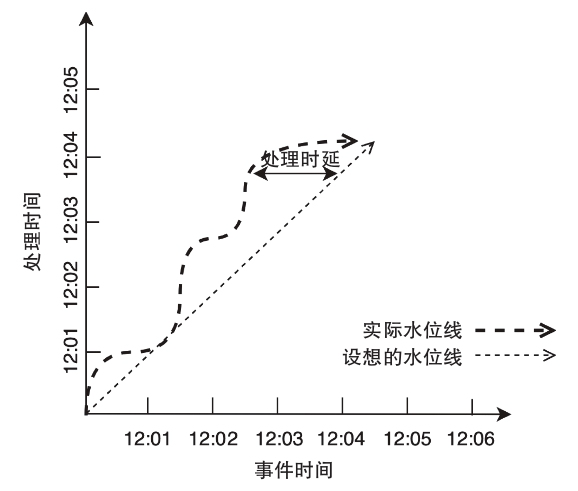

Flink可以成为主流的实时数据处理框架源于：
1. Flink及时吸收和采用了Google开源论文提到的DataFlow/Beam编程思想
2. 实现轻量且高效的分布式异步快照算法实现，为端到端的数据一致性提供了强大保证。该分布式异步快照算法的原型是Chandy-Lamport算法，来自Chandy和Lamport的论文分布式快照：确定分布式系统的全局状态。

# DataFlow模型的设计思想
DataFlow能够对无界、无序的数据源按数据本身的特征进行窗口计算，得到基于事件发生时间的有序结果，并能在准确性、延迟程度和处理成本之间取得平衡。
## 有界、无界与流处理、批处理

    
    
有界数据集和无界数据集

## 窗口计算
DataFlow提供了3种窗口计算类型，支持窗口把一个数据集切分为有限的数据片，以便于聚合处理。
滚动窗口(Tumbling Window)
滑动窗口(Sliding Window)
会话窗口(Session Window)
全局窗口(Global Window)

## 时间域与水位线机制
时间域分为两种类型，即事件时间(event time)和处理时间(processing time)，其中事件时间指事件发生时的系统时间；处理时间指数据处理管道在处理数据时，一个事件被数据处理系统观察到的时间，即数据处理系统的时间。

    
    
事件时间与处理时间关系

事件时间和处理时间的主要区别在于，事件时间是永远不变的，而事件的处理时间会随着事件在数据管道中被处理而变化。在数据处理过程中，因为系统本身受到一些现实影响（通信延迟、调度算法、处理时长、管道中间数据序列化等），所以会导致这两个时间概念存在差值且动态波动。 <b>借助全局数据处理进度的标记或水位线(Watermark)，可以有效处理迟到乱序的事件，得到正确的数据处理结果</b>

# 分布式异步快照算法

# 参考资料
- Flink设计与实现：核心原理与源码解析