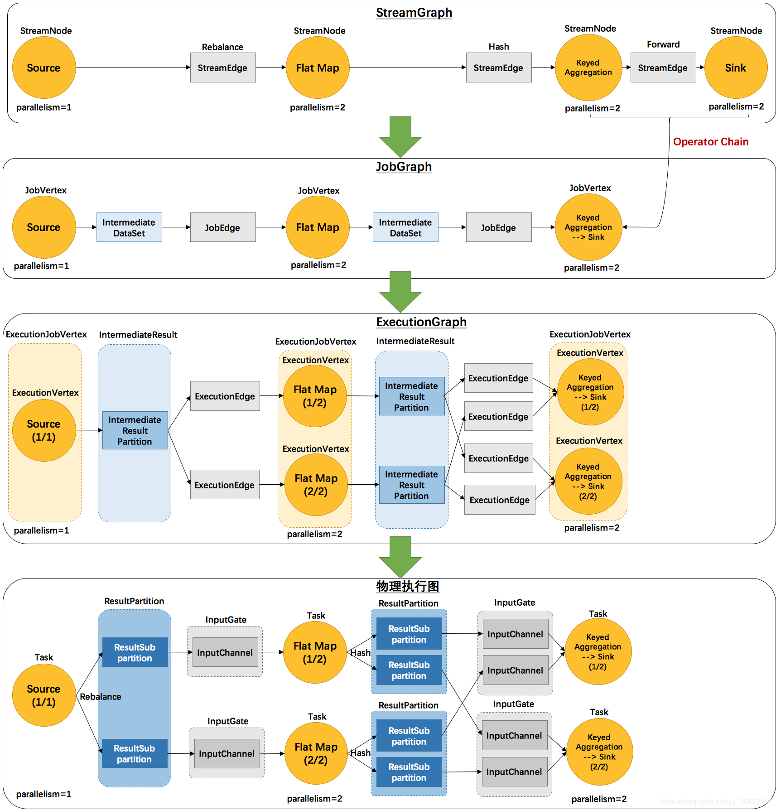

在`Flink`中，执行图按层级顺序分为以下四层

1. `StreamingGraph`：是根据用户通过`Stream API`编写的代码生成的初始流程图，用于表示程序的拓扑结构。`
   JobGraph`:`StreamGraph`经过优化后生成
2. `JobGraph`，提交给`JobManager`的数据结构。主要的优化为将多个符合条件的节点链接在一起作为一个节点（任务链`Operator Chains`）后放在一个作业中执行，这样可以减少数据在节点之间流动所需要的序列化/反序列化/传输消耗。
3. `ExecutionGraph`：`JobManager`根据`JobGraph`生成`ExecutionGraph`，`ExecutionGraph`是`JobGraph`的并行化版本，是调度层最核心的数据结构。
4. 物理执行图：`JobManager`根据`ExecutionGraph`对任务进行调度后，在各个`TaskManager`上部署作业后形成的“图”，并不是一个具体的数据结构。
   

<center>
    <div><b>DataFlow演变流程</b></div>
    
</center>


# 数据结构

## `StreamGraph`

```java
public class StreamGraph implements Pipeline;

```

## `JobGraph`

```java
public class JobGraph implements Serializable {
    private final Map<JobVertexID, JobVertex> taskVertices =
            new LinkedHashMap<JobVertexID, JobVertex>();
    private JobType jobType = JobType.BATCH;
}

public class JobEdge implements java.io.Serializable {
    /** The vertex connected to this edge. */
    private final JobVertex target;

    /** The distribution pattern that should be used for this job edge. */
    private final DistributionPattern distributionPattern;

    /** The channel rescaler that should be used for this job edge on downstream side. */
    private SubtaskStateMapper downstreamSubtaskStateMapper = SubtaskStateMapper.ROUND_ROBIN;

    /** The channel rescaler that should be used for this job edge on upstream side. */
    private SubtaskStateMapper upstreamSubtaskStateMapper = SubtaskStateMapper.ROUND_ROBIN;

    /** The data set at the source of the edge, may be null if the edge is not yet connected. */
    private final IntermediateDataSet source;
}

public class JobVertex implements java.io.Serializable {
    private final JobVertexID id;
    private final List<OperatorIDPair> operatorIDs;

    /** Produced data sets, one per writer. */
    private final Map<IntermediateDataSetID, IntermediateDataSet> results = new LinkedHashMap<>();

    /** List of edges with incoming data. One per Reader. */
    private final List<JobEdge> inputs = new ArrayList<>();

    /** The list of factories for operator coordinators. */
    private final List<SerializedValue<OperatorCoordinator.Provider>> operatorCoordinators =
            new ArrayList<>();

    /** Number of subtasks to split this task into at runtime. */
    private int parallelism = ExecutionConfig.PARALLELISM_DEFAULT;

    /** Maximum number of subtasks to split this task into a runtime. */
    private int maxParallelism = MAX_PARALLELISM_DEFAULT;

    /** The minimum resource of the vertex. */
    private ResourceSpec minResources = ResourceSpec.DEFAULT;

    /** The preferred resource of the vertex. */
    private ResourceSpec preferredResources = ResourceSpec.DEFAULT;
}
```


```java
public class JobGraphBuilder {
	// job类型:流处理(JobType.STREAMING)和批处理(JobType.BATCH)
    // 分别通过newStreamingJobGraphBuilder和newBatchJobGraphBuilder静态接口
    // 创建JobGraphBuilder(JobType jobType)
    private final JobType jobType;
    
   	// 构建JobGraph
    public JobGraph build();
};
```

## ExecutionGraph

```java
package org.apache.flink.runtime.executiongraph;


public interface ExecutionGraph extends AccessExecutionGraph {
    
}

public class ExecutionJobVertex implements AccessExecutionJobVertex,
			Archiveable<ArchivedExecutionJobVertex> {
    private final JobVertex jobVertex;
    @Nullable private ExecutionVertex[] taskVertices;
    @Nullable private IntermediateResult[] producedDataSets;
    @Nullable private List<IntermediateResult> inputs;
    private final VertexParallelismInformation parallelismInfo;
    private final SlotSharingGroup slotSharingGroup;
}

public class ExecutionVertex
    	implements AccessExecutionVertex, Archiveable<ArchivedExecutionVertex> {
    /** The current or latest execution attempt of this vertex's task. */
    Execution currentExecution; // this field must never be null
}

public class Execution
    	implements AccessExecution, Archiveable<ArchivedExecution>, LogicalSlot.Payload {
    /** The executor which is used to execute futures. */
    private final Executor executor;

    /** The execution vertex whose task this execution executes. */
    private final ExecutionVertex vertex;

    /** The unique ID marking the specific execution instant of the task. */
    private final ExecutionAttemptID attemptId;
}
```


```java
public class StreamExecutionEnvironment implements AutoCloseable {
    protected final List<Transformation<?>> transformations = new ArrayList<>();
};

public void addOperator(Transformation<?> transformation) {
    Preconditions.checkNotNull(transformation, "transformation must not be null.");
    this.transformations.add(transformation);
}

```


```java
    public JobExecutionResult execute() throws Exception {
        return execute((String) null);
    }

    public JobExecutionResult execute(String jobName) throws Exception {
        final List<Transformation<?>> originalTransformations = new ArrayList<>(transformations);
        // 获取StreamGraph,其实现是将transformations通过StreamGraphGenerator生成StreamGraph
        // 主要的实现接口是getStreamGraph(transformations)调用StreamGraphGenerator::generate
        StreamGraph streamGraph = getStreamGraph();
        if (jobName != null) {
            streamGraph.setJobName(jobName);
        }

        try {
            return execute(streamGraph);
        } catch (Throwable t) {
            Optional<ClusterDatasetCorruptedException> clusterDatasetCorruptedException =
                    ExceptionUtils.findThrowable(t, ClusterDatasetCorruptedException.class);
            if (!clusterDatasetCorruptedException.isPresent()) {
                throw t;
            }

            // Retry without cache if it is caused by corrupted cluster dataset.
            invalidateCacheTransformations(originalTransformations);
            streamGraph = getStreamGraph(originalTransformations);
            return execute(streamGraph);
        }
    }

    @Override
    public JobClient executeAsync(StreamGraph streamGraph) throws Exception {
        checkNotAllowedConfigurations();
        validateAllowedExecution();
        final JobClient jobClient = super.executeAsync(streamGraph);
        return jobClient;
    }

    @Internal
    public JobClient executeAsync(StreamGraph streamGraph) throws Exception {
        // 获取PipelineExecutor，其中有：
        // 1. LocalExecutor
        final PipelineExecutor executor = getPipelineExecutor();
        CompletableFuture<JobClient> jobClientFuture =
                executor.execute(streamGraph, configuration, userClassloader);

        try {
            JobClient jobClient = jobClientFuture.get();
            jobListeners.forEach(jobListener -> jobListener.onJobSubmitted(jobClient, null));
            collectIterators.forEach(iterator -> iterator.setJobClient(jobClient));
            collectIterators.clear();
            return jobClient;
        } catch (ExecutionException executionException) {
            final Throwable strippedException =
                    ExceptionUtils.stripExecutionException(executionException);
            jobListeners.forEach(
                    jobListener -> jobListener.onJobSubmitted(null, strippedException));

            throw new FlinkException(
                    String.format("Failed to execute job '%s'.", streamGraph.getJobName()),
                    strippedException);
        }
    }
```

以上面的`LocalExecutor`为例，查看其`execute`接口了解`JobGraph`的生成，去除一些次要的，保留主要的接口实现，了解其主实现流程：

```java
    @Override
    public CompletableFuture<JobClient> execute(
            Pipeline pipeline, Configuration configuration, ClassLoader userCodeClassloader)
            throws Exception {
        Configuration effectiveConfig = new Configuration();
        effectiveConfig.addAll(this.configuration);
        effectiveConfig.addAll(configuration);

        // we only support attached execution with the local executor.
        checkState(configuration.getBoolean(DeploymentOptions.ATTACHED));

        final JobGraph jobGraph = getJobGraph(pipeline, effectiveConfig, userCodeClassloader);

        return PerJobMiniClusterFactory.createWithFactory(effectiveConfig, miniClusterFactory)
                .submitJob(jobGraph, userCodeClassloader);
    }

   private JobGraph getJobGraph(
            Pipeline pipeline, Configuration configuration, ClassLoader userCodeClassloader)
            throws MalformedURLException {
        // This is a quirk in how LocalEnvironment used to work. It sets the default parallelism
        // to <num taskmanagers> * <num task slots>. Might be questionable but we keep the behaviour
        // for now.
        if (pipeline instanceof Plan) {
            Plan plan = (Plan) pipeline;
            final int slotsPerTaskManager =
                    configuration.getInteger(
                            TaskManagerOptions.NUM_TASK_SLOTS, plan.getMaximumParallelism());
            final int numTaskManagers =
                    configuration.getInteger(ConfigConstants.LOCAL_NUMBER_TASK_MANAGER, 1);

            plan.setDefaultParallelism(slotsPerTaskManager * numTaskManagers);
        }

        return PipelineExecutorUtils.getJobGraph(pipeline, configuration, userCodeClassloader);
    }

 	// For PipelineExecutorUtils
    public static JobGraph getJobGraph(
            @Nonnull final Pipeline pipeline,
            @Nonnull final Configuration configuration,
            @Nonnull ClassLoader userClassloader)
            throws MalformedURLException {
        checkNotNull(pipeline);
        checkNotNull(configuration);

        final ExecutionConfigAccessor executionConfigAccessor =
                ExecutionConfigAccessor.fromConfiguration(configuration);
        final JobGraph jobGraph =
                FlinkPipelineTranslationUtil.getJobGraph(
                        userClassloader,
                        pipeline,
                        configuration,
                        executionConfigAccessor.getParallelism());

        configuration
                .getOptional(PipelineOptionsInternal.PIPELINE_FIXED_JOB_ID)
                .ifPresent(strJobID -> jobGraph.setJobID(JobID.fromHexString(strJobID)));

        if (configuration.getBoolean(DeploymentOptions.ATTACHED)
                && configuration.getBoolean(DeploymentOptions.SHUTDOWN_IF_ATTACHED)) {
            jobGraph.setInitialClientHeartbeatTimeout(
                    configuration.getLong(ClientOptions.CLIENT_HEARTBEAT_TIMEOUT));
        }

        jobGraph.addJars(executionConfigAccessor.getJars());
        jobGraph.setClasspaths(executionConfigAccessor.getClasspaths());
        jobGraph.setSavepointRestoreSettings(executionConfigAccessor.getSavepointRestoreSettings());

        return jobGraph;
    }
```

```java
public final class FlinkPipelineTranslationUtil {
    public static JobGraph getJobGraph(ClassLoader userClassloader,Pipeline pipeline,
            Configuration optimizerConfiguration, int defaultParallelism) {
		// 若pipeline instanceof Plan,是PlanTranslator
        // 若pipeline instanceof StreamGraph，则StreamGraphTranslator
        // 抛出异常
        FlinkPipelineTranslator pipelineTranslator =
                getPipelineTranslator(userClassloader, pipeline);

        return pipelineTranslator.translateToJobGraph(
                pipeline, optimizerConfiguration, defaultParallelism);
    }
```

以`StreamGraphTranslator`为例来了解如何生成JobGraph

```java
    @Override
    public JobGraph translateToJobGraph(
            Pipeline pipeline, Configuration optimizerConfiguration, int defaultParallelism) {
        StreamGraph streamGraph = (StreamGraph) pipeline;
        // StreamGraph::getJobGraph通过StreamingJobGraphGenerator的createJobGraph来生成JobGraph
        return streamGraph.getJobGraph(userClassloader, null);
    }

	// StreamGraph::getJobGraph
	public JobGraph getJobGraph(ClassLoader userClassLoader, @Nullable JobID jobID) {
        return StreamingJobGraphGenerator.createJobGraph(userClassLoader, this, jobID);
    }
```

查看`StreamingJobGraphGenerator`来了解JonGraph的生成

```java
    public static JobGraph createJobGraph(
            ClassLoader userClassLoader, StreamGraph streamGraph, @Nullable JobID jobID) {
        // TODO Currently, we construct a new thread pool for the compilation of each job. In the
        // future, we may refactor the job submission framework and make it reusable across jobs.
        final ExecutorService serializationExecutor =
                Executors.newFixedThreadPool(
                        Math.max(1,
                                Math.min(Hardware.getNumberCPUCores(),
                                        streamGraph.getExecutionConfig().getParallelism())),
                        new ExecutorThreadFactory("flink-operator-serialization-io"));
        try {
            return new StreamingJobGraphGenerator(userClassLoader, streamGraph,
					jobID, serializationExecutor).createJobGraph();
        } finally {
            serializationExecutor.shutdown();
        }
    }

    private JobGraph createJobGraph() {
        preValidate();
        jobGraph.setJobType(streamGraph.getJobType());
        jobGraph.setDynamic(streamGraph.isDynamic());

        jobGraph.enableApproximateLocalRecovery(
                streamGraph.getCheckpointConfig().isApproximateLocalRecoveryEnabled());

        // Generate deterministic hashes for the nodes in order to identify them across
        // submission iff they didn't change.
        Map<Integer, byte[]> hashes =
                defaultStreamGraphHasher.traverseStreamGraphAndGenerateHashes(streamGraph);

        // Generate legacy version hashes for backwards compatibility
        List<Map<Integer, byte[]>> legacyHashes = new ArrayList<>(legacyStreamGraphHashers.size());
        for (StreamGraphHasher hasher : legacyStreamGraphHashers) {
            legacyHashes.add(hasher.traverseStreamGraphAndGenerateHashes(streamGraph));
        }

        setChaining(hashes, legacyHashes);

        if (jobGraph.isDynamic()) {
            setVertexParallelismsForDynamicGraphIfNecessary();
        }

        // Note that we set all the non-chainable outputs configuration here because the
        // "setVertexParallelismsForDynamicGraphIfNecessary" may affect the parallelism of job
        // vertices and partition-reuse
        final Map<Integer, Map<StreamEdge, NonChainedOutput>> opIntermediateOutputs =
                new HashMap<>();
        setAllOperatorNonChainedOutputsConfigs(opIntermediateOutputs);
        setAllVertexNonChainedOutputsConfigs(opIntermediateOutputs);

        setPhysicalEdges();

        markSupportingConcurrentExecutionAttempts();

        validateHybridShuffleExecuteInBatchMode();

        setSlotSharingAndCoLocation();

        setManagedMemoryFraction(
                Collections.unmodifiableMap(jobVertices),
                Collections.unmodifiableMap(vertexConfigs),
                Collections.unmodifiableMap(chainedConfigs),
                id -> streamGraph.getStreamNode(id).getManagedMemoryOperatorScopeUseCaseWeights(),
                id -> streamGraph.getStreamNode(id).getManagedMemorySlotScopeUseCases());

        configureCheckpointing();

        jobGraph.setSavepointRestoreSettings(streamGraph.getSavepointRestoreSettings());

        final Map<String, DistributedCache.DistributedCacheEntry> distributedCacheEntries =
                JobGraphUtils.prepareUserArtifactEntries(
                        streamGraph.getUserArtifacts().stream()
                                .collect(Collectors.toMap(e -> e.f0, e -> e.f1)),
                        jobGraph.getJobID());

        for (Map.Entry<String, DistributedCache.DistributedCacheEntry> entry :
                distributedCacheEntries.entrySet()) {
            jobGraph.addUserArtifact(entry.getKey(), entry.getValue());
        }

        // set the ExecutionConfig last when it has been finalized
        try {
            jobGraph.setExecutionConfig(streamGraph.getExecutionConfig());
        } catch (IOException e) {
            throw new IllegalConfigurationException(
                    "Could not serialize the ExecutionConfig."
                            + "This indicates that non-serializable types (like custom serializers) were registered");
        }

        jobGraph.setChangelogStateBackendEnabled(streamGraph.isChangelogStateBackendEnabled());

        addVertexIndexPrefixInVertexName();

        setVertexDescription();

        // Wait for the serialization of operator coordinators and stream config.
        try {
            FutureUtils.combineAll(
                            vertexConfigs.values().stream()
                                    .map(
                                            config ->
                                                    config.triggerSerializationAndReturnFuture(
                                                            serializationExecutor))
                                    .collect(Collectors.toList()))
                    .get();

            waitForSerializationFuturesAndUpdateJobVertices();
        } catch (Exception e) {
            throw new FlinkRuntimeException("Error in serialization.", e);
        }

        if (!streamGraph.getJobStatusHooks().isEmpty()) {
            jobGraph.setJobStatusHooks(streamGraph.getJobStatusHooks());
        }

        return jobGraph;
    }
```


# 参考资料

1. [Flink 流处理概念：Dataflow编程、执行图、并行度、数据传输策略、任务链](https://blog.csdn.net/qq_35423154/article/details/113806950)

