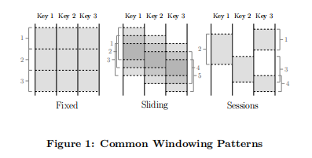

---

<b>论文想要解决什么问题？</b>

---

# 1.简介

本文提出了单一且统一的概念模型，即：

- 允许在无界、无序的数据源上计算按事件时间排序的结果，并根据数据本身的特征划分窗口，可以在广泛的组合范围内具有可调的正确性、延迟和成本。
- 从四个相关维度分解Pipeline实现，来提供清晰性，可组合性和灵活性：
    -  What results are being computed.
    - Where in event time they are being computed.
    - When in processing time they are materialized.
    - How earlier results relate to later refinements. 

- 将数据处理的逻辑概念从底层的物理实现中分离出来，允许选择批处理、微批处理或流引擎，从而只考虑正确性、延迟和成本。

具体来说，是通过以下方式实现的：

- 窗口模型(Window Model)，支持未对齐的event-time窗口，以及提供易于创建和使用的API(2.2节)。
- 触发模型(Triggering Model)，将结果的输出时间和Pipeline的运行时特性绑定，提供功能强大且灵活的声明式API，用于描述所需要的触发语义(2.3节)。
- 增量处理模型(Incremental Processing Model)，将数据回撤和更新集成到窗口和触发模型中(2.3节)。
- 可扩展的实现(Scalable implementations)，基于MillWheel流处理引擎和FlumeJava批处理引擎之上的可扩展实现，以及GoogleCloud Dataflow的外部重新实现，包括一个运行时无关的开源SDK(3.1节)。
- 核心原则(core principles)，用于指导该模型的设计(3.2节)。
- 真实经验(real-world experiences)，简要讨论了谷歌大规模、无界、乱序数据处理的实际经验，推动了该模型的开发(3.3节)

指的注意的是，该模型在现有的强一致性批处理、微批处理、流处理或Lambda架构系统中，由于CPU、RAM和磁盘的固有约束，在计算上不切实际的东西依旧存在。**该模型提供的是一个通用框架，允许以一种独立于底层执行引擎的方式相对简单地表达并行计算，同时还能够根据现有的数据和资源，为任何特定问题精确计算延迟和准确性。**从这个意义上说，它**旨在易于使用的模型，可用于构建实用的大规模数据处理管道**。

## 1.1 无界/有界 VS 流/批处理

描述有限/无限数据集时，本文首选无界/有界这一术语，而非流/批处理，因为后者会带来使用特定类型执行引擎的隐含意义。实际上，从无边界数据集概念诞生以来，就已经使用批处理刺痛重复运行来处理，而设计良好的流处理系统则完全能够处理有界数据集。从模型的角度来看，流或批处理的区别在很大程度上是不相关的，因此本文专门保留这些术语用于描述运行时执行引擎。

## 1.2 窗口

    

- 固定窗口(Fixed Window)，也称滚动窗口(tumbling window)，窗口大小是固定的，例如每小时或每天一次窗口计算。通常该窗口是对齐的，即每个窗口都应用相应时段内所有数据。为了在时间上均匀地扩展窗口完成负载，有时会在窗口的每个键值上添加一些随机相移来实现非对齐。

- 滑动窗口(Sliding Window)，由窗口大小和滑动周期两者一起定义，例如每分钟进行一次每小时的窗口计算，滑动周期可能会小于窗口大小，这意味着窗口之间可能会发生重叠。滑动窗口通常也会对齐，。固定窗口实际上是窗口大小等于窗口周期的滑动窗口的一种特殊情况。
- 会话窗口(Session Window)，它捕获数据子集(本例中是每个键)上某个活动周期，通常由超时时间间隔定义，小于超时时间内发生的任何时间都会被分组到一个会话。会话窗口是未对齐窗口。例如窗口2只适用于`Key1`，窗口1和4只适用于`Key3`。

## 1.3 时间域

# 2. DataFlow Model

<b>定义系统模型并解释其语义可以满足含标准批处理、微批处理和流模型以及Lambda结构的混合流处理和批处理语义</b>

## 2.1 核心原语

首先，考虑经典批处理模型中的原语。对流经系统的`(key, value)`，DataFlow SDK有两个核心的转换(transform)：

- `ParDo`用于通用并行处理。每个待处理的输入元素(其本身可能是一个有限集合)都会被用户自定义函数(在DataFlow中称为`DoFn`)处理，该函数可以为每个输入产生零或多个输出。例如，考虑这样的操作，展开输入key的所有前缀，并复制value。
  $$
  \begin{array}{l}
  (fix, 1), (fit, 2) \\
  \ \ \ \ \ \ \downarrow Pardo(ExpandP ref ixes) \\
  (f,1), (f_i,1), (fix, 1), (f, 2), (fi, 2), (fit, 2)
  \end{array}
  $$

- `GroupByKey`用于`(key, value)`分组
  $$
  \begin{array}{l}
  (f,1), (fi,1), (fix, 1), (f, 2), (fi, 2), (fit, 2) \\
  \ \ \ \ \ \ \downarrow GroupByKey \\
  (f, [1,2]), (fi, [1,2]), (fix, [1]), (fit, [2])
  \end{array}
  $$
  `ParDo`操作在每个输入元素做个操作，因而可以很自然应用到无边界数据。`GroupByKey`操作收集指定key的所有数据，在将它们发送到下游缩减前。如果输入源数据是无界的，便无法知道合何时结束。该问题的常见解决方案是将数据窗口化。

## 2.2 窗口化

支持分组的系统通常将`GroupByKey`重新定义为`GroupByKeyAndWindow`。本文的主要贡献是支持未对齐的窗口，对此主要有两点。其一，从模型角度，将所有的窗口当做未对齐窗口，且允许底层实现在适用情况下对对齐情况的优化，更加简单；其二，窗口可以分解成两个相关操作：

- `Set<Window> AssignWindows(T datum)`，将元素赋值给零或多个窗口。
- `Set<Window> MergeWindows(Set<Window> windows)`，按照分组时间进行窗口合并。这允许数据驱动的窗口在数据到达并分组在一起时，随着时间的推移而构建。

对于任何给定的窗口策略，这两个操作都密切相关，如sliding window assign需要sliding window merging，session window assignment需要ssession window merging，等等。

注意，为了原生支持事件时间的窗口，传递`(key, value, eventtime, window)` 4元组，而f非`(key, value)`到系统。带事件时间的元素传递给系统，并在最初时分配一个默认的全局窗口，覆盖所有事件时间，提供与标准批处理模型中默认值匹配的语义。

### 窗口分配(Window Assignment)

> From the model’s perspective, window assignment creates a new copy of the element in each of the windows to which  it has been assigned.

从模型的的角度来看，窗口分配是在每个已分配的窗口中，创建元素的新副本。例如，2分钟时间宽度1分钟为周期的滑动窗口：
$$
\begin{array}{l}
(k, v1, 12:00, [0, \infty )),(k, v2, 12:01, [0, \infty )) \\
\ \ \ \ \ \ \ \downarrow AssignW indows(Sliding(2m, 1m)) \\
(k, v1, 12:00, [11:59, 12:01)), \\
(k, v1, 12:00, [12:00, 12:02)),\\
(k, v2, 12:01, [12:00, 12:02)), \\
(k, v2, 12:01, [12:01, 12:03))\\
\end{array}
$$
在本例中，这两个`(key, value)`都被复制到重叠元素时间戳的两个窗口中。由于窗口直接与所属的元素相关联，这意味着窗口分配可以发生在分组前，管道(Pipeline)中的任何位置。这一点很重要，因为分组操作可能隐藏在下游复合(Composite)转换的任何地方，例如`Sum.integersPerKey()`。

### 窗口合并(Window Merging)

然后，开始`GroupByKeyAndWindow`操作，实际上，这由五部分组成的复合操作：

1. `DropTimestamps`：丢弃元素时间戳，因为从这里开始，只有窗口相关的部分。
2. `GroupByKey`：
3. `MergerWindow`
4. `GroupAlsoByWindow`
5. `ExpandToElements`
