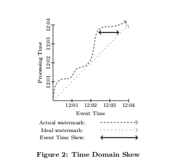
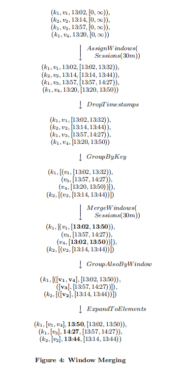

# 1.简介

本文提出了单一且统一的概念模型，即：

- 允许在无界、无序的数据源上计算按事件时间排序的结果，并根据数据本身的特征划分窗口，可以在广泛的组合范围内具有可调的正确性、延迟和成本。
- 从四个相关维度分解Pipeline实现，来提供清晰性，可组合性和灵活性：
    -  What results are being computed.
    - Where in event time they are being computed.
    - When in processing time they are materialized.
    - How earlier results relate to later refinements. 

- 将数据处理的逻辑概念从底层的物理实现中分离出来，允许选择批处理、微批处理或流引擎，从而只考虑正确性、延迟和成本。

具体来说，是通过以下方式实现的：

- 窗口模型(Window Model)，支持未对齐的event-time窗口，以及提供易于创建和使用的API(2.2节)。
- 触发模型(Triggering Model)，将结果的输出时间和Pipeline的运行时特性绑定，提供功能强大且灵活的声明式API，用于描述所需要的触发语义(2.3节)。
- 增量处理模型(Incremental Processing Model)，将数据回撤和更新集成到窗口和触发模型中(2.3节)。
- 可扩展的实现(Scalable implementations)，基于MillWheel流处理引擎和FlumeJava批处理引擎之上的可扩展实现，以及Google Cloud Dataflow的外部重新实现，包括一个运行时无关的开源SDK(3.1节)。
- 核心原则(core principles)，用于指导该模型的设计(3.2节)。
- 真实经验(real-world experiences)，简要讨论了谷歌大规模、无界、乱序数据处理的实际经验，推动了该模型的开发(3.3节)


指的注意的是，该模型在现有的强一致性批处理、微批处理、流处理或Lambda架构系统中，由于CPU、RAM和磁盘的固有约束，在计算上不切实际的东西依旧存在。**该模型提供的是一个通用框架，允许以一种独立于底层执行引擎的方式相对简单地表达并行计算，同时还能够根据现有的数据和资源，为任何特定问题精确计算延迟和准确性。**从这个意义上说，它**旨在易于使用的模型，可用于构建实用的大规模数据处理管道**。


## 1.1 无界/有界 VS 流/批处理

描述有限/无限数据集时，本文首选无界/有界这一术语，而非流/批处理，因为后者会带来使用特定类型执行引擎的隐含意义。实际上，从无边界数据集概念诞生以来，就已经使用批处理刺痛重复运行来处理，而设计良好的流处理系统则完全能够处理有界数据集。从模型的角度来看，流或批处理的区别在很大程度上是不相关的，因此本文专门保留这些术语用于描述运行时执行引擎。


## 1.2 窗口

<center>
    
</center>


- 固定窗口(Fixed Window)，也称滚动窗口(tumbling window)，窗口大小是固定的，例如每小时或每天一次窗口计算。通常该窗口是对齐的，即每个窗口都应用相应时段内所有数据。为了在时间上均匀地扩展窗口完成负载，有时会在窗口的每个键值上添加一些随机相移来实现非对齐。

- 滑动窗口(Sliding Window)，由窗口大小和滑动周期两者一起定义，例如每分钟进行一次每小时的窗口计算，滑动周期可能会小于窗口大小，这意味着窗口之间可能会发生重叠。滑动窗口通常也会对齐，。固定窗口实际上是窗口大小等于窗口周期的滑动窗口的一种特殊情况。
- 会话窗口(Session Window)，它捕获数据子集(本例中是每个键)上某个活动周期，通常由超时时间间隔定义，小于超时时间内发生的任何时间都会被分组到一个会话。会话窗口是未对齐窗口。例如窗口2只适用于`Key1`，窗口1和4只适用于`Key3`。


## 1.3 时间域

在处理与时间事件相关的数据时，需要考虑两个固有的时间域。虽然在文献的不同地方都有介绍(特别是时间管理和语义模型，还包括窗口、乱序处理、标点(punctuation)、心跳、水印(watermark)、帧)，详细示例在2.3节展示。本文关心两个时间域：

- 事件时间(Event Time)，是事件实际发生的时间，即记录产生的系统时间(产生事件的任何系统)。

- 处理时间(Processing Time)：在Pipeline处理过程中，在任何给定的时间点观察到事件的时间，即系统时钟显示的当前时间。需要注意的是，本文对分布式系统中的时钟同步没有任何假设。

给定事件的事件时间在本质上是不会改变，但是处理时间会随着事件在管道中的流动而不断变化。


在处理过程中，实际使用的系统(通信延迟、调度算法、处理时间，Pipeline序列化等)导致了两个域之间固有的、动态偏移。全局进度指标，如标点(punctuation)或水印(watermark)，提供了一种可视化这种偏移的好方法。对我们来说，可以考虑<b><font color=orange>MillWheel的水印，它是流水线处理的事件时间的下界(通常是启发式确定的)。</font></b>正如本文上面说得，完整性的概念通常与准确性不兼容，所以<b><font color=orange>本文不会依赖水印。然而，它确实提供了一个有用的概念，即系统何时认为可能观察到了事件时间中给定点之前的所有数据，</font></b>不仅可以用于可视化偏移，还可以用于监控整个系统的健康状况和进度，以及围绕进度做出不要求完全准确性的决策，例如基本的垃圾回收策略。

<center>
    
</center>

在理想世界中，时域偏差始终为零;我们总是在事件发生时立即处理所有的事件。现实并非如此，通常我们最终得到的结果看起来更像图2。从12点左右开始，随着Pipeline的滞后，水印开始偏离实际时间，在12:02左右回落到接近实际时间，然后在12:03滚动时再次明显滞后。这种时间偏移动态变化在分布式数据处理系统中很常见，并且在定义提供正确、可重复的结果所需的功能方面发挥重要的作用。

# 2. DataFlow Model

<b><font color="orange">定义系统模型并解释其语义可以满足含标准批处理、微批处理和流模型以及Lambda结构的混合流处理和批处理语义</font></b>

## 2.1 核心原语

首先，考虑经典批处理模型中的原语。对流经系统的`(key, value)`，DataFlow SDK有两个核心的转换(transform)：

- `ParDo`用于通用并行处理。每个待处理的输入元素(其本身可能是一个有限集合)都会被用户自定义函数(在DataFlow中称为`DoFn`)处理，该函数可以为每个输入产生零或多个输出。例如，考虑这样的操作，展开输入key的所有前缀，并复制value。
  $$
  \begin{array}{l}
  (fix, 1), (fit, 2) \\
  \ \ \ \ \ \ \downarrow Pardo(ExpandP ref ixes) \\
  (f,1), (f_i,1), (fix, 1), (f, 2), (fi, 2), (fit, 2)
  \end{array}
  $$

- `GroupByKey`用于根据`key`对`(key, value)`分组
  $$
  \begin{array}{l}
  (f,1), (fi,1), (fix, 1), (f, 2), (fi, 2), (fit, 2) \\
  \ \ \ \ \ \ \downarrow GroupByKey \\
  (f, [1,2]), (fi, [1,2]), (fix, [1]), (fit, [2])
  \end{array}
  $$
  `ParDo`操作对每个输入元素逐个操作，因而可以很自然应用到无边界数据。`GroupByKey`操作收集指定key的所有数据，在将它们发送到下游缩减(聚集操作，多行数据会被折叠得到一行，因此可以减少基数)。如果输入源数据是无界的，便无法知道何时结束。该问题的常见解决方案是将数据窗口化。


## 2.2 窗口化

支持分组的系统通常将`GroupByKey`重新定义为`GroupByKeyAndWindow`。本文的主要贡献是支持未对齐的窗口，对此主要有两点。其一，从模型角度，将所有的窗口当做未对齐窗口，且允许底层实现在适用情况下对对齐情况进行优化，这样更加简单；其二，窗口可以分解成两个相关操作：

- `Set<Window> AssignWindows(T datum)`，将元素赋值给零或多个窗口。
- `Set<Window> MergeWindows(Set<Window> windows)`

> which merges windows at grouping time. This allows data-driven windows to be constructed over time as data arrive and are grouped together.
>
> 在分组时合并窗口。这使得数据驱动的窗口可以随着时间推移在数据到达且分组时构建。

对于任何给定的窗口策略，这两个操作都密切相关，如sliding window assign需要sliding window merging，session window assignment需要session window merging，等等。

注意，为了原生支持事件时间的窗口，传递`(key, value, eventtime, window)` 4元组，而非`(key, value)`到系统。带事件时间的元素传递给系统，并在最初时分配一个默认的全局窗口，覆盖所有事件时间，提供与标准批处理模型中默认值匹配的语义。


### 窗口分配(Window Assignment)

> From the model’s perspective, window assignment creates a new copy of the element in each of the windows to which  it has been assigned.

从模型的的角度来看，窗口分配是在每个已分配的窗口中，创建元素的新副本。例如，2分钟时间宽度1分钟为周期的滑动窗口：
$$
\begin{array}{l}
(k, v1, 12:00, [0, \infty )),(k, v2, 12:01, [0, \infty )) \\
\ \ \ \ \ \ \ \downarrow AssignW indows(Sliding(2m, 1m)) \\
(k, v1, 12:00, [11:59, 12:01)), \\
(k, v1, 12:00, [12:00, 12:02)),\\
(k, v2, 12:01, [12:00, 12:02)), \\
(k, v2, 12:01, [12:01, 12:03))\\
\end{array}
$$
在本例中，这两个`(key, value)`都被复制到重叠元素时间戳的两个窗口中。由于窗口直接与所属的元素相关联，这意味着窗口分配可以发生在管道(Pipeline)中的任何的分组(grouping)前的位置。这一点很重要，因为分组操作可能隐藏在下游复合(Composite)转换的任何地方，例如`Sum.integersPerKey()`。


### 窗口合并(Window Merging)

窗口合并是`GroupByKeyAndWindow`操作的一部分，采用会话窗口示例进行解释，图4展示了四个示例数据，其中三个用于`k1`，一个用于`k2`，按照会话进行窗口划分，会话超时时间是30分钟。初始化时系统分配一个默认的全局窗口。`AssignWindows`实现将每个元素放入一个单独的窗口中，这个窗口比它自身的时间戳延长了30分钟。此窗口表示之后迟到的事件可以落入这个时间范围内，视它们为同一会话。之后开始`GroupByKeyAndWindow`操作，这实际上是一个由五部分组成的复合操作：

1. `DropTimestamps`：丢弃元素时间戳，因为从这里开始，只有窗口相关的部分。
2. `GroupByKey`:按key分组成`(value、window)`元组。
3. `MergeWindows`：根据key合并当前缓冲的窗口。实际的合并逻辑由窗口策略定义的。在本例中，`v1`和`v4`对应的窗口存在重叠，会话窗口将它们合并成一个新的、更大的会话。
4. `GroupAlsoByWindow`：对于每个key，根据`window`聚合所有的value。经过上一步的合并，`v1`和`v4`现在位于相同的窗口中，这一步将它们组合在一起。
5. `ExpandToElements`：使用新的窗口(`pre-window`)时间戳，将每个key、每个窗口的value组扩展为`(key, value, event_time, window)`元组。在本例中，将时间戳设置为窗口的结束时间，在水印正确性方面，任何大于或等于窗口中最早事件的时间戳都视为有效。

<center>
    
</center>


下面给一个实际使用中窗口的示例，考虑Cloud DataFlow SDK代码中计算keyed正数和：

```
PCollection<KV<String, Integer>> input = IO.read(...);
PCollection<KV<String, Integer>> output = input.apply(Sum.integersPerKey());
```

要执行相同操作，需要向图4那样，以超时30分钟切分会话窗口，那么需要在启动求和前，添加调用`window.into`接口

```java
PCollection<KV<String, Integer>> input = IO.read(...);
PCollection<KV<String, Integer>> output = input
	.apply(Window.into(Sessions.withGapDuration(Duration.standardMinutes(30))))
	.apply(Sum.integersPerKey());
```


## 触发(Triggers)和增量处理(Incremental Processing)

出于这些原因，我们假定只有水印(Watermark)是不够的。解决完整性问题的一个有用的观点是，(也是Lambda架构提出的一种有效地回避问题的方式）：它没有通过某种方式更快地提供正确的解决方法来处理完整性问题，它只是提供流管道所能提供的最佳低延迟估计结果，并承诺在批处理管道运行后，最终保持一致性和正确性。

>If we want to do the same thing from within a single pipeline (regardless of execution engine), then we will need a way to provide multiple answers (or panes) for any given window. We call this feature triggers, since they allow the specification of when to trigger the output results for a given window.
>
>In a nutshell, triggers are a mechanism for stimulating the production of *GroupByKeyAndWindow* results in response to internal or external signals. They are complementary to the windowing model, in that they each affect system behaviour along a different axis of time:
>
>- Windowing: determines *where* in event time data are grouped together for processing.
>- Triggering: determines *when* in processing time  the results of groupings are emitted as panes.

​		如果我们希望在单个管道中执行相同的操作(与执行引擎无关)，那么我们将需要一种方法为任何给定窗口提供多个答案(或窗格)。我们称次功能为触发器(Triggers)，因为它们允许指定何时为指定窗口触发输出结果。
​		简而言之，触发器是一种机制，用于触发`GroupByKeyAndWindow`结果的生成，以响应内部或外部信号，他们是窗口模型的补充，因为它们沿着不同的时间轴影响系统行为：

- 开窗：决定在事件时间中，数据在哪里分组，并进行处理。

- 触发：决定在处理时间中，分组的结果何时以窗格的形式发出。