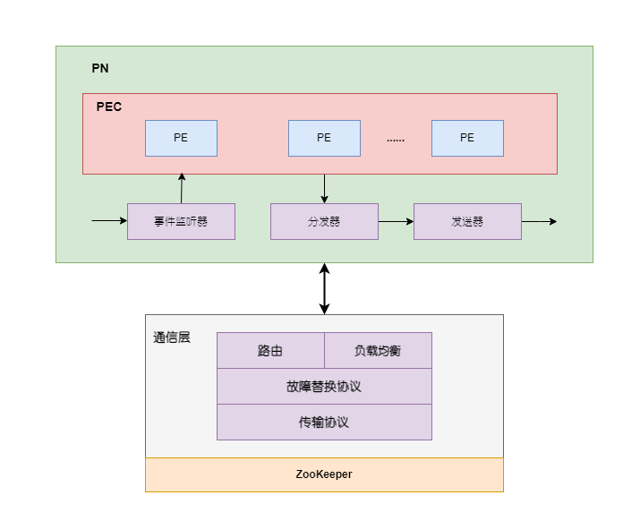

在大多数场合，流式计算对大数据处理的计算时效性要求很高，要求计算在非常短时间延时内完成，这样可以更好发挥流式计算系统的威力。流式计算的概念已经存在很长的时期，将早期和当前的流式计算系统分别称为连续查询处理类和可扩展流数据平台类计算系统。

1. 连续查询处理往往是数据流管理系统(DSMS)必须要实现的功能，一般用户输入SQL查询语句后，数据流按照时间先后顺序被切割成数据窗口，DSMS在连续流动的数据窗口中执行用户提交的SQL语句，并实时返回查询结果。包括STREAM、StreamBase、Borealis、Aurora、Telegraph等，这类系统往往会为用户提供SQL查询接口来对流数据进行挖掘。
2. 可扩展数据流平台类计算系统与此不同，其设计初衷是出于模仿MapReduce计算框架的思路，即在对处理时效性有高要求的计算场景下，如何提供一个完善的计算框架，并暴露给用户少量的编程接口，使得用户能够集中精力处理应用逻辑。至于系统性能、低延迟、数据不丢失以及容错等问题，则由计算框架来负责，这样能够大大增加应用开发的生产力。包含Yahoo的S4和Twitter的Storm系统。

一个优秀的流计算系统应具备如下的特点：

1. 记录处理低延迟。
2. 极佳的系统容错性。
3. 极强的系统扩展能力。系统可扩展性一般指当系统计算负载过高或者存储计算资源不足以应付手头的任务时，能够通过增加机器等水平扩展方式便捷地解决这些问题。
4. 灵活强大的应用逻辑表达能力。

# DAG(有向无环图)

从流式计算的计算任务拓扑结构角度来看，一般的流式计算任务都是由计算节点和流式数据组成的DAG。DAG中的顶点是算子，表示计算，边表示数据依赖关系。DAG的节点一般是完成一个计算任务所需要的各种处理功能，比如过滤、数值累加、Join等具体计算功能，而流经各个计算节点的实时数据流构成了DAG的有向边。

<b><font color=FF7D33>
主要有两个问题:
1. 如何定义各个计算节点的处理逻辑和对应的输入输出数据？
2. 如何使用数据流将这些计算节点连接起来表达整体的计算任务？

本质上就是图拓扑结构的构建问题。
</b></font>

## 计算节点
一般而言，在流式计算系统的DAG拓扑结构图中，计算节点分为两类，
- 一类是整个计算任务的数据输入节点，负责和外部其他系统进行交互，并将输入数据接入流式计算系统。Storm中将这类计算节点称为Spout，MillWheel将这类计算节点称为Injector，S4中对计算节点也有类似的划分，其中无主键事件(Keyless Event)充当类似的角色。

- 第二类节点是完成计算任务的任务计算节点。在Storm中被称为Bolt，整个计算任务就是由若干此类节点通过流经计算节点的流式数据串接起来完成的。每个此类计算节点往往从上游节点接收数据流，对数据流进行特定的计算处理，然后产生衍生数据流，并分发到其下游的计算节点。

## 数据流
对于所有的流式系统，DAG拓扑结构中的边都是由连续不断进入流式计算系统的数据构成的数据流，区别在于表达数据流中数据的方式。

在MillWheel中，每条流经计算节点的数据由以下三元组来表达：`(Key, Value, TimeStamp)`。即每条数据是由主键(Key)、数据值(Value)和时间戳(TimeStamp)构成的。其中的数据值可以是任意字符串，以此代表整个待处理数据的记录内容。

Storm则将每条数据用数据元组(Data Tuple)来表示，虽然并未明确指明数据主键，但是实际可以将主键放在元组中特定的位置来对主键和其他内容进行区分，接收到数据的计算节点可以从元组对应的内容中读出所需的数据。

S4使用`[K，A]`方式来表达某条数据，其中，K和A分别是主键和属性构成的数据元组。比如下面的例子就表明了单词及其计数的数据：
```
Key:word=＂Hello＂
Attribute: count=2
```


## 拓扑结构
复杂的任务可以进行分解，复杂的任务可以由若干基本的结构单元通过嵌套关系关联而成，DAG结构中最常见的基本拓扑结构包含：流水线、乱序分组、定向分组和广播模式。

1. 流水线(Pipeline)是最常见的基本拓扑结构，其将两个计算任务通过数据流连接起来。

2. 乱序分组(Shuffle Grouping)是描述并发的两个计算任务间某种特殊连接方式的基础拓扑结构。计算任务A有两个并发计算节点，计算任务B有三个并发计算节点，如果计算任务A向下游的计算任务B分发数据流时遵循乱序分组机制，即上游节点将其输出的数据随机分发到下游某个计算节点中，则这个结构可被看作是乱序分组的基本结构。乱序分组往往是大数据情况下对数据进行负载均衡的较好机制。

3. 定向分组(Field Grouping)从体系结构上与乱序分组类似，不同点在于上下游计算节点分发数据的模式，定向分组的上游节点在分发数据时，往往根据数据的某个属性（比如主键）进行哈希计算，保证同一属性内容的数据被固定分发到下游的某个计算节点。

4. 广播模式的上游计算节点在分发数据时，同一个数据要向所有的下游计算节点各自分发一次。


# 计算系统架构

常见的流式计算系统架构分为两种：主从模式（Master-Slave）和P2P模式。大多数系统架构遵循主从模式，主要是因为主控节点做全局管理比较简洁，比如Storm、MillWheel和Samza，P2P架构无中心控制节点，S4是P2P架构。其中，Samza是利用消息系统Kafka和Hadoop 2.0的资源管理系统YARN综合而成的，可以理解为是在YARN平台之上的一个应用计算框架，从本质上讲，也遵循主从架构。

## 主从架构

Storm中有主控节点和工作节点，主控节点上运行Nimbus，其主要职责是分发计算代码、在机器间分配计算任务以及故障检测等管理功能；主控节点上运行Nimbus，其主要职责是分发计算代码、在机器间分配计算任务以及故障检测等管理功能。集群中的每台工作服务器上运行Supervisor，其监听Nimbus分配给自己的任务，并根据其要求启动或者停止相关的计算任务，一个Supervisor可以负责DAG图中的多个计算任务。

ZooKeeper集群用来协调Nimbus和Supervisor之间的工作，Storm将两者的状态信息存储在ZooKeeper集群上，这样Nimbus和Supervisor都成为无状态的服务节点，可以方便地进行故障恢复，无论哪个构件发生故障，都可以随时在另外一台机器上快速重新启动而不会丢失任何状态信息，但是，具体的DAG流式计算任务的计算节点可能是有状态的。
<center>
    
</center>
<b><font color="orange">zk上需要存储那些信息？</font></b>


## P2P架构

S4采用了P2P架构，没有中心控制节点，集群中的每台机器既负责任务计算，同时也做一部分系统管理工作，每个节点功能对等，这样的好处是系统可扩展性和容错性能好，不会产生主从模式中的单点失效问题，但管理复杂。

PE（Processing Element）是基本计算单元，属于DAG任务的计算节点，其接收到数据后触发用户应用逻辑对数据进行处理，并可能产生送向下游计算节点的衍生数据。PN（Processing Node）是PE运行的逻辑宿主（物理主机与逻辑宿主存在一对多关系），其中的事件监听器负责监听管理消息和应用数据，PEC调用对应的PE执行应用逻辑，分发器在通信层的帮助下分发数据，发送器负责对外产生衍生数据。通信层主要负责集群管理、自动容错以及逻辑宿主到物理节点的映射等功能，其可以自动侦测硬件故障，并做故障切换以及修正逻辑宿主和物理节点映射表。通信层利用ZooKeeper来协助管理P2P集群。

<center>
    
</center>


S4有一个比较严重的问题是没有合理的应用状态持久化策略，当机器出现故障时，可能存在应用状态信息丢失的问题。


## Smaza架构

<center>
    
</center>

Smaza是在Kafka和YARN之上封装了流式计算语义API的系统，其中，Kafka负责数据流的存储与管理，YARN负责资源管理、系统执行调度和系统容错等功能，Samza API则提供了描述执行流式计算DAG任务的接口。


Samza的任务执行流程:

<center>
    
</center>


1. 通过YARN客户端向资源管理器(RM)提交任务。
2. RM从节点管理器(NM)分配计算容器给Samza的应用管理器(AM)，计算容器包含了计算所需内存、CPU等各种资源。
3. 资源分配成功，YARN在容器内启动Samza AM，Samza AM起到类似于Hadoop 1.0中JobTracker的功能，负责具体计算任务的管理协调等功能。
4. Samza AM向RM申请一个或者多个容器启动Samza任务运行器(Task Runner)，任务运行器执行用户编码的应用逻辑，其对应的输入流和输出流都通过Kafka Broker来进行管理。

这样，一个Samza流式计算任务就可以启动起来并执行。


# 送达保障(Delivery Guarantees)

对于流式计算系统的DAG任务结构来说，流数据进入系统后经过多个计算节点的不断变换，最终到达输出节点形成计算结果。<b><font color=FF7D33>如何保证流数据正确地从上游节点送达下游节点非常重要，这个问题的解决方案一般被称作数据的送达保证机制。</font></b>

从上下游计算节点之间同一数据传递的次数来说，可能是0次、1次或者多次，根据其可能的组合，可以定义如下三种送达可能。

1. 至少送达一次(At-Least Once Delivery)：即上游节点保证向下游节点送达一次或者多次相同的数据。
2. 至多送达一次(At-Most Once Delivery)：即上游节点不能保证将消息送达下游节点。如果流式计算系统容错机制不完善，存在丢失数据的情形，则一般属于这种类型的送达保证机制。上游节点将流数据发向下游节点后，不管下游节点是否收到，都继续进行后续处理，S4和MUDP8就属于这种送达类型，这意味着**计算结果的正确性无法得到保证**，因为数据如果没有正确送达下游节点，这个送达机制并不考虑继续重新发送数据。
3. 恰好送达一次(Exact-Once Delivery)：即上游节点保证将流数据正确地送达下游节点且只正确送达一次，不会出现多次送达的情况。

在很多应用场景下，流式计算系统内数据的恰好送达一次是必需的要求，否则出现数据丢失或者数据被重复送达并计算多次都有可能会导致计算结果的错误，比如在聚合类或者Join类的操作中就必须满足恰好送达一次的要求。如果流式计算系统能够提供恰好送达一次语义，会为应用开发者提供很大便利，因为应用开发者可以假设无论发生什么状况，系统在数据传递方面没有任何问题，无须在应用层提供这种保证。


## 　Storm送达保证机制

Storm在系统级提供恰好送达一次语义，这是通过送达保证机制和事务拓扑(Transaction Topology)联合完成的。送达保证机制能够实现至少送达一次语义，而事务拓扑则保证不会出现多次送达的情形。

Storm独创的“送达保证机制”优雅明快，其运行机制：

- 数据源节点(Spout)对于每条送入系统内的数据(假设是数据i)赋予一个64位长的消息ID，作为输入数据i的唯一标识，这个原始ID会跟着数据i在后续的下游节点中被传递，不论后续走到哪个计算节点，凡是由这条输入数据衍生的新数据都会记住其是由原始输入数据i衍生出的。Storm系统在系统表T中为数据i维护数值对[ID→Signature]，其中，Signature是数据i的签名，其初值为消息ID数值。之后，Spout将消息ID随着数据i传给下游节点。
- 下游节点在接收到数据i及其消息ID后，对数据i进行变换，可以生成0个或者多个其他数据，对于新产生的数据，也分别赋予一个64位的随机值ID。每个新数据也会记住其原始输入数据消息ID，表明其是由数据i衍生出的。
- 如果计算节点N成功地接收到了数据i(或者由其衍生的数据)，并完成了相应的应用逻辑操作，则通过`ACK()`函数用异或(XOR)操作来更新表T中数据i对应的签名，即将N的输入数据的随机ID和由这个输入数据产生的所有新数据的随机ID一起与消息i的签名进行XOR操作，用XOR之后的值替换原先的签名数值。
- 一个新数据可以由多个不同的输入数据共同生成，此时，虽然Storm为这个新数据只生成一个随机ID，但多个标识输入数据来源的数据源ID会绑定到这个新数据上，用来标明其是由这些原始输入数据衍生的

- 当在某个计算节点更新数据i对应的签名后，如果其**签名变为数值0**，则说明Storm已经成功地处理掉了原始输入数据i，不会再向下游节点传播数据i产生的衍生数据。此时，**Storm向最初产生这条数据的数据源Spout节点发送commit消息告知已成功处理此条数据**。
- Storm会定期扫描系统表T，对那些一定时间内没有被正确处理的消息（即ID对应的签名不为0），则认为在处理这条消息的某个环节产生问题，于是通知数据源Spout节点重新发送该消息。这样就达到了识别送达失败的数据并反复尝试的目的。

上述根据数据i的衍生数据被Storm赋予的随机ID不断更新签名的过程中，并不能保证完全的可靠性，因为有可能在数据并未正确处理完之前，碰巧通过XOR得出一个数值0，即数值0并不一定代表数据被正确处理，虽然这种可能性还是存在的，但是其发生概率为$2^{−64}$，小到基本可以忽略不计，所以绝大多数场合基本不存在什么问题。

```
							10010  ---- E  --- 00110
													\
						/					   			G
A -  01111  	 ---- C   \					 		 /
   						     00100 ----- F   --- 11101
									   /
B -   01001      ----- D      11011 ----
```

例如，A和B是Storm某个任务的两个Spout节点，其中由A注入数据`d1`，Storm赋予唯一的随机ID=01111(5位二进制数表示，下面相同)，其签名与ID相同。同理，由B注入数据`d2`的唯一ID和签名都是01001。

节点A将数据`d1`传递给下游节点C，节点C对`d1`进行转换，生成两个新数据分别传递给节点E和F，Storm对新数据赋予的随机ID分别为10010和00100，节点C在做完数据转换操作后调用`ACK()`函数，将`d1`原先的签名01111与其输入数据及两个新生成数据对应的随机ID进行XOR操作，得到新签名10110，同理，`d2`更新为11011。

接着，节点E根据输入数据生成新数据传递给下游节点G，节点F根据输入数据生成新数据，也传递给下游节点G。

```
系统表T
d1 : [01111 -> 01111]
d2 : [01001 -> 01001]

C和D完成数据变换
d1 : [01111 -> 10110] 01111 XOR 01111 XOR 10010 XOR 00100 = 10110
d2 : [01001 -> 11011] 01001 XOR 01001 XOR 11011 = 11011

假设E完成数据变换，之后,F完成变换更新d1和d2，如果F先完成变换，类似推理
d1 : [01111 -> 11101] 10110 XOR 10010 XOR 00110 = 00010 	E完成数据变换更新T的d1
				    00010 XOR 00100 XOR 11101 = 11101	   F完成变换更新d2
d2 : [01001 -> 11101] 11011 XOR 11011 XOR 11011 = 11101	     F完成变换更新d2

G完成变换
d1 : [01111 -> 0] 11101 XOR 11101 = 0
d2 : [01001 -> 0] 11101 XOR 11101
```

最终，节点G将d的签名更新为0。表示数据已经被正确处理，给A节点发送commit消息通知`d1`处理完成。对于`d2`同理处理。


Storm的至少一次送达语义实现原理：由于对于任意一个数值N，其与自身的XOR操作结果为0，即`N XOR N = 0`，而0与任意数值N异或结果为N自身，即`N XOR 0=N`。Storm中如果数据被正确处理，则其对应的签名一定为0。

在Storm的送达保证机制中，如果一条数据i能够从Spout流转到某个终结节点（即这个节点不再产生数据i的衍生数据），对于其中任意一个由i衍生的数据，其对应的随机ID一定会被XOR操作两次：一次是在产生这个数据的上游节点，因为如果计算节点正确执行后，新产生的数据随机ID会被用来更新签名；另外一次是在其对应的下游节点，如果下游节点能够接收到上游节点传送来的数据，那么会用输入数据的随机ID去更新签名。所以对于任意一个衍生数据，其被赋予的随机ID被两次用来更新签名，所有的数据都是如此，所以签名的最后一定是0。**如果某个上游节点产生的新数据未能送达下游节点**，那么这个新数据就只会被XOR操作一次，即在上游节点更新一次签名，因为下游节点没有收到新数据，所以就没有第二次XOR操作，这样**最终的签名不会是0**，这是通过该机制发现数据未能送达的基本原理。


## MillWheel的恰好送达一次机制

当MillWheel的某个计算节点接收到数据记录后，依序执行以下操作。

1. 通过重复检测判断这条记录是否在之前发送过，如果是重复记录，则抛弃此条记录(计算节点将每条新产生的数据都赋予一个唯一的ID)。     <b>这里实现去重</b>
2. 用户定制的数据处理函数被触发，执行结束后，计算节点的中间状态、计时信息可能被改变，也可能产生衍生数据。
3. 步骤2涉及的所有状态、计时改变及衍生数据被写入外部数据库作为状态持久化。
4. 向上游节点发送ACK消息，通知上游节点自己已正确接收并处理了发送来的数据记录。如果上游节点在一定时间内未能收到确认消息，上游节点复发送数据来确保下游节点至少可以成功接收到一次消息。      <b>这里确保实现至少一次送达</b>
5. 向下游节点发送本次计算产生的衍生数据

<b>步骤3实现状态持久化，步骤4实现至少一次送达语义，步骤1和4联合实现恰好送达一次语义。</b>

为了能够正确检测重复的数据，MillWheel的计算节点将每条新产生的数据都赋予一个唯一的ID，在状态持久化过程中，将这个ID和各种状态信息一同写入外部数据库中。这样，当再次接收到相同的数据时，通过数据库就可以知道是否重复发送数据，如果是重复数据，则抛掉该数据，并向上游节点发送ACK消息确认(否则上游节点会反复发送该消息)。为了增加查找效率，MillWheel在计算节点内存中使用了Bloom Filter在历史数据记录集合中进行快速查找。


## Samza的至少一次送达语义

Samza依靠Kafka的消息持久化联合其broker缓存机制，可以保证至少送达一次语义，因为其消息是持久化到磁盘的，只要能够记录计算节点对应的消息队列目前处理消息的偏移位置(offset)，即使出现故障，也可以实现消息回放(Replay)，以此实现至少送达一次语义。


# 任务故障

<b><font color="orange">对于长期运行的流式作业，每个任务都谁是会出现故障，如何确保能够透明地处理这些故障，让流式作业可以继续运行。要实现这一点需要保证任务故障时可以继续运行，还需要保证结果和算子状态的正确性。</font></b>

对于流处理中的每个事件，任务都要执行以下几步：①接收事件并将它们存在本地缓冲区；②选择性更新内部状态；③产生输出记录。以上每步都可能发生故障，系统必须在故障情况下明确定义其行为。如果故障发生在第一步，事件是否会丢失？如果更新内部状态后发生故障，系统恢复后是否会重复更新？上述情况下，结果是否正确？


## 结果保障

结果保障指的是流处理引擎内部状态的一致性，也就是关注故障恢复后应用代码能够看到的状态。需要注意的是，保证应用状态的一致性和保证输出的一致性不是一回事。

---

**至多一次(At-Most Once Delivery)**

它保证每个事件至多被处理一次，也就是说没有机制来保证结果的正确性。上游节点不能保证消息被送达到下游节点。如果计算系统容错机制不完善，存在丢数据的可能性。`S4`和`MUDP8`属于这种类型。

---

 **至少一次(At-Least Once Delivery)**

对于大多数应用，用户不希望丢数据，这类保证称为至少一次。上游节点保证向下游节点送达一次或者多次相同的数据。所欲的数据都会被处理，但是有些数据可能会被处理多次。如果正确性仅依赖于信息的完整性，重复处理可以接受。例如，确定某个事件是否在输入流中出现过，可以采用至少一次保障正确实现；但如果要计算某个事件在输入流中出现的次数，至少一次保障会导致错误的计算结果。

为保证至少一次结果语义的正确性，需要在源头或缓冲区中去重。持久化时间日志会将所有的事件写入永久存储，这样可以在任务故障恢复时重放他们。一种实现方式是采用记录确认(record-acknowledgments)，它会将所有的数据都存在缓冲区中，直到处理管道中所有的任务都确认某个事件已经处理完毕才将数据丢弃。

---

**精确一次(Exact-Once Delivery)**

上游节点保证将流数据正确地送达下游节点且只正确送达一次。它表示没有数据的丢失，而且每个事件对于内部状态的更新都只有一次。本质上，精确一次保证意味着应用总会提供正确的结果如同故障没有发生过一样。`Storm`属于这种，它借助送达保证机制(实现至少送达一次)+事务拓扑(保证不会出现多次送达)联合完成。`Flink`也属于这种，它借助轻量级检查点机制来实现。

精确一致性保障以一次性保障为前提，同样需要数据重放，此外还需要流处理引擎保证内部状态的一致性，即在故障恢复后，引擎需要知道某个时间对应的更新是否已经反映在状态上。

---

**端到端的精确一次**

上面三个都属于应用状态的一致性。它在实际流处理中，处理流处理引擎还需要数据源组件和数据终点组件，端到端的精确一次指的是在整个数据管道上结果都是正确的。在每个组件都提供自身保证的情况下，整个数据管道上端到端保障受制于保障最弱的组件。在某些时候，可以借助弱保障来实现强语义，常见情况是求最大值或最小值的幂等操作，可以用至少一次保证来实现精确一次语义。

---

# 状态持久化

流式计算系统中常见的系统容错有三种模式：备用服务、热备和检查点机制。

## 备用服务(Standby Service)

计算任务的某个计算节点N在另外一台物理机上设置其对应的备份服务S，计算框架定时通过心跳或者ZooKeeper等来及时捕获服务状态，当节点N发生故障时，启动备份服务S来接替计算节点N的功能。这只适合计算节点属于无状态(Stateless)类型的服务，因为一旦计算节点N死掉，如果存有状态信息，则状态信息全部丢失，无法在计算节点S进行状态恢复，存在状态丢失的可能性。这对于流式计算系统来说是很严重的功能不足，大大限制了其使用场景。

<center>
    
</center>


## 热备服务(Host Standby)

热备机制可以避免备用服务机制的不足。与备份服务不同的是，热备机制的计算节点N和其备用节点S同时运行相同的功能，上游节点将数据流同时发往下游的计算节点N及其备用节点S，当计算节点N发生故障时对系统无任何影响，因为备用节点S一直和节点N同时运行，所以即使是有状态的服务，两者也时刻保持着相同的状态信息。其好处是显而易见的，但是也有对应的缺点：一个是备用节点额外耗费各种系统资源。另外，正常运行时，在两个节点的下游需要有**流选择器来保证只有一个上游数据能够通过，避免数据重复**。

<center>
    
</center>


## 检查点(Checkpointing)

这是目前大数据处理系统中使用最多的方式，目前主流的流式计算系统都采用检查点的容错机制，比如Storm、MillWheel和Samza。其与备用服务架构基本相同，但是两者的不同点在于：为了能够在故障替换时恢复计算节点N的状态信息，计算节点N周期性地将其状态信息通过检查点的方式在其他地方进行备份，当计算框架侦测到计算节点N发生故障时，则启动备用节点S，并从Log中将对应的状态信息进行恢复，这样，即使对有状态的服务也可以保证正常切换。

<center>
    
</center>

检查点方式也有其对应的两个缺点。首先，如果状态信息较多，为了恢复状态信息，备用节点切换过程可能较长。其次，检查点备份的时间周期也需要仔细斟酌，如果备份周期长，则很可能在上次和下次备份信息之间的系统发生故障，这样依然会存在丢失状态信息的可能；而如果备份周期短，则系统会花费很多资源用在数据备份上，也会影响系统整体的性能。


为了保证不会丢失任何状态信息，对于流经的每条数据，只要计算节点处理之后状态信息发生变化都需要进行状态信息备份，也就是状态持久化过程。尽管通过这种方式可以保证不会损失任何状态信息，但是这在一定程度上无疑会影响系统的运行性能，所以这些流式计算系统一般会以灵活的方式让用户根据任务类型选择是否进行这种频繁的状态备份，比如，如果用户确信应用无须保存状态信息，则可以设置为不启用该功能，以此来兼顾正确性和效率的平衡。


### Storm的状态持久化

通过Trident提供的强大功能，Storm使用了事务拓扑(Transaction Topology)机制来同时实现状态持久化和恰好送达一次语义，其具体机制如下。

- 为了减少持久化动作的次数，首先将多条数据记录封装成一份批数据（Batch），每份批数据由Storm绑定一个事务ID，事务ID是单调增长数值类型，也即先进入系统的批数据，其事务ID小；后进入系统的批数据，其事务ID大。正像前面讲述Storm“保证送达机制”一样，系统如果发现某份批数据处理失败，则通知数据源Spout重发该份数据，保持事务ID不变。
- 在发送这份批数据前，Storm首先通知任务的所有计算节点要开始一项事务意图（TransactionAttempt）。然后Storm将数据送入流式系统中，历经各个应达的计算节点，直到计算结束。最后，Storm通知所有的计算节点该事务意图已经结束，各个计算节点此时可以通过Trident提交其状态信息，也即可以通过事务的方式进行状态持久化。
- Storm保证每个节点的事务提交顺序是全局有序的，即事务ID编号小的一定在编号大的事务之前提交，此时，计算节点可以执行下面的持久化逻辑，最新的事务ID和此时对应的节点状态信息一起存入Trident，在真正存入之前做下面两个步骤的检查：
    - 对该节点来说，如果在Trident中未发现有目前要提交的事务ID，此时可以将事务ID和状态更新到数据库中。
    - 如果在Trident中已经发现存在待提交的事务ID，那么Storm会放弃这次提交，因为这说明这次接收到的批数据是系统重发后到达该节点的，而这个节点之前已经成功处理过这份数据，并成功将状态信息在数据库中持久化了，之所以系统会重发，应该是Storm的其他计算节点而非本节点的故障导致的。

通过上述逻辑可以实现状态持久化，也可以实现恰好送达一次语义，因为结合Storm提供的事务提交顺序要求全局有序可知：如果是上述第3个步骤的情形，说明对于接收到重发数据的非故障计算节点来说，不会重复计算和提交两次，保证了恰好一次的语义。而对于故障计算节点来说，由于只有接收到重发数据并成功提交后，后续绑定了更高事务ID的数据才会获得处理，所以也能保证恰好送达一次语义并正确地进行持久化。

如果严格按照上述事务提交顺序全局有序的要求，则进入Storm的数据会串行执行，即第一份批数据在经过所有的节点计算完成并提交成功后，第二份批数据才开始运行。很明显，这样的效率太低，可以将其改造成类似于CPU流水线执行命令的并行方式，即第一份批数据经过上游节点计算后进入下游节点，而第二份批数据进入上游节点，此时上游节点处理第二份批数据，下游节点处理第一份批数据，这样在维持事务提交顺序全局有序的约束下增加了并发性


### MillWheel的状态持久

MillWheel的状态持久化也是使用外部存储数据库，具体而言，是采用Bigtable或Spanner作为状态存储数据库。因为计算节点对于每条流入数据都需要进行状态持久化，考虑到有些应用场景是无状态的，为了在此种场景下加快系统性能，MillWheel提供了两种持久化方式：强方式(Strong Production)和弱方式(Weak Production)。

所谓强方式，就如介绍MillWheel的计算节点执行处理流程若干步骤所讲的一样，先将状态信息持久化，然后向下游节点发送衍生数据。每个节点对每条数据都必须持久化，而且要维持此种处理顺序，这是称之为强方式的原因。弱方式的状态持久化是可选的，即非必需的步骤，这样对于无状态应用场景，通过弱方式可以加快系统处理速度。可选指的是在某些计算节点的某种情况下选用状态持久化。

如果是强方式，那么下游节点在持久化后就可以向上游节点发生ACK消息（因为即使下游计算节点发生故障，也可以从持久化数据获得待发送的衍生数据并重新向下游发送，保证系统通畅及数据送达语义），与下游节点后面的计算节点没有依赖关系。但是如果是弱方式，下游节点B只有接收到自己的下游节点C发送回来的ACK消息，才能给上游节点A发送ACK消息（如果不这样，而是下游节点B立即给上游节点A发送ACK消息，如果下游节点B在发送ACK后崩溃，B再次启动后，若C没有接收到B的数据，B也无法再次发送，因为没有将这个衍生数据持久化，而上游节点A因为已经接收到B的ACK消息，所以也不会再次发送，导致无法实现“至少送达一次”语义），这样就造成了对所有下游节点的ACK逐层依赖，如果流计算任务层级较多，尤其糟糕的是某些节点拖后腿（Straggler）或者发生故障，会整体拖慢系统的执行效率。


在要求“至少送达一次”语义要求下，弱方式的所谓“状态持久化可选”，指的是如果计算节点B的下游节点C在一定时间内没有ACK确认，那么此时节点B可以做一次状态持久化，这样就摆脱了对下游节点C的ACK依赖，计算节点B在持久化后可以不用等待下游节点C的ACK消息而直接发送ACK消息给自己的上游节点A。即使此时计算节点B崩溃，在重启后可以从持久化信息里读出衍生数据，并再次发给下游节点C。通过这种方式就在整体性能和送达保证之间做了一个较好的均衡。

<center>
    
    <div>弱方式</div>
</center>

### Samza的状态持久

Samza除了可以支持如Leveldb等外部键值数据库来进行状态持久化外，还采取了一种比较巧妙的方式。因为Samza是搭建在消息系统Kafka和Hadoop YARN之上的，而Kafka是提供消息持久化和容错机制的，所以Samza将状态持久化也采用消息队列机制来处理，即某个计算节点可以将其状态信息形成Kafka的一个消息队列，这样由Kafka来保证状态信息的持久性和可恢复性。如果某个节点发生故障，YARN会在另一个节点的容器中重新启动服务，并从Kafka对应的存储该节点状态信息的消息队列中恢复节点状态。


| 流计算系统 |      | 系统架构 | 保证送达                                                  | 状态持久化                                        |
| ---------- | ---- | -------- | --------------------------------------------------------- | ------------------------------------------------- |
| Flink      |      |          | 恰好一次送达                                              | 检查点                                            |
| Storm      |      | 主从模式 | 恰好一次送达<br/>(通过送达保证机制和事务拓扑结构联合完成) | 检查点                                            |
| MillWheel  |      | 主从模式 | 恰好一次送达<br/>                                         | 检查点<br/>(为加快性能，支持强方式和弱方式持久化) |
| Samza      |      | 主从模式 | 至少一次送达                                              | 检查点                                            |
| S4         |      | P2P模式  |                                                           | 备用服务<br/>(可能丢失状态信息)                   |

# 参考资料

1. 大数据日知录
2. 

