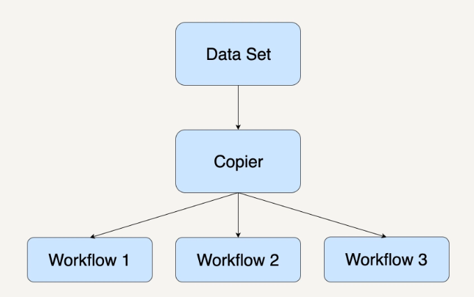
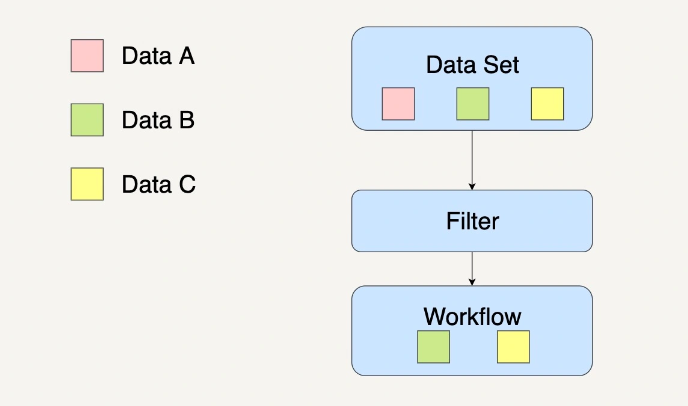
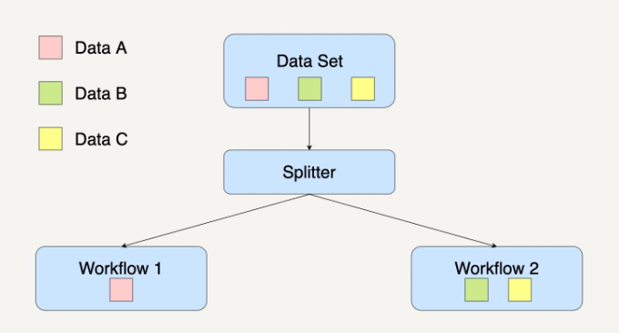
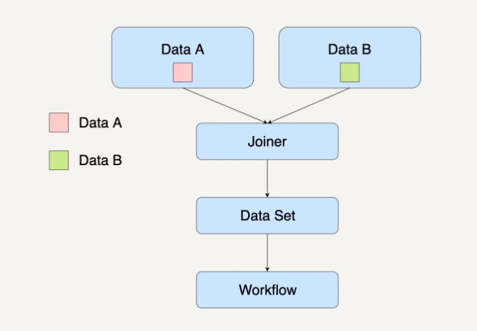

# 设计模式

## 复制模式(Copier Pattern)

复制模式通常是将单个数据处理模块中的数据，完整地复制到两个或更多的数据处理模块中，然后再由不同的数据处理模块进行处理。

    

## 过滤模式(Filter Pattern)

过滤模式的作用是过滤掉不符合特定条件的数据。在数据集通过了这个数据处理模块后，数据集会缩减到只剩下符合条件的数据。

    

## 分离模式(Splitter Pattern)

如果你在处理数据集时并不想丢弃里面的任何数据，而是想把数据分类为不同的类别来进行处理时，你就需要用到分离模式来处理数据。

    

## 合并模式(Joiner Pattern)

合并模式会将多个不同的数据集转换集中到一起，成为一个总数据集，然后将这个总的数据集放在一个工作流中进行处理。

    

# 参考资料

- [流计算精品翻译: The Dataflow Model](https://developer.aliyun.com/article/64911?accounttraceid=f8c5656442264b919304a52823d13794sgaq)
- [极客时间:大规模数据处理实战](https://time.geekbang.com/column/intro/100025301?tab=catalog)

