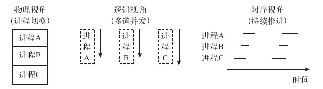

进程就是进展中的程序，或者说进程是执行中的程序。就是说，一个程序加载到内存后就变为进程, 即进程 = 程序 + 执行。

为了提高CPU利用率，人们想起将多个程序同时加载到计算机里，并发执行。这些同时存在于计算机内存的程序就称为进程, 进程让每个用户感觉到自己独占CPU。进程就是为了在CPU上实现多道编程而出现的概念。

对于操作系统来说，进程是其提供的一种抽象，目的是通过并发来提高系统利用率，同时还能缩短系统响应时间。

# 进程

## 进程模型
进程到底是什么呢？什么是进展中的程序呢？
1. 从物理内存的分配来看，每个进程占用一片内存空间，从这点上说，进程就是内存的某片空间。由于在任意时刻，CPU只能执行一条指令，因此任意时刻在CPU上执行的进程只有一个，而到底执行哪条指令由物理程序计数器指定。也就是说，在物理层面上，所有进程共用一个程序计数器。

2. 从逻辑层面上来看，每个进程可以执行，也可以暂时挂起让别的进程执行，之后又可以接着执行。进程需要某种办法记住每次挂起时自己所处的执行位置，这样才能在下次接着执行时从正确的地点开始。从这个角度看，每个进程有着自己的计数器，记录其下一条指令所在的位置。从逻辑上说，程序计数器可以有很多个。

3. 从时间上看，每个进程都必须往前推进。在运行一定的时间后，进程都应该完成了一定的工作量，即每次进程返回，它都处在上次返回点之后。
<center>
    
    <div>进程模型三个视角</div>
</center>

操作系统如何实现进程呢？
1. 任何抽象都需要有一个物理基础。对于进程来说，其物理基础就是程序。程序运行在计算机上，首先需要解决的问题是进程的存储。由于多个进程可能同时并存，<b><font color="FF5733">进程的存储需要考虑如何让多个进程共享同一个物理内存而不发生冲突(内存管理)</font></b>。
2. 进程运行实际上是指进程在CPU上执行。<b><font color="FF5733">如何将CPU在多个进程之间进行交接或切换(进程调度)：决定在什么时候让什么进程使用CPU</font></b>。

## 进程状态

进程分为3种状态：执行、阻塞和就绪，在3种状态之间可以进行各种转换。如果每个状态都可以转换为另外一种状态，则一共有6种转换：
```
                  调度器选择另一个程序
        执行态   ---------------------x 就绪态
                x---------------------
                    调度器选择本程序       x
            \                           /
    进程因等待 \                         /
    输入阻塞    \                       /    输入数据到达
                \                     /
                 x                   /
                        阻塞态
```
## 进程和地址空间
进程空间也称为地址空间。简单来说，地址空间就是进程要用的所有资源。进程与地址空间研究的主要内容是如何让多个进程空间共享一个物理内存。具体来说，就是高效、安全地让所有进程共享这片物理内存。

## 进程管理
与一个社会管理人的过程类似，操作系统要管理进程就要维护关于进程的一些信息。当一个进程产生时，操作系统也需要为其创建记录。操作系统用于维护进程记录的结构就是进程表或进程控制块（Process Control Block, PCB）。这个进程表或PCB中存放的就是有关该进程的资料。那么进程表里有什么资料呢？不同的操作系统维护的进程资料不尽相同。一般来说，维护的资料信息应当包括寄存器、程序计数器、状态字、栈指针、优先级、进程ID、信号、创建时间、所耗CPU时间、当前持有的各种句柄等。而采纳的数据结构主要是线性表、链表和结构(struct)，当然也可能使用树和图(网络)结构。

### 进程的创建

操作系统是如何创建一个进程的呢？一般来说，创建进程的步骤如下所示：
1. 分配进程控制块。
2. 初始化机器寄存器。
3. 初始化页表。
4. 将程序代码从磁盘读进内存。
5. 将处理器状态设置为“用户态”。
6. 跳转到程序的起始地址（设置程序计数器）。
这里一个最大的问题是，跳转指令是内核态指令，而在第5步时处理器状态已经被设置为用户态，但在用户态下是不能执行内核态指令的。这个问题如何解决？当然了，这就需要硬件帮忙了。硬件必须将第5和第6两步作为一个步骤一起完成。

---

UNIX将进程创建分为两个步骤：
1. `fork`，创建一个与自己完全一样的新进程
2. `exec`将新的进程的地址空间用另一个程序的内容覆盖，然后跳转到新程序的起始地址，从而完成新程序的启动。

# 进程调度
一般来说，程序使用CPU的模式有3种：
1. 程序大部分时间在CPU上执行，称为CPU导向(CPU-bound)或计算密集型程序。
2. 程序大部分时间在进行输入输出，称为I/O导向(I/O-bound)或输入输出密集型程序
3. 程序介于前两种模式之间，称为平衡型程序。例如，网络浏览或下载、网络视频等

## 进程调度目标
CPU调度就是要达到极小化平均响应时间、极大化系统吞吐率、保持系统各个功能部件均处于繁忙状态和提供某种貌似公平的机制。

极小化平均响应时间就是要极小化用户发出命令和看到某种结果之间所花费的时间，即平均等待的时间；极大化系统吞吐率就是要在单位时间内完成尽可能多的程序，就是单位时间内能完成的工作数量，即整个系统运行效率高；保持系统各个功能部件繁忙就是要让CPU和输入输出设备均处于忙碌状态。

提供公平就是要让各个程序感到某种“平等”，即在CPU面前“人人平等”。公平是任何系统都应该努力达到的目标。因为没有公平，该系统对用户的吸引力就会急剧下降。

---
对于不同的系统来说，在调度目标方面也有一些细微的不同。例如，对于批处理系统来说，由于用户并不坐在计算机前面等待结果，响应时间就显得不太重要，但系统吞吐率、CPU利用率和周转时间则很重要。

对于交互式系统来说，由于用户在等待计算机，因此响应时间要很快。但在这里要注意的是适度性（proportionality）。适度性就是响应时间要和期望值相匹配，也就是不要超越用户的期望。比如，用户期待1秒钟的响应时间，你就给他1秒钟的响应时间，而不必提供0.1秒钟的响应时间。这是因为，提供超出用户期望的响应会增加系统设计的难度，而又不会提高用户的满意度。

对于实时系统来说，调度就是要达到在截止时间前完成所应该完成的任务和提供性能可预测性。

## 调度算法

### 先来先服务调度算法
先来先服务调度算法缩写为FCFS(First Come First Serve)。先来先到的一个隐含条件就是不能抢占，一个程序一旦启动就一直运行到结束或者受阻塞为止。

### 时间片轮转算法
时间片轮转算法是对FCFS算法的一种改进，其主要目的是改善短程序的响应时间。其方法就是周期性地进行进程切换。例如，每1秒钟进行一次进程轮换。这样，短程序排在长程序后面也可以很快得到执行。因此长程序执行1秒后就得把CPU让出来。这样整个系统的响应时间就得到了改善。

---
<b>系统响应时间依赖于时间片的选择</b>。那到底选择多大的时间片才合适呢？

如果选择的时间片过大，时间片轮转将越来越像FCFS，当选择的时间片超过任何一个程序所需要的执行时间长度时，则完全退化为FCFS。而如果选择的时间片过小，则进程切换所用的系统消耗将太多，使得系统的大部分时间花在进程的上下文切换上，而用来真正执行程序的有用时间很少，从而降低系统效率，并造成浪费。

那如何选择一个合适的时间片呢？我们需要知道进行一次进程切换所用系统消耗和我们能够承受的整个系统消耗，就可以得出合适的时间片。例如，如果每次进程切换需要消耗0.1毫秒的CPU时间，则选择10毫秒的时间片将浪费约1%的CPU时间在上下文切换上；如果选择5毫秒的时间片，则浪费约为2%；20毫秒的时间片，则浪费约为0.5%。如果我们能够承受的CPU浪费为1%，则选择10毫秒的时间片就很合理。

时间片选择还需考虑的一个因素是，有多少进程在系统里运行？如果运行的进程多，时间片就需要短一些，用户的交互体验会很差。进程数量少，时间片就可以适当长一些。时间片的选择是一个综合的考虑，需要权衡各方利益，进行适当折中。

---
时间片轮转看上去非常公平，响应时间非常好，每个进程周期性地获得CPU时间。但时间片轮转真的公平吗？时间片轮转的系统响应时间总是比FCFS的响应时间短吗？答案却不一定(进程切换需要消耗系统时间)。

### 短任务优先算法
要改善短任务排在长任务后面轮转而造成响应时间和交互体验下降的办法就是短任务优先(Shorted Time to Completion First, STCF)算法。这种算法的核心是所有的程序并不都一样，而是有优先级的区分。具体来说，就是短任务的优先级比长任务的高，优先级高的程序先运行。

短任务优先算法有两个变种：一种是非抢占，一种是抢占。非抢占短任务优先算法的原理是让已经在CPU上运行的程序执行到结束或阻塞，然后在所有候选的程序中选择需要执行时间最短的进程来执行。抢占式短任务优先算法则是每增加一个新的进程就需要对所有进程(包括正在CPU上运行的进程)进行检查，谁的时间短，就运行谁。

在所有非抢占调度算法中，STCF算法的响应时间最优。而在所有抢占调度算法中，抢占式STCF算法的响应时间最优。

---
STCF调度算法也有缺点。第一是可能造成长程序无法得到CPU时间而导致饥饿。除此之外，无法知道每个进程还需要运转多久？

### 优先级调度算法
前面介绍的STCF算法有一个缺点是可能造成长进程“饥饿”，使用优先级即可。优先级调度算法的原理是给每个进程赋予一个优先级，每次需要进程切换时，找一个优先级最高的进程进行调度。如果赋予长进程一个高优先级，则该进程就不会再“饥饿”。STCF算法本身就是一种优先级调度，只不过它给予短进程高优先级而已。

优先级调度的优点是可以赋予重要的进程以高优先级以确保重要任务能够得到CPU时间。其缺点则与STCF算法一样，低优先级的进程可能会“饥饿”。不过，这个问题在优先级调度算法里比在STCF里好解决：只要动态地调节优先级即可。例如，在一个进程执行特定CPU时间后将其优先级降低一个级别，或者将处于等待进程的优先级提高一个级别。这样，一个进程如果等待时间很长，其优先级将因持续提升而超越其他进程的优先级，从而得到CPU时间。“饥饿”现象就可以防止。

---
优先级调度还有一个缺点，就是响应时间不能保证，除非将一个进程的优先级设置为最高。即使将优先级设置为最高，但如果每个人都将自己进程的优先级设为最高，则响应时间还是无法保证。

### 混合调度算法

原理是将所有进程分成不同的大类，每个大类为一个优先级。如果两个进程处于不同的大类，则处于高优先级大类的进程优先执行；如果两个进程处于同一个大类，则采用时间片轮转来执行。
```
最高优先级      队列头
  ｜           优先级1    --可执行进程--可执行进程--可执行进程
  ｜           优先级2    --可执行进程
  ｜           优先级3    --可执行进程--可执行进程
  ｜           优先级4    --可执行进程--可执行进程--可执行进程
  ｜           优先级5    --可执行进程--可执行进程--可执行进程--可执行进程
最低优先级
```
### 其他调度算法
有的操作系统还实现了一些其他算法，它们包括：保证调度(Guaranteed Scheduling)、彩票调度(Lottery Scheduling)、用户公平调度(Fair Share Scheduling Per User)。

保证调度算法的目标是保证每个进程占用CPU的时间完全一样，即如果系统里一共有n个进程，则每个进程占用CPU的时间为1/n。保障调度算法就是保障每个进程使用1/n的CPU时间。保障就是肯定运转1/n的时间，而不是运转大概1/n时间。那么保障调度和轮转调度是一样的吗？时间片轮转能不能达到1/n的效果？关键就是达到1/n不一定要靠轮转。轮转是能够达到1/n的，但是保障调度不一定要轮转。每次给的时间片不一定要一样。

彩票调度算法是一种概率调度算法。给每个进程分发一定数量的彩票，而调度器则从所有彩票里随机抽取一张彩票，而持有该彩票的进程就获得CPU。如果想让某个进程获得更多的CPU时间，我们可以给该进程多发几张彩票。彩票调度算法的优越性是显而易见的，通过给每个进程至少一张彩票就可以防止“饥饿”，因为该进程获得CPU的概率将大于0。除此之外，彩票算法还可以用于模拟其他进程调度算法。例如，如果给每个进程一样多的彩票，则该算法就近似保证调度算法；如果给短任务赋予更多的彩票，则该算法将类似于短任务优先算法。那么彩票调度算法有什么用呢？比如，如果要保障A进程50%的CPU时间，那么就把一半的彩票分给A，这样的话就能保障50%的CPU时间。别的调度方法也可能达到这个效果，但是不灵活。

用户公平调度算法按照每个用户而不是每个进程来进行公平分配。以进程为单位的算法，这样一个贪婪的用户可以通过启动许多进程来抢占CPU时间。如果每个用户都很贪婪，都试图启动很多进程，则将造成整个系统效率低下，甚至停顿。用户公平调度算法就是将CPU时间按照用户进行平均分配。如果一个用户的进程多，则其所拥有的进程所获得的CPU时间将短；反之，则多。

## 实时调度算法
实时系统是一种必须提供时序可预测性的系统。由于其应用范围广和特性不同于一般计算机系统，实时系统则必须考虑每个具体任务的响应时间必须符合要求，即每个任务必须在什么时间之前完成，而无须考虑如何降低整个系统的响应时间或吞吐率。

实时系统调度算法种类繁多，最经典的两种算法：动态优先调度和静态优先级调度。动态优先级调度又称为最早截止任务优先(Earliest Deadline First, EDF)算法，而静态优先级调度又称为最短周期优先(Rate Monotonic Scheduling, RMS)算法。

### EDF调度算法
EDF调度算法就是最早截止的任务先做。如果新的工作来了，比正在运行的程序的截止时间更靠前，那么就抢占当前进程。EDF调度算法是实时调度里面的最优算法。如果一组任务可以被调度的话(指所有任务的截止时间在理论上能够满足)，则EDF可以满足。一批任务如果不能全部满足，那么EDF能满足的任务数最多, 这就是它最优的体现。

EDF调算算法就是STCF算法变化来的。如果将STCF算法的任务所需执行时间变为截止时间，则抢占式STCF算法就是EDF调度算法

### RMS算法

EDF算法是一种动态调度算法，该算法动态地计算每个任务的截止时间并动态调节优先级。如果需要，还会对当前进程进行抢占。虽然EDF算法在理论上是最优的，但动态计算截止时间和动态抢占CPU均要消耗系统资源，因此EDF算法实际效果比其理论效果要差一截。与EDF算法相对的是所谓的RMS调度算法，该算法在进行调度前先计算出所有任务的优先级，然后按照计算出来的优先级进行调度，任务执行中间既不接收新的进程，也不进行优先级的调整或进行CPU抢占。优点是系统消耗小，缺点是不灵活。一旦该系统的任务决定了，就不能再接收新的任务。

对于RMS算法来说，一个重要的任务是判断一个任务组能否调度。而这个判断并不是容易做的。Liu和Kayland在1973年证明了如果一个系统里所有任务的CPU的利用率低于ln 2，则这些任务的截止时间均可以得到满足。具体来说，一个系统里所有任务的截止时间如果想都得到满足，则这些任务必须满足下面的条件：n为任务的数量，$c_i$为第i个任务的执行时间，$p_i$为第i个任务的释放周期。而当n趋向无穷时，U的值变为ln2。
$$
\begin{array}{l}
U = \sum_{i=1}^{n} \frac{c_i}{p_i} \le n(\sqrt[n]{2} - 1)
\end{array}
$$

根据上述公式，如果CPU利用率在ln2以下时，所有任务的截止时间均可满足。因为ln2约等于0.693147，此时系统还剩下约30%的CPU时间,这个时间可以用来处理一些非实时任务。

RMS算法为静态最优算法。即如果任何静态优先级算法可以满足一组任务的截止时间，则RMS算法也必能满足。

## 进程调度过程

在更换进程的时候到底有哪些操作需要完成呢？首先，当然需要将当前进程的状态予以保护，以便将来能够重新执行。然后是将选中的进程的环境布置好，这包括设置寄存器、栈指针、状态字等操作。最后是跳转到选中的进程，也就是设置或恢复其程序计数器。调度进程时操作系统所执行的操作概览：
- 因时序或外部中断或进程挂起而导致操作系统获得CPU控制权。
- 操作系统在所有就绪的进程中按照某种算法遴选进程。
- 如果选中的是非当前进程，则操作系统将当前进程（中断或挂起的进程）状态予以保护。
- 将选中的进程的环境布置好（设置寄存器、栈指针、状态字等）。
- 跳转到选中的进程。

## 调度异常

### 优先级倒挂
优先级倒挂(priority inversion)指的是一个低优先级任务持有一个被高优先级认为所需要的共享资源。这样高优先级任务因资源缺乏而处于受阻状态，一直到低优先级任务释放资源为止。这样实际上造成了这两个任务的优先级倒挂。如果此时有其他优先级介于二者之间的任务，并且其不需要这个共享资源，则该中级优先级的进程将获得CPU控制，从而超越这两个任务，导致高优先级进程被临界区外的低优先级进程阻塞。

在某些时候，优先级倒挂并不会造成损害。高优先级任务的延迟并不会注意到。因为低优先级进程最终会释放资源。但在其他一些时候，优先级倒挂则可能引起严重后果。如果一个高优先级进程一直不能获得资源，有可能造成系统故障，或激发事先定义的纠正措施，如系统复位。例如，美国的火星探测器Mars Path-finder就是因为优先级倒挂而出现故障。

如果高优先级进程在等待资源时不是阻塞等待，而是循环（繁忙）等待，则它将永远无法获得所需资源。因为此时的低优先级进程无法与高优先级进程争夺CPU时间，从而无法执行，进而无法释放资源。而这将造成高优先级进程无法获得资源而继续推进。

优先级倒挂还可能造成系统性能降低。由于优先级倒挂造成低优先级任务在高优先级任务之前执行，因此系统的响应将降低，甚至实时系统的响应时间保证都有可能违反。

---
解决方案

优先级倒挂的问题在20世纪70年代就已经发现，但却没有找到一个可以预测其发生的方法，因为在实际运行中很难判断哪些进程之间会进行资源竞争，哪些进程又会从别人的资源竞争中渔翁得利。虽然不能预测其发生，但却可以采取手段防止其出现。由于优先级倒挂必须满足某些条件，因此我们只需将这些条件排除即可防止优先级倒挂。那么如何防止优先级倒挂呢？优先级倒挂有两种形式：
- 不持有资源的低优先级进程阻碍需要资源的高优先级进程的执行。
- 持有资源的低优先级进程阻碍需要资源的高优先级进程的执行。

第1种情况为优先级倒挂的正常定义。这种倒挂的出现需要3种优先级别的存在：一个低优先级进程持有资源，一个不需要该资源的中优先级进程和一个需要使用该资源的高优先级进程。由于中优先级进程不需要使用低优先级进程占用的资源，因此它将能够抢占低优先级进程而获得CPU，从而在高优先级进程前面运行。要防止这种优先级倒挂，只需要将系统的优先级别限制为两种即可解决。可以得出第1种防止办法：使用中断禁止。

---
<b>中断禁止核心是通过禁止中断来保护临界区。在采用此种策略的系统中只有两个优先级：可抢占优先级和中断禁止优先级。</b>前者为一般进程运行时的优先级，后者为运行于临界区进程的优先级。由于不存在第3种优先级，因此第1种优先级倒挂无法发生。由于系统里只存在一把锁(禁止中断操作在任何时候只能由一个进程执行)，不能发生乱序，因此也不会发生死锁。又由于进入临界区的进程总是能够不被打断而一直运行到结束，因此也不会发生悬挂(hang)。即使高优先级进程采用繁忙等待也不会发生死锁。

这里需要注意的是，<b>所有中断都必须禁止</b>。如果禁止的仅仅是一个特定的硬件设备的中断，则硬件的中断优先处理机制将再次引入优先级倒挂。该方法普遍应用于简单的嵌入式系统，这种系统的特点是可靠性、简易性和资源需求低。不过这种方法对程序员的要求较高，因此在程序设计时需要将临界区设计得很短（中断禁止时间过长会造成系统响应时间增加而导致错误或灾难)，通常应该在100微秒以下。而这个时间对于通用计算机来说很不现实。

在多CPU环境下，由于不能使用中断禁止，因此使用一个简单的变种：<b>单一共享标志锁</b>。该方法在共享内存里面提供一个单一标志。所有CPU在进入跨CPU临界区时都必须先获得该标志。这个标志在有的操作系统里面称为旋锁。

---
优先级上限(priority ceiling)

使用中断禁止可以防止第1种优先级倒挂，但无法避免第2种情况的倒挂。<b>要防止第2种优先级倒挂，就不能让低优先级进程持有高优先级进程所需要的资源。让共享的临界区有自己的优先级，并让访问临界区的进程获得临界区的优先级。只要临界区的优先级设置得足够高，就可以避免优先级倒挂(因为获得资源的进程具有的将是高优先级)。</b> 在实际实现的时候，共享的mutex进程有其自身的高优先级。一个程序如果进入mutex保护的临界区，将获得该临界区所具有的高优先级别。如果其他试图访问mutex的进程的优先级都低于mutex的优先级，则将不会发生优先级倒挂。但如果试图访问mutex的程序具有高于mutex的优先级，则仍可能发生倒挂。

---
优先级继承(priority inheritance)

<b>如果要完全杜绝优先级倒挂，则需要在任何时候都确保等待资源的进程所具有的优先级必须低于持有资源的进程的优先级，实现这种目标的机制就是优先级继承。在此种方式下，当一个高优先级进程等待一个低优先进程所持有的资源时，这个低优先级进程将暂时获得高优先级进程的优先级别。</b> 这样就能防止一个中间优先级的进程抢占低优先级进程而延长资源占用时间，同时也防止了因高优先级进程自身进行繁忙等待可能导致的死锁。即此种方法对两种优先级倒挂都有效果。在释放共享资源后，低优先级进程回到其原来的优先级级别。

# 进程通信

