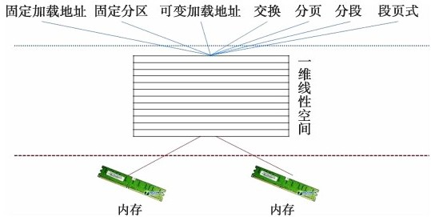
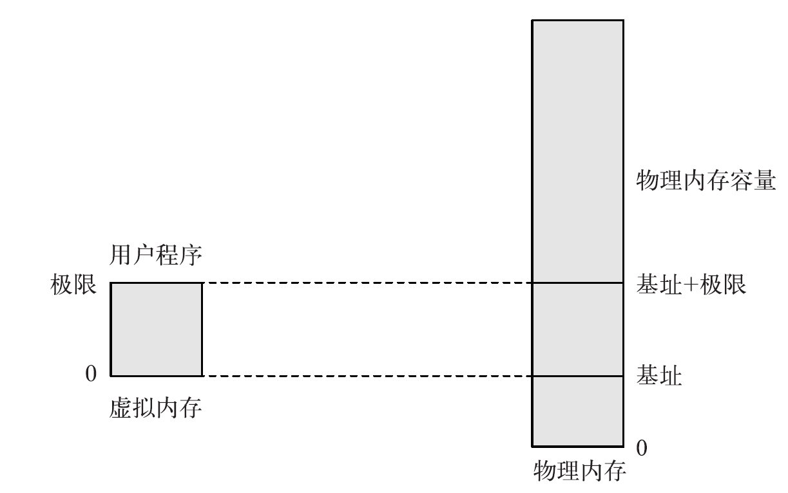

<center>
    
</center>

内存管理从根本上说是操作系统对存储设备进行的抽象和装扮。通过<b>虚拟内存</b>，操作系统为程序员或用户提供4种抽象：

1. <b>程序的地址独立性，内存管理目标之一</b>，程序发出的地址应该和具体机器的物理地址无关。
2. <b>地址空间的保护，内存管理目标之一，即一个程序不可以访问另外一个程序的地址空间。</b>由于多道程序同时存放在内存中，操作系统要保证它们之间互不干扰。所谓的互不干扰就是一个进程不能随便访问另一个进程的地址空间。
3. 内存空量的巨量或无限扩大
4. 内存访问速度的大幅度提升

操作系统实现虚拟内存的机制是动态地址翻译。

```
内存架构：
缓存 -- 主存 -- 磁盘 -- 磁带
```

内存管理机制负责对内存架构进行管理，使程序在内存架构的任何一个层次上的存放对于用户来说都是一样的。用户无须担心自己的程序是存储在缓存、主存、磁盘还是磁带上，最终运行、计算、输出的结果都一样。内存管理实现这种媒介透明的手段就是虚拟内存。

---

1. 内存管理要提供哪些抽象呢？或者说，内存管理要达到什么目标呢？
2. 主存能够存放的程序数量将是很有限的，而这将极大地限制多道编程的发展。如何解决物理主存容量偏小的缺陷呢？如何在不增加成本的情况下扩大内存容量呢？
3. 如何将内存空间在操作系统和用户程序之间进行分配呢？
4. 多道编程的内存管理是如何进行动态地址翻译的呢？内存管理策略
5. 操作系统怎么知道应该分配多少空间给一个程序呢？怎么知道该程序会进行多少层嵌套调用，产生多少新的数据呢？
6. 该程序的增长超过物理内存空间的容量，如何运行？
7. 如果运行两个一样的程序，只是数据不同，能否让两个程序共享部分内存空间？
8. 操作系统如何才能知道有哪些空闲空间？

---


# 虚拟内存

虚拟内存的中心思想是将物理主存扩大到便宜、大容量的磁盘上，即将磁盘空间看做主存空间的一部分。用户程序存放在磁盘上就相当于存放在主存内。用户程序既可以完全存放在主存，也可以完全存放在磁盘上，当然也可以部分存放在主存、部分存放在磁盘。而在程序执行时，程序发出的地址到底是在主存还是在磁盘则由操作系统的内存管理模块负责判断，并到相应的地方进行读写操作。事实上，我们可以更进一步，将缓存和磁带也包括进来，构成一个效率、价格、容量错落有致的存储架构。虚拟内存要提供的就是一个空间像磁盘那样大、速度像缓存那样高的主存储系统。虚拟内存尽可能从缓存满足用户访问请求，从而给人以速度提升的感觉。从这个角度来看，虚拟内存就是实际存储架构与程序员对内存的要求之间的一座桥梁。

> 每个进程都有自己独立的地址空间，这些地址空间都是虚拟地址。当进程需要内存时（例如通过brk分配内存），进程从内核获得的仅仅是一段虚拟地址的使用权，而不是实际的物理地址，进程并没有获得物理内存。实际的物理内存只有当进程真的去访问新获取的虚拟地址时，产生“缺页”异常，从而进入分配实际物理地址的过程，也就是分配实际的page frame并建立page table。之后系统返回产生异常的地址，重新执行内存访问，一切好象没有发生过。因此，看起来虚拟内存和物理内存的分配被分割开了，这是否意味着进程可以任意的申请虚拟地址空间呢？也不行，毕竟virtual memory需要physical memory做为支撑，如果分配了太多的virtual memory，和物理内存不成比例，对性能会有影响。对于这个状况，我们称之为overcommit[2]。

## 内存分配策略

Linux大部分申请内存的请求都回复"yes"，以便能跑更多更大的程序。因为申请内存后，并不会马上使用内存。这种技术叫做`OverCommit`。 当内存不足时，会发生`OOM。`它会选择杀死一些进程(用户态进程，不是内核线程)，以便释放内存。Linux支持三种[`OverCommit`策略](https://www.kernel.org/doc/Documentation/vm/overcommit-accounting)。

内存分配策略，相关参数`vm.overcommit_memory`

> 参数说明 ：位于`/proc/sys/vm/overcommit_memory`可选值：0、1、2。 
>
> - 0 :  启发式策略(`Heuristic overcommit handling`)，是系统的默认值。明显的过度使用地址空间会被拒绝，它在确保不合理的内存分配失败的同时允许过度使用来减少swap。在该模式下，root用户可以分配稍微多一些的内存。
>
> - 1 : 任何`OverCommit`都会被接受。在kernel的官方介绍有如下的描述：
>
>     > Always overcommit. Appropriate for some scientific applications. Classic example is code using sparse arrays and just relying on the virtual memory consisting almost entirely of zero pages.
>
> - 2 : 禁止OverCommit。总地址空间超用不允许超过swap + `vm.overcommit_ratio`(默认50)/100 * RAM，该模式下，大多数情况下进程在访问页不会被kill，而在申请内存时报错。该模式会降低内存的使用效率，浪费内存资源。其中`overcommit`的量取决于`vm.overcommit_kbytes`(绝对值)和`vm.overcommit_ratio`(百分数) 关于使用场景在kernel的官方介绍有如下的描述
>
>     > Useful for applications that want to guarantee their memory allocations will be available in the future without having to initialize every page.

可以通过`/proc/meminfo`的`CommitLimit`查询当前系统的`overcommit limit`以及`Committed_AS`查询已经分配内存大小。


如何查询和设置内存分配策略，它由`sysctl`指令支持对其操作

```shell
# 查询vm.overcommit_memory参数
sysctl vm.overcommit_memory
sysctl -a | grep vm.overcommit_memory
cat /proc/sys/vm/overcommit_memory

# 修改vm.overcommit_memory参数，例如将其修改为1
sysctl vm.overcommit_memory=1
echo 1 > /proc/sys/vm/overcommit_memory
```


## OOM

> 当oom-killer发生时，linux会选择杀死哪些进程 选择进程的函数是oom_badness函数(在mm/oom_kill.c中)，该函数会计算每个进程的点数(0~1000)。 点数越高，这个进程越有可能被杀死。 每个进程的点数跟oom_score_adj有关，而且oom_score_adj可以被设置(-1000最低，1000最高)[1]。

>/proc/[pid]/oom_score (since Linux 2.6.11)
>
>This file displays the current score that the kernel gives to this process for the purpose of selecting a process for the OOM-killer.  A higher score means that the process is more likely to be selected by the OOM-killer.  The basis for this score is the amount of memory used by the process, with increases (+) or decreases (-) for factors including.
>* whether the process is privileged (-).
>Before kernel 2.6.36 the following factors were also used in the calculation of oom_score:
>* whether the process creates a lot of children usingfork(2) (+);
>* whether the process has been running a long time, or has used a lot of CPU time (-);
>* whether the process has a low nice value (i.e., > 0) (+); and
>* whether the process is making direct hardware access (-).
>
>The oom_score also reflects the adjustment specified by the oom_score_adj or oom_adj setting for the process.[3]

## 内存使用信息

`/proc/meminfo`是了解Linux系统内存使用状况的主要接口。

[/PROC/MEMINFO之谜](http://linuxperf.com/?p=142)

# 操作系统在内存中的位置

内存管理的第一个问题是操作系统本身在内存中的存放位置。应该将哪一部分的内存空间用来存放操作系统呢？或者说，我们如何将内存空间在操作系统和用户程序之间进行分配呢？

1. 最简单的方式就是将内存划分为上下两个区域，操作系统和用户程序各占用一个区域

   ```
   0xFFFF...
     |	用户程序 in RAM				   | 操作系统 in RAM  
     |----------------				  |-----------------
     | 操作系统 in RAM				   | 用户程序 in RAM
   0
   		(a)								(b)
   ```

   (a)的构造易于理解，操作系统是为用户提供服务的，在逻辑上处于用户程序之下。将其置于地址空间的下面，符合人们的惯性思维。操作系统处于地址空间下面还有一个实际好处：就是在复位、中断、陷入等操作时，控制移交给操作系统更方便，因为操纵系统的起始地址为0，无须另行记录操作系统所处的位置，程序计数器清零就可以了。清零操作对于硬件来说非常简单，无须从总线或寄存器读取任何数据；(b)虽然也可以工作，但显然与人们习惯中操作系统在下的惯性思维不符。

2. 现代的计算机内存除了RAM之外，可能还备有ROM。而操作系统既可以全部存放在ROM里，也可以部分存放在ROM里，这样又多出了两种分配方式

   ```
   0xFFFF...
     |	操作系统 in ROM				   | 操作系统 in ROM  
     |----------------				  |-----------------
     | 用户程序 in RAM				   | 用户程序 in RAM
    								| ----------------
    								|  操作系统 in RAM
   0
   		(a)								(b)
   	
   			备有ROM时操作系统和用户程序之内存分配
   ```

   (a)模式下操作系统放在ROM里面的好处是不容易被破坏，缺点就是ROM要做得大，能够容纳整个操作系统。由于ROM比较贵，通常情况下是备有少量的ROM，只将操作系统的一部分放在ROM里，其余部分放在RAM里，(b)分配模式更好。(b)分配模式还有另外一个好处：可以将输入输出和内存访问统一起来。即将输入输出设备里面的寄存器或其他存储媒介编入内存地址（在用户程序地址之上），使得访问输入输出设备如同访问内存一样。这种输入输出称为内存映射的输入输出。如果要访问的地址高于RAM的最高地址，则属于I/O操作，否则属于正常内存操作。多数现代操作系统采用的是(b)模式：即ROM里面包括操作系统一部分和I/O, RAM里面则包括操作系统的其他部分和用户程序

   

   根据操作系统是否占用ROM或我们是否采用内存映射的输入输出来分，存在两种模式：

   - 操作系统占用RAM的底层，用户程序占用RAM的上层。
   - 操作系统占用RAM的底层和位于用户程序地址空间上面的ROM，用户程序位于中间，又分为3种情况：
     - 没有使用内存映射的输入输出，ROM里面全部是操作系统。
     - 使用了内存映射的输入输出，ROM的一部分是操作系统，另一部分属于I/O设备。
     - 使用了内存映射的输入输出，ROM全部属于I/O设备。

# 内存管理

## 单道编程内存管理
最简单的内存管理是单道程序下的内存管理。在单道编程环境下，整个内存里面只有两个程序：一个是用户程序，另一个是操作系统。由于只有一个用户程序，而操作系统所占用的内存空间是恒定的，可以将用户程序总是加载到同一个内存地址上。即用户程序永远从同一个地方开始执行。在这种管理方式下，操作系统永远跳转到同一个地方来启动用户程序。用户程序里面的地址都可以事先计算出来，即在程序运行前就计算出所有的物理地址。在运行前即将物理地址计算好的方式叫做<b>静态地址翻译</b>。


固定地址的内存管理单元非常简单，实际上并不需要任何内存管理单元。因为程序发出的地址已经是物理地址，在执行过程中无须进行任何地址翻译。不需要地址翻译， 程序运行速度快。

固定地址的内存管理其缺点也明显：
1. 整个程序要加载到内存空间中去，导致比物理内存大的程序无法运行。
2. 只运行一个程序造成资源浪费。如果一个程序很小，虽然所用内存空间小，但剩下的内存空间也无法使用。
3. 可能无法在不同的操作系统下运行，因为不同操作系统占用的内存空间大小可能不一样，使得用户程序的起始地址可能不一样。这样在一个系统环境下编译出来的程序很可能无法在另一个系统环境下执行。

## 多道编程内存管理

为了克服单道编程的缺点，发明了多道编程。随着多道编程度数的增加，CPU和内存的利用效率也随着增加，这种增加有个限度，超过这个限度，则因为多道程序之间的资源竞争反而造成系统效率下降。

虽然多道编程可以极大地改善CPU和内存的效率，改善用户响应时间，这种效率和响应时间的改善是需要付出代价的。这个代价就是操作系统的复杂性。因为多道编程的情况下，无法将程序总是加到固定的内存地址上，也就是无法使用静态地址翻译。必须在程序加载完毕后才能计算物理地址，也就是在程序运行时进行地址翻译，这种翻译称为<b>动态地址翻译</b>
```
用户进程 --地址翻译--> 地址翻译器(MMU)  --物理地址--> 物理内存
```

<b>多道编程的内存管理是如何进行动态地址翻译的呢？那得看内存管理的策略</b>。多道编程下的内存管理策略有两种：固定分区和非固定分区

### 固定分区内存管理策略
固定分区的管理就是将内存分为固定的几个区域，每个区域的大小固定。最下面的分区为操作系统占用，其他分区由用户程序使用。这些分区大小可以一样，也可以不一样。考虑到程序大小不一的实际情况，分区的大小通常也各不相同。当需要加载程序时，选择一个当前闲置且容量够大的分区进行加载。在这种模式下，当一个新的程序想要运行，必须排在一个共同的队列里等待。当有空闲分区时，才能进行加载。由于程序大小和分区大小不一定匹配，有可能形成一个小程序占用一个大分区的情况，从而造成内存里虽然有小分区闲置，但无法加载大程序的情况。如果在前面加载小程序时考虑到这一点，可以将小程序加载到小分区里，可以降低这种情况发生的概率

---
那么可以采用多个队列，即给每个分区一个队列。程序按照大小排在相应的队列里这样不同的程序有不同的对，就像在社会中不同的社会阶层有不同的待遇一样。当然，这种方式也有缺点，就是如果还有空闲分区，但等待的程序不在该分区的等待队列上，就将造成有空间而不能运行程序的尴尬处境。

#### 地址翻译
在多道编程环境下，由于程序加载到内存的地址不固定，必须对地址进行翻译。

程序是加载到内存里事先划分好的某片区域，而且该程序是整个加载进去。该程序里面的虚地址只要加上其所占区域的起始地址即可获得物理地址。因此，翻译过程非常简单：物理地址=虚拟地址+程序所在区域的起始地址，程序所在区域的起始地址称为(程序)基址。

由于有多个程序在内存空间中，需要进行地址保护。由于每个程序占用连续的一片内存空间，因此只要其访问的地址不超出该片连续空间，则为合法访问。因此，地址保护也变得非常简单，只要访问的地址满足下列条件即为合法访问：程序所在区域的起始地址≤有效地址≤程序所在区域的起始地址+程序长度，<b>只需要设置两个端值：基址和极限，即可达到地址翻译和地址保护的目的。</b> 这两个端值可以由两个寄存器来存放，分别称为基址寄存器和极限寄存器。在固定分区下，基址就是固定内存分区中各个区域的起始内存地址，而极限则是所加载程序的长度.
<center>
  
</center>

每次程序发出的地址需要和极限比较大小；如果大于极限，则属非法访问。此时将陷入内核，终止进程(在个别操作系统上，也可能进入一个异常处理的过程)；否则将基址加上偏移获得物理地址，就可以合法访问这个物理地址。
```C++
if（虚拟地址＞极限) {
  陷入内核终止进程(core dump)
} else {
  物理地址=虚拟地址+基址
}
```

怎么知道一个程序有多大呢？编译后，就可以得到这个程序的大小。基址和极限是很重要的两个参数，只有内核能够改变它们。如果要切换程序，只需将保存基址和极限的寄存器的值按照新程序的情况重新设置即可。

---
动态地址翻译虽然增加了系统消耗，不如静态地址翻译效率高，但其带来的优点远远超过静态地址翻译。
1. 灵活。因为实施了动态地址翻译，无须依赖编译器或加载器来进行静态地址翻译，可以将程序随便加载到任何地方，极大地提高操作系统操作的灵活性。
2. 实施地址保护的“不二法门”。要想进行地址保护，就必须对每个访问地址进行检查，而动态地址翻译恰恰就能做到这一点。
3. 使虚拟内存的概念得以实现。


从物理上讲，一个程序发出的访问地址有可能在内存，也有可能在磁盘。计算机怎么能知道这个地址所指向的数据在内存上还是在磁盘上呢？这无法在静态地址编译时知道。唯一的方法就是动态地址翻译。在每次内存访问的时候，虚拟地址就是用户每次看到的地址，这个地址只是一个抽象，由内存管理单元进行翻译，变成物理内存地址才能使用。由于这个翻译是在程序执行过程中发生，因此称为动态地址翻译。有了动态地址翻译，编译器和用户进程就再也不用考虑物理地址了。

在动态地址翻译环境下，一个虚拟地址仅在被访问的时候才需要放在内存里，在其他时候并不需要占用内存。由于动态地址翻译可以动态地改变翻译参数或过程，因此可以在程序加载到不同的物理位置时，或不同虚拟地址占用同一物理地址时，做出正确翻译。在使用基址和极限管理模式下，不同程序进入物理内存时，只需要变更基址和极限寄存器的内容即可。

### 非固定分区内存管理策略

#### 交换
<b>交换就是将一个进程从内存倒到磁盘上，再将其从磁盘上加载到内存中的过程，主要目的是为程序找到一片更大的空间，防止一个程序因空间不够而崩溃。</b>交换的另一目的，是实现进程切换，也就是将一个程序暂停一会儿，让另一个程序运行。使用交换进行进程切换的成本很高，一般不这样做。

交换和非固定分区一样，每个程序占用一片连续的空间，操作系统使用基址和极限来进行管理。但由于一个程序在执行过程中可能发生交换，其基址和极限均有可能发生变化。但这种变化对于内存管理来说，并不增加多少难度。只要每次加载程序的时候将基址和极限寄存器的内容进行重载即可。

#### 重叠(overlay)
如果一个程序在执行过程中占用空间增大了，通过交换给找一个更大的空间来执行，这种情况下该程序的增长无法超过物理内存空间的容量。<b>如果一个程序超过了物理内存，还能运行吗？解决办法就是所谓重叠(overlay)</b>。重叠就是将程序按照功能分成一段一段功能相对完整的单元。一个单元执行完后，再执行下一个单元，而一旦执行到下一个单元，就不会再执行前面的单元。我们可以把后面的程序单元覆盖到当前程序单元上，这样就可以执行一个比物理内存还要大的程序。

但是这相当于把内存管理的部分功能交给了用户，是个很拙劣的方法。也不是每个人都能够将程序分成边界清晰的一个个执行单元的。

#### 双基址
如果运行两个一样的程序，只是数据不同，能否让两个程序共享部分内存空间？例如，如果我们同时启动两个PPT演示文稿，我们希望PPT的程序代码部分能够共享，在基址极限这种管理模式下，这种共享无法实现。

可以设定两组基址和极限，数据和代码分别用一组基址和极限表示。

#### 空闲空间管理
在管理内存的时候，操作系统需要知道内存空间有多少空闲。如何才能知道有哪些空闲呢？这就必须跟踪内存的使用。跟踪的办法有两种：
1. 给每个分配单元赋予一个字位，用来记录该分配单元是否闲置。例如，字位取值0表示分配单元闲置，字位取值1则表示该分配单元已被占用。这种表示法就是所谓的位图表示法。位图表示法的优点是直观、简单，在搜索需要的闲置空间时只需要找到一片连续0个数大于等于所需分配单元数即可。
```
| 1 | 1 | 1 | 1 | 1 | 0 | 0 | 0 | 0 | 1 | 1 | 1 |
```

2. 将分配单元按是否闲置链接起来，称为链表表示法。
```
  | P | 0 | 5|
          ---->
            | H | 5 | 4 |
                --->
                    | P | 9 | 3 |
                        ---> 
                            | H | 12 | 2 |
                                  ---> 
                                      | P | 14 | 6|
```
P代表程序，即当前这片空间由程序占用。后面的数字是本片空间的起始分配单元号和大小。而H代表的是空洞，即这是一片闲置空间。

在链表表示下，寻找一个给定大小的闲置空间意味着找到一个类型为H的链表项，其大小大于或等于给定的目标值。扫描链表速度通常较慢。为提高查找闲置单元的速度，有人提出了将闲置空间和被占空间分开设置链表，这样就形成了两个链表的管理模式。

---

位图表示和链表表示的比较

位图表示和链表表示各有优缺点。如果程序数量很少，那么链表比较好，因为链表的表项数量少。例如，如果只有3个程序在内存中，则最多只需要7个链表节点。如果程序很稠密，那么链表的节点就很多了。

位图表示法的空间成本是固定的，不依赖于内存中程序的数量。因此，从空间成本上分析，到底使用哪种表示法得看链表表示后的空间成本是大于位图表示还是小于位图表示而定。

从可靠性上看，位图表示法没有容错能力。如果一个分配单元为1，不能肯定它应该为1，还是因为错误变成1的。因为链表有被占空间和闲置空间的表项，可以相互验证，具有一定的容错能力。

从时间成本上，位图表示法在修改分配单元状态时，操作很简单，直接修改其位图值即可，而链表表示法则需要对前后空间进行检查以便做出相应的合并。


# 参考资料

1. [sysctl 中 vm.overcommit_memory 的含义](https://blog.51cto.com/lookingdream/1933132)
2. [Linux vm运行参数之(一):overcommit相关的参数](http://www.wowotech.net/memory_management/overcommit.html)
3. [proc(5) — Linux manual page](https://man7.org/linux/man-pages/man5/proc.5.html)

