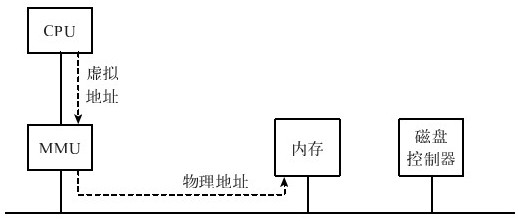

存在的问题：

多道编程的内存管理模式里，以交换内存管理最为灵活和先进。它可以解决因程序所需空间增长而无法继续运行的困难，又可以实现动态多道编程。事实上，这种策略存在很多重大问题，而其中最重要的两个问题是空间浪费和程序大小受限。

1. 空间浪费
```
假定我们运行8个程序：A、B、C、D、E、F、G、H，其启动、内存需要和交换过程如下：
A启动，需占用内存200KB，分配空间1000KB～1199KB。
B启动，需占用内存100KB，分配空间1200KB～1299KB。
C启动，需占用内存300KB，分配空间1300KB～1599KB。
A结束，释放内存空间1000KB～1199KB。
D启动，需占用内存50KB，分配空间1000KB～1049KB。
E启动，需占用内存100KB，分配空间1600KB～1699KB。
C结束，释放内存空间1300KB～1599KB。
F启动，需占用内存200KB，分配空间1300KB～1499KB。
G启动，需占用内存50KB，分配空间1500KB～1549KB。
H启动，需占用内存200KB，无法分配空间！
在上述前7个进程执行序列后，当前内存中尚有200KB的闲置空间，分别处于地址1050KB～1199KB和1550KB～1599KB。
因为不连续，所以无法容纳进程H,而进程H的空间需求只有200KB！
```
随着程序在内存与磁盘间的交换，内存将变得越来越碎片化，即内存将被不同程序分割成尺寸大小无法使用的小片空间。散布在进程之间的闲置空间称为外部碎片。这是因为从进程的粒度来看，这种碎片处于进程空间的外面。这种碎片化过程也称为“外部碎片化“。随着进程的进进出出，外部碎片将浪费大量的内存空间。

我们可以采取一些措施来降低外部碎片的危害，例如，在寻找空间容纳新的进程时，可以按照某种算法，如最先适用(first fit)或者最佳适用(best fit)来进行。最佳适用就是找到一个能够容纳新程序的最小空间。而最先适用就是找到第1个可以容纳新进程的空间。实践证明，最先适用比最佳适用更好。虽然最佳适用的名字听上去很好，但因为每次都是最小适应，使得多出来的空间反而更加难以再次利用。但不管是最佳适用还是最先适用，这些算法都不能消除外部碎片。当然，如果实在不行，我们可以进行碎片整理，即通过移动进程在内存里面的位置将空闲空间连成一片。但是这种操作需要将进程导出到磁盘上，再重新加载，效率十分低下。在进行碎片整理的过程中，系统的响应延迟将显著增加。

---
2. 程序受限问题
交换的内存管理模式还存在：地址空间增长困难，其中有两层意思：
    1. 空间增长效率低下。通过交换，可以让程序的大小增长。即先把程序倒到磁盘上，再在内存寻找一片更大的空间将程序倒进来，从而扩展程序所占的空间。由于磁盘操作耗时，这种交换出去，再找一片更大的空间来增长程序空间的做法效率非常低。
    2. 空间增长存在天花板限制。交换所能带来的空间增长有限。这个限制就是单一程序不能超过物理内存空间（减去操作系统所占部分），尽管多个程序的总空间可以超过物理内存空间。

---

解决办法

空间碎片化的根源是每个程序的大小不一样，这样在空间分配时不存在一致性。解决的办法自然是将空间按照某种规定的大小进行分配。只要将虚拟内存与物理内存都分成大小一样的部分，称为页，然后按页进行内存分配，就可以克服外部碎片的问题。

程序增长有限则是因为一个程序需要全部加载到内存才能运行。而解决的办法就是使一个程序无须全部加载就可以运行。用分页也可以解决这个问题：只将当前需要的页面放在内存里，其他暂时不用的页面放在磁盘上，这样一个程序同时占用内存和磁盘，其增长空间就大大增加了。分页后，如果一个程序需要更多的空间，给其分配一个新页即可。

---
# 分页内存管理

分页系统的核心就是将虚拟内存空间和物理内存空间皆划分为大小相同的页面，如4KB、8KB或16KB等，并以页面作为内存空间的最小分配单位，一个程序的一个页面可以存放在任意一个物理页面里。这样，由于物理空间是页面的整数倍，并且空间分配以页面为单位，将不会再产生外部碎片。同时，由于一个虚拟页面可以存放在任何一个物理页面里，空间增长也容易解决：只需要分配额外的虚拟页面，并找到一个闲置的物理页面存放即可。<b>分页系统下，一个程序发出的虚拟地址由两部分组成：页面号和页内偏移值.</b>例如，对于32位寻址的系统，如果页面大小为4KB，则页面号占20位，页内偏移值占12位。

为了解决程序比内存大的问题，可以允许一个进程的部分虚拟页面存放在物理页面之外，也就是磁盘上。在需要访问这些外部虚拟页面时，再将其调入物理内存。由此，交换系统的所有缺陷均被克服。

## 地址翻译
分页系统要能够工作的前提是：对于任何一个虚拟页面，系统知道该页面是否在物理内存中，如果在的话，其对应的物理页面是哪个；如果不在的话，则产生一个系统中断(缺页中断)，并将该虚页从磁盘转到内存，然后将分配给它的物理页面号返回。也就是说，页面管理系统要能够将虚拟地址转换为物理地址。翻译过程:
```C++
if (虚拟页面非法、不在内存或者被保护) {
    陷入到操作系统错误服务程序
} else {
    将虚拟页面号转换为物理页面号
    根据物理页面号产生最终物理地址
}
```
<b>分页系统的核心是页面的翻译，即从虚拟页面到物理页面的映射。</b>而这个翻译过程由内存管理单元(MMU)完成。MMU接收CPU发出的虚拟地址，将其翻译为物理地址后发送给内存。内存单元按照该物理地址进行相应访问后读出或写入相关数据.
<center>
    
</center>

## 页面翻译

