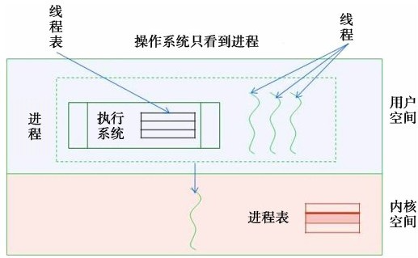
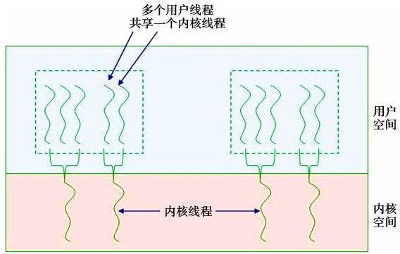

对进程级的并发机制——进程模型
- 进程分身术——进程、进程管理、进程的用户态、内核态和混合态实现、现代操作系统的进程实现模型、多进程之间的关系、进程模型主要考虑的问题。
- 为什么同步、同步的目的、锁原语的进化、睡觉与叫醒原语、信号量、管程、消息传递和栅栏。
- 死锁的产生、发展、防止与避免进行讲解，并讨论死锁、活锁和饥饿的关系
- 如何使用中断启用和禁止、测试与设置来实现锁原语。

<b>虽然进程和线程出现的动机都是并发，并发层次不同：进程属于处理器级并发，即在处理器这一层次上提供并发的抽象；线程则属于进程级并发，即在进程层次上再提供一层并发的抽象。如果我们下到底层，进入计算机体系结构里就会发现，流水线提供的也是一种并发，是指令级并发。</b>

# 线程

## 线程管理
线程管理要维持线程的各种信息，这些信息包含了线程的各种关键资料，存放这些信息的数据结构称为线程控制表或线程控制块。那么线程控制块里面到底包含哪些信息呢？

线程共享一个进程空间，许多资源是共享的，这些共享的资源存放在进程控制块即可，那些不被共享的资源和信息就需要存放在线程控制块里。按照这个标准来划分，线程共享的资源有地址空间、全局变量、文件、子进程等。定时器、信号和占用CPU时间也可以共享。但程序计数器不能共享，因为每个线程的执行序列不一样。寄存器也不能共享，栈也不能共享，这是线程的上下文(运行环境)。

## 线程模型实现
线程的调度却与进程调度不同。由于线程是在进程的基础上产生的概念(进程里面的一个执行序列)，其调度可以由进程负责，也可以将线程的调度交给操作系统，就形成了线程的两种实现：<b>用户态实现和内核态实现</b>。由进程自己管理就是用户态线程的实现，由操作系统管理就是内核态线程实现。用户态和内核态的判断以线程表所处的位置为依据：位于内核叫内核态实现，位于用户层叫用户态实现。

### 内核态线程实现
线程是进程的分身，是进程的不同执行序列。既然每个线程是不同的执行序列，则说明线程应该是CPU调度的基本单位。那么操作系统怎么管理线程呢？将线程控制块存放在操作系统内核空间。操作系统内核就同时保有进程控制块和线程控制块。而根据进程控制块和线程控制块提供的信息，操作系统就可以对线程进行各种类似进程的管理，如线程调度、线程的资源分配、各种安全措施的实现等。内核态线程的实现示意图:
```
每个用户线程就是一个内核线程

----------------------------------------------------------------
            ｜          ｜              ｜
            ｜          ｜              ｜              用户空间
----------------------------------------------------------------
            v           v              v
｜线程表｜   ｜          ｜              ｜              ｜ 线程表 ｜
----------------------------------------------------------------
```
由操作系统来管理线程有很多好处，最重要的好处是用户编程简单。因为线程的复杂性由操作系统承担，用户程序员在编程时无需管理线程的调度，即无需担心线程什么时候会执行、什么时候会挂起。另外一个重要好处是，如果一个线程执行阻塞操作，操作系统可以从容地调度另外一个线程执行。因为操作系统能够监控所有的线程。

那么内核态线程实现有什么缺点呢？首先是效率较低。因为线程在内核态实现，每次线程切换都需要陷入到内核，由操作系统来进行调度。而从用户态陷入到内核态是要花时间的。另外，内核态实现占用内核稀缺的内存资源，因为操作系统需要维护线程表。操作系统所占内存空间一旦装载结束后就已经固定，无法动态改变。由于线程的数量通常大大多于进程的数量，因此随着线程数量的增加，操作系统内核空间将迅速耗尽。

如果要建立进程线程，但内核空间不够了，怎么办？我们可以做的选择有：“杀死”别的进程；创建失败；让它等一下。“杀死”别的进程将造成服务不确定性。宣称创建失败也很差。因为创建失败有可能意味着某个进程无法往前推进，这违反了进程模型的时序推进要求。让创建者等一下，这要看创建的是什么进程和线程了。如果是系统进程线程，等一下可能意味着关键服务无法按时启动。

那在内核空间满了后，应该怎么办呢？如果内核空间溢出，操作系统将停止运转。因为要创立的进程可能很重要，所以不能不创建。

最致命的是内核态实现需要修改操作系统，这就有了用户态线程。

### 用户态线程实现
用户态实现就是用户自己做线程的切换，自己管理线程的信息，而操作系统无须知道线程的存在。

那么在用户态如何进行线程调度呢？那就是用户自己写一个执行系统（runtime system）作调度器，即除了正常执行任务的线程外，还有一个专门负责线程调度的线程。由于在用户态下运行，要想取得CPU控制权只能自愿合作。一个线程在执行完一段时间后主动把资源释放给别人使用，而在内核态下无需如此，因为操作系统可通过周期性的时钟中断把控制权夺过来。在用户态实现情况下，执行系统的调度器(runtime scheduler)也是线程，没有能力强行夺走控制权，所以必须合作。
<center>
    
    <div>用户态线程实现</div><br/>
</center>

用户态实现有什么优点呢？首先是灵活性，操作系统无须知道线程的存在，在任何操作系统上都能应用；其次是线程切换快。因为切换在用户态进行，无须陷入到内核态。最后是不用修改操作系统，实现容易。

那么这种实现方式有什么缺点吗？首先，编程序变得很诡异。用户态线程需要相互合作才能运转。在写程序时，必须仔细斟酌在什么时候应该让出CPU给别的线程使用。而让出时机的选择对线程的效率和可靠性有很大的影响。另外一个更为严重的问题是，<b>用户态线程实现无法完全达到线程提出所要达到的目的：进程级多道编程。</b>如果在执行过程中一个线程受阻，它将无法将控制权交出来(因为受阻后无法执行交出CPU的指令了)，这样整个进程都无法推进。操作系统随即把CPU控制权交给另外一个进程，一个线程受阻造成整个进程都受阻，我们期望通过线程对进程实施分身的计划就失败了。这是用户态线程的致命弱点。

## 现代操作系统的线程实现模型
用户态和内核态的线程模型都存在缺陷，因此现代操作系统将二者结合起来使用。用户态的执行系统负责进程内部线程在非阻塞时的切换；内核态的操作系统负责阻塞线程的切换，即同时实现内核态和用户态线程管理。其中内核态线程数量较少，而用户态线程数量较多。每个内核态线程可以服务一个或多个用户态线程。换句话说，<b>用户态线程被多路复用到内核态线程上。</b>
<center>
    
    <div>线程的内核态与用户态混合实现</div><br/>
</center>

在分配线程时，将需要执行阻塞操作的线程设为内核态线程，而不会执行阻塞操作的线程设为用户态线程，就可以获得两种态势实现下的优点，而避免其缺点。


## 多线程关系
线程在共享地址空间的过程中也会产生矛盾。这些矛盾归结到下面两个根本问题：
- 线程之间如何通信？
- 线程之间如何同步？

## 从用户态进入内核态
什么情况会造成一个线程从用户态进入到内核态呢？

1. 程序运行过程中发生中断或异常，系统将自动切换到内核态来运行中断或异常处理机制。
2. 程序进行系统调用也将造成从用户态进入到内核态的转换


# 线程同步

# 死锁

# 锁的实现
