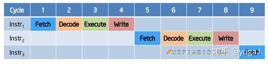
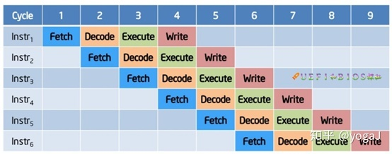
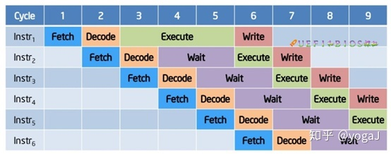
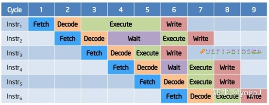

计算机的一条指令的执行,简单来说分为4步,即：
1. Fetch:指令取出
2. Decode:指令解码
3. Execute:指令执行
4. Write:结果写回

计算进指令执行发展历程

**1. 386时代：指令是顺序执行的（假设一指令占一个时钟周期）**

<b>指令顺序执行</b>

**2. 486时代：引入流水线（pipeline）技术**

<b>理想情况下,流水线技术处理</b>

实际上, 存在诸多挑战：流水线空转、分支问题.很多执行组件处于堵塞(Stall)状态,严重拉低了流水线的吞吐量

<b>流水线技术，存在组件阻塞状态</b>

**3. 乱序执行：整体执行方式从程序流驱动变成了数据流驱动。** 顺序的指令不需要按照顺序执行：只要部件的输入条件满足，就可以开始执行). 由此, 吞吐量恢复到了理想情况

<b>乱序执行</b>

预测执行(Speculative Execution), 多分支预测(Multiple Branch Prediction)、 数据流分析(Data Flow Analysis)三项技术，一起构成了乱序执行(out-of-order execution, OOOE)的技术基石。它是现代高性能计算的基础技术之一，广泛被应用在高端ARM CPU（包括各种定制ARM芯片：高通、Apple、etc）, IBM的Power 系列CPU，SPARC和X86 CPU中。

## 预测执行(Speculative Execution)
> 推测执行(亦作预测执行、投机性执行)是优化技术的一类，采用这个技术的计算机系统会根据现有信息，利用空转时间提前执行一些将来可能用得上，也可能用不上的指令。如果指令执行完成后发现用不上，系统会抛弃计算结果，并回退执行期间造成的副作用（如缓存）。
> 
> 推测执行的目标是在处理器系统资源过剩的情况下并行处理其他任务，实际上电脑处理器在工作中，闲置效能的这种情况还不少。因此为了充分运用效率，推测执行无处不在。流水处理器的分支预测、数值预测、预读取内存和文件、以及数据库系统的乐观并发控制等机能中都采用到了推测执行。最终可以达到提高整体效能的目的。
> 
>                                               -- 来自维基百科

### 分支问题，引入分支预测技术

### 安全问题
> 乱序执行和预测执行在遇到异常或发现分支预测错误时，CPU会丢弃之前执行的结果，将CPU的状态恢复到乱序执行或预测执行前的正确状态，然后选择对应正确的指令继续执行。这种异常处理机制保证了程序能够正确的执行，但是问题在于，**CPU恢复状态时并不会恢复CPU缓存的内容，而这两组漏洞正是利用了这一设计上的缺陷进行侧信道攻击**。
> 
> 它们被叫做缓冲时延旁路攻击方法。Spectre和Meltdown就是这一安全问题典型代表.
> 

> NDSS 2019安全会议上提出的研究中，UCB学者们表明，预测执行可以用于数据窃取以外的其他事件，这表明预测执行线程可以作为隐藏恶意命令的秘密场所。
## 多分支预测

## 数据流分析

# 参考资料
- [CPU中所谓的预测执行(Speculative Execution)](https://zhuanlan.zhihu.com/p/157233356)
- [维基百科:推测执行](https://zh.m.wikipedia.org/zh-hans/%E6%8E%A8%E6%B5%8B%E6%89%A7%E8%A1%8C)
- 