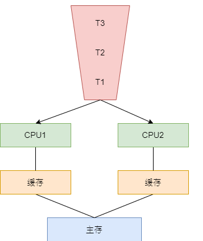

# 多核处理器结构

在x86体系结构下，多处理功能芯片经过了对称多处理器结构（SMP Architecture）、超线程结构（Hyper Threading）、多核结构（Multi-core Architecture）和多核超线程结构（Multi-core Hy-per Threading Architecture）的4个演变阶段。

## 对称多处理器结构(SMP)
### 架构特点
- 多处理器(MP), 包含多个同样的CPU。
- 对称. 所有的处理器对于系统来说都是一样的，都有相同的处理能力。例如，它们都有一样的访问内存中的任何位置和任意I/O设备的能力.
- 剩余的组成部分是唯一的。这种架构只有一个内存系统、一个操作系统拷贝和一个运行队列。

    

### 系统问题
1. **总线竞争.** 系统内部只有一条处理器连接内存系统的通路,它成了SMP系统的主要性能瓶颈，这就是256路 SMP计算机罕见的原因——总线竞争带来了系统无休止的中断。
> 除非程序特别指明，否则线程不会与某个特定的CPU有任何关联。一个线程可能在某个时间片时在CPU_1上执行，而在下一个时间片可能会在CPU_2上执行。由于线程是调度的实体，所以 T1和 T2可能是同一个进程上的两个线程。在这种情况下， T1和T2非常有可能定期频繁地访问同一块内存区域。这就带来了总线竞争问题。

解决总线竞争的办法是每个处理器使用大型缓存。大型缓存使得总线上的数据往返次数变少，但也产生了缓存一致性问题。

2. **缓存一致性问题.**
> 如果两个不同缓存都有变量x的一个拷贝，而其中一个处理器更新了它的私有拷贝，这种情况该如何处理？另一个缓存可能包含的是失效、错误的x值，这就是所谓的缓存一致性问题。
 
SMP架构提供了一种硬件设备来解决该问题, 当x更新时，在其他缓存以及主存里的所有拷贝都会更新。保证缓存一致性的硬件设备对应用软件是完全透明的。

## 超线程结构

## 多核结构

## 多核超线程结构

# 参考资料
- 提高C++性能的编程技术

# CPU调度

## RealTime

## CFS

