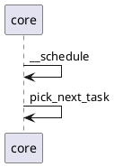

`kernel/sched/core.c`的
```C
asmlinkage __visible void __sched schedule(void) {
    struct task_struct *tsk = current;
    sched_submit_work(tsk);
    do {
        preempt_disable();
        __schedule(SM_NONE);
        sched_preempt_enable_no_resched();
    } while (need_resched());
    sched_update_worker(tsk);
}
EXPORT_SYMBOL(schedule);
```

```C
// 
static void __sched notrace __schedule(unsigned int sched_mode) {

}
```

```C
static inline struct task_struct *
__pick_next_task(struct rq *rq, struct task_struct *prev, struct rq_flags *rf) {
                    ...
    // kernel/sched/fair.c
    p = pick_next_task_fair(rq, prev, rf)
                    ...
}
```

