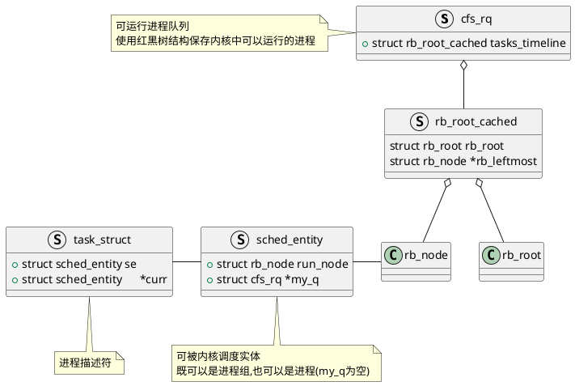

<div>
    <center>
        
        <div>cfs_rq, sched_entity和task_struct之间的关系</div>
    </center>
</div>


Linux 内核为了实现 完全公平调度算法，定义两个对象：`cfs_rq`(可运行进程队列) 和`sched_entity`(调度实体)。
- `cfs_rq`(可运行进程队列)：使用 红黑树 结构来保存内核中可以运行的进程。
- `sched_entity`(调度实体)：可被内核调度的实体，它既可以是一个进程组也可以是一个进程。

`include/linux/sched.h`中有`struct sched_entity`的定义
```C
struct sched_entity {
	struct load_weight		load;
	// 用于连接到运行队列的红黑树中
	// 把调度实体连接到可运行进程的队列中
	struct rb_node			run_node;

	struct list_head		group_node;
	// 是否已经在运行队列中
	unsigned int			on_rq;

	// 统计开始运行的时间点
	u64				exec_start;
	// 总共运行的实际时间
	u64				sum_exec_runtime;
	// 总共运行的虚拟运行时间
	u64				prev_sum_exec_runtime;
	// 虚拟运行时间(用于红黑树的键值对比)
	u64				vruntime;
	s64				vlag;
	u64				slice;

	u64				nr_migrations;

#ifdef CONFIG_FAIR_GROUP_SCHED
	int				depth;
	struct sched_entity		*parent;
	/* rq on which this entity is (to be) queued: */
	struct cfs_rq			*cfs_rq;
	/* rq "owned" by this entity/group: */
	struct cfs_rq			*my_q;
	/* cached value of my_q->h_nr_running */
	unsigned long			runnable_weight;
#endif
	.......
};
```

`kernel/sched/sched.h`中有`struct cfs_rq`的定义
```C
struct cfs_rq {
	struct load_weight	load;
	unsigned int		nr_running;			// 运行队列中的进程数
	unsigned int		h_nr_running;      /* SCHED_{NORMAL,BATCH,IDLE} */
	unsigned int		idle_nr_running;   /* SCHED_IDLE */
	unsigned int		idle_h_nr_running; /* SCHED_IDLE */

	s64			avg_vruntime;
	u64			avg_load;

	// 当前时钟
	u64			exec_clock;
	// 用于修正虚拟运行时间
	u64			min_vruntime;

    			.......

	// 红黑树根节点
	struct rb_root_cached	tasks_timeline;

	struct sched_entity	*curr;
	struct sched_entity	*next;

#ifdef CONFIG_FAIR_GROUP_SCHED
	// 绑定的CPU RunQueue
	struct rq			*rq;
	int					on_list;
	struct list_head	leaf_cfs_rq_list;
	// 所属task_group
	struct task_group	*tg;
	// 缓存task_group的idle值
	int					idle;
#endif /* CONFIG_FAIR_GROUP_SCHED */
};
```
进程描述符`task_struct`
```C
struct task_struct {
    ...
    struct sched_entity se;
    ...
}
```


# 计算

```C
/*
 * Update the current task's runtime statistics.
 */
static void update_curr(struct cfs_rq *cfs_rq) {
	struct sched_entity *curr = cfs_rq->curr;
	u64 now = rq_clock_task(rq_of(cfs_rq));
	u64 delta_exec;

	if (unlikely(!curr)) return;

	// 计算运行时间差
	delta_exec = now - curr->exec_start;
	if (unlikely((s64)delta_exec <= 0)) return;

	curr->exec_start = now;

	if (schedstat_enabled()) {
		struct sched_statistics *stats;

		stats = __schedstats_from_se(curr);
		__schedstat_set(stats->exec_max,
				max(delta_exec, stats->exec_max));
	}

	// 增加调度实体entity总实际运行时间
	curr->sum_exec_runtime += delta_exec;
	schedstat_add(cfs_rq->exec_clock, delta_exec);

	// 更新entity的虚拟运行时间
	curr->vruntime += calc_delta_fair(delta_exec, curr);
	update_deadline(cfs_rq, curr);
	update_min_vruntime(cfs_rq);

	if (entity_is_task(curr)) {
		struct task_struct *curtask = task_of(curr);

		trace_sched_stat_runtime(curtask, delta_exec, curr->vruntime);
		cgroup_account_cputime(curtask, delta_exec);
		account_group_exec_runtime(curtask, delta_exec);
	}

	account_cfs_rq_runtime(cfs_rq, delta_exec);
}
```

```C
// 计算虚拟运行时间
static inline u64 calc_delta_fair(u64 delta, struct sched_entity *se) {
	if (unlikely(se->load.weight != NICE_0_LOAD))
		delta = __calc_delta(delta, NICE_0_LOAD, &se->load);

	return delta;
}
```

# 参考资料

1. [Linux 完全公平调度算法](https://github.com/liexusong/linux-source-code-analyze/blob/master/cfs-scheduler.md)