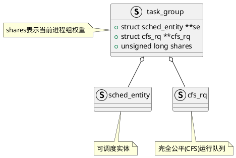

Linux采用`task_group`表示一个进程组，内核源码`kernel/sched/sched.h`中有其定义
```C
struct task_group {
    // cgroup相关,
    struct cgroup_subsys_state css;
#ifdef CONFIG_FAIR_GROUP_SCHED
    // 当前进程组的可调度实体(每个CPU分配一个)
    struct sched_entity	**se;
    // 完全公平调度运行队列(每个CPU分配一个)
    struct cfs_rq **cfs_rq;
    // 当前进程组的权重(用于获取时间片)
    unsigned long shares;
    /* A positive value indicates that this is a SCHED_IDLE group. */
    int idle;
#endif
    struct rcu_head		rcu;
    struct list_head	list;

    // 由于支持进程组嵌套(进程组包含进程组)
    // 进程组通过下面三个成员组成一个树状结构
    struct task_group	*parent;	// 父进程组
    struct list_head	siblings;	// 兄弟进程组
    struct list_head	children;	// 子进程组
    
    struct cfs_bandwidth	cfs_bandwidth;
        ......
};

```

# 参考资料
1. [一文带你图解Linux组调度(看完悟了) - 知乎 ](https://zhuanlan.zhihu.com/p/480186053)
