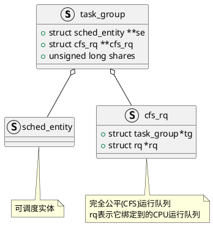

Linux采用`task_group`表示一个进程组，内核源码`kernel/sched/sched.h`中有其定义
```C
struct task_group {
    // cgroup相关,
    struct cgroup_subsys_state css;
#ifdef CONFIG_FAIR_GROUP_SCHED
    // 当前进程组的可调度实体(每个CPU分配一个)
    struct sched_entity	**se;
    // 完全公平调度运行队列(每个CPU分配一个)
    struct cfs_rq **cfs_rq;
    // 当前进程组的权重(用于获取时间片)
    unsigned long shares;
    /* A positive value indicates that this is a SCHED_IDLE group. */
    int idle;
#endif
    struct rcu_head		rcu;
    struct list_head	list;

    // 由于支持进程组嵌套(进程组包含进程组)
    // 进程组通过下面三个成员组成一个树状结构
    struct task_group	*parent;	// 父进程组
    struct list_head	siblings;	// 兄弟进程组
    struct list_head	children;	// 子进程组
    
    struct cfs_bandwidth	cfs_bandwidth;
        ......
};

```
`kernel/sched/fair.c`的`pick_next_task_fair`
```C
struct task_struct *
pick_next_task_fair(struct rq *rq, struct task_struct *prev, struct rq_flags *rf) {

}
```

## 更新runtime
```C
static void update_curr(struct cfs_rq *cfs_rq)
```

## 获取下一个可运行进程
```C
static struct sched_entity *
pick_next_entity(struct cfs_rq *cfs_rq, struct sched_entity *curr) {
    /**
     *  NEXT_BUDDY是一个调度标志
     *  如果任务被唤醒并满足抢占条件时,会调用set_next_buddy()函数
     *  将被唤醒的任务指定为下一次调度将运行的进程
     *
     *  使能NEXT_BUDDY会影响延迟(latency)且不公平
    */
	if (sched_feat(NEXT_BUDDY) &&
	    cfs_rq->next && entity_eligible(cfs_rq, cfs_rq->next))
		return cfs_rq->next;

    // EEVDF调度(根据截止虚拟截止时间调度)优化CFS
	return pick_eevdf(cfs_rq);
}

static struct sched_entity *pick_eevdf(struct cfs_rq *cfs_rq) {
    // EEVDF调度, 每次首先选择运行截止时间最早的进程
	struct sched_entity *se = __pick_eevdf(cfs_rq);

	if (!se) {
        // EEVDF调度失败, 获取红黑树的最左端节点
		struct sched_entity *left = __pick_first_entity(cfs_rq);
		if (left) {
			pr_err("EEVDF scheduling fail, picking leftmost\n");
			return left;
		}
	}

	return se;
}
```
# 参考资料
1. [一文带你图解Linux组调度(看完悟了) - 知乎 ](https://zhuanlan.zhihu.com/p/480186053)
